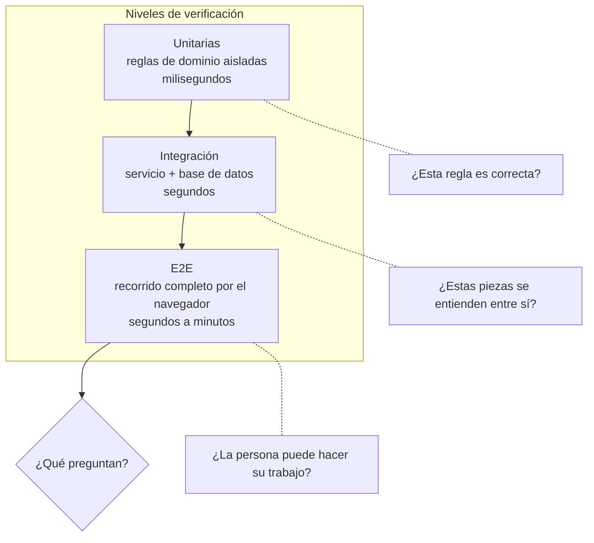
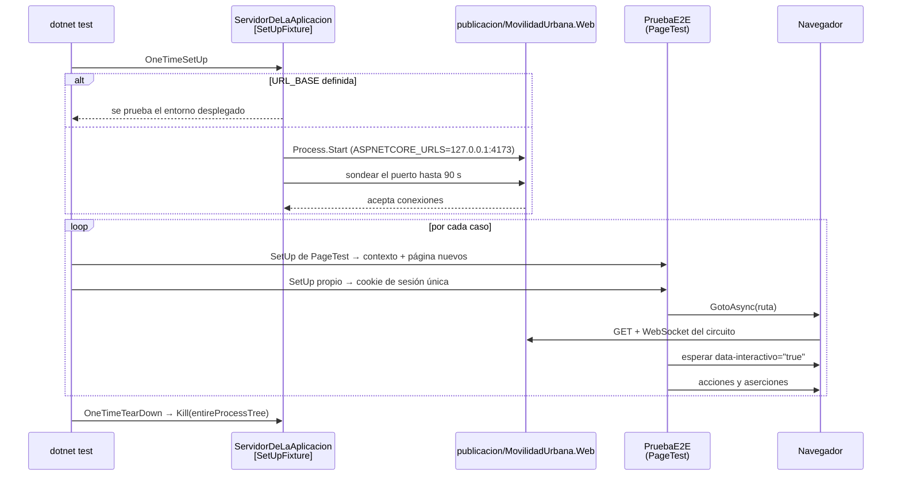
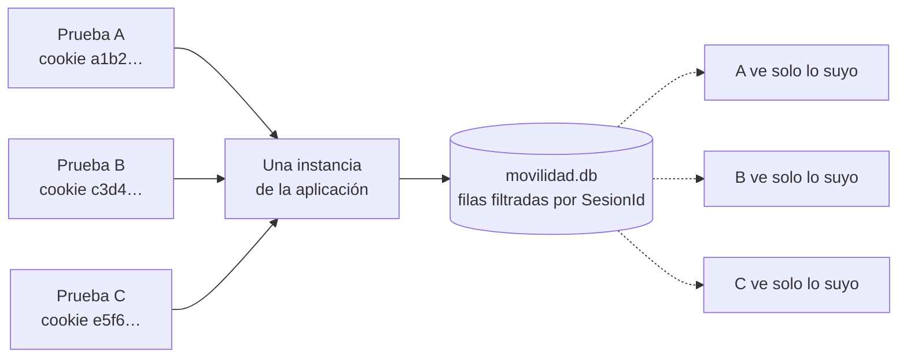
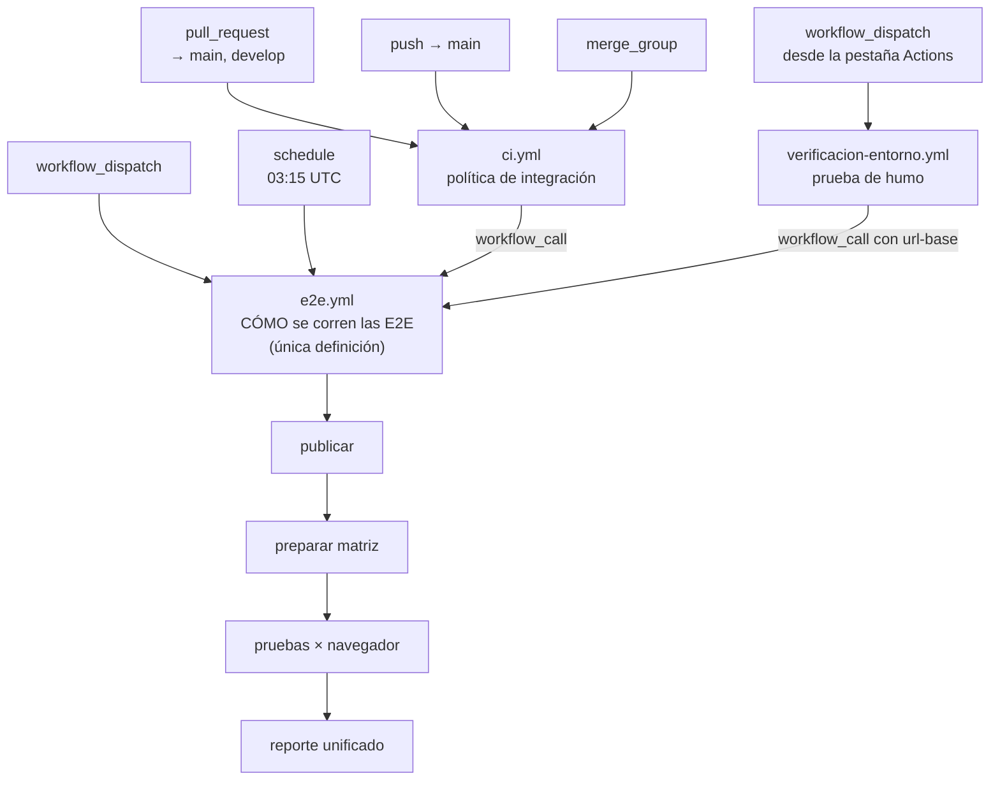
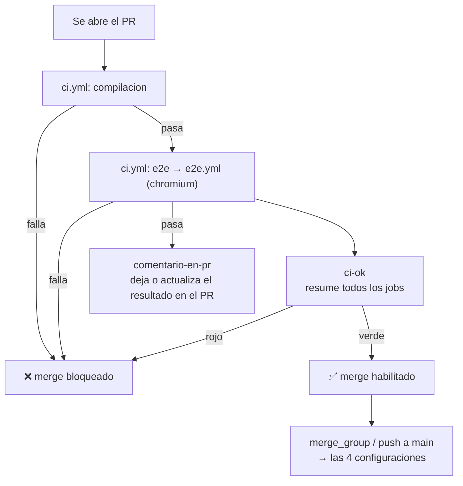

# Pruebas E2E en .NET con Playwright

Una prueba de extremo a extremo abre un navegador de verdad contra la aplicación de verdad y hace
lo que haría una persona: escribe en los campos, aprieta el botón, mira lo que aparece en pantalla.
Es la única familia de pruebas que responde la pregunta que importa antes de liberar —«¿esto que
funcionaba sigue funcionando?»— sin que nadie tenga que abrir el navegador a mano.

Esta guía está escrita para quien nunca hizo una. Se apoya en un laboratorio que existe, compila y
corre: [Lab-E2E.WebBlazor](../../Lab-E2E.WebBlazor), una aplicación Blazor con render *interactive
server*, SQLite y Clean Architecture, con 22 pruebas E2E escritas con las vinculaciones oficiales de
Playwright para .NET y tres workflows de GitHub Actions que las ejecutan. Cada afirmación técnica
remite a un archivo de ese repositorio; nada acá es una descripción abstracta de cómo *podría* ser.

El recorrido va de lo general a lo particular. Los capítulos 1 y 2 fijan el vocabulario y el mapa.
Los capítulos 3 a 6 son el oficio: cómo se arma el proyecto, qué se prueba, cómo se escribe un caso
y cómo se lo mantiene estable. El 7 lleva todo eso a la cadena de integración con GitHub Actions.
Los anexos traen plantillas, listas de verificación y glosario.

## Cómo leer las marcas de evidencia

Cada afirmación no trivial lleva una marca. La separación es deliberada: una guía pierde autoridad
cuando presenta la preferencia del autor como si fuera un estándar de la industria.

| Marca | Significado |
| --- | --- |
| **[E: ruta]** | *Evidencia en el repositorio*. Se comprueba abriendo ese archivo del laboratorio |
| **[V]** | *Verificado por ejecución*. Se corrió y se observó el resultado; el registro está en [§9](#9-evidencias-y-observaciones) |
| **[F: id]** | *Fundamentado*. Respaldado por documentación externa listada en [Anexo E](#anexo-e--fuentes) |
| **[C]** | *Criterio*. Decisión de diseño del laboratorio o recomendación del autor: defendible, no obligatoria |

## Contenido

| § | Tema | Qué deja |
| --- | --- | --- |
| [1](#1-qué-es-una-prueba-e2e) | Qué es una prueba E2E | Definición, qué problema resuelve, qué no es, dónde se ubica frente a otras pruebas |
| [2](#2-marco-de-referencia) | Marco de referencia | Escenarios, contextos y actores: el vocabulario que reaparece en toda la guía |
| [3](#3-mapa-conceptual) | Mapa conceptual | «Estoy en esta situación → qué aplico y dónde lo leo» |
| [4](#4-anatomía-de-un-proyecto-e2e-en-net) | Anatomía del proyecto | Dónde vive, qué paquetes, qué archivos, qué hace cada uno |
| [5](#5-qué-testear-y-qué-no) | Qué testear | Criterios de selección de casos y antipatrones |
| [6](#6-cómo-se-escribe-un-caso) | Cómo se escribe un caso | Localizadores, aserciones, esperas, datos |
| [7](#7-lo-que-aparece-cuando-la-aplicación-tiene-servidor) | Aplicaciones con servidor | Interactividad, aislamiento de datos, publicación, paralelismo |
| [8](#8-los-workflows-de-github-actions) | Workflows | Integración continua, control del merge del PR, ejecución a pedido |
| [9](#9-evidencias-y-observaciones) | Evidencias | Qué se verificó, cómo, y qué quedó sin verificar |
| [Anexos](#anexo-a--plantilla-comentada-de-la-clase-base) | A–F | Plantillas, listas de verificación, glosario, fuentes |

## Índice detallado

La tabla de arriba dice de qué trata cada capítulo; esta lista lleva directo a cada sección.

- **[1. Qué es una prueba E2E](#1-qué-es-una-prueba-e2e)**
  - [1.1. Definición](#11-definición)
  - [1.2. Qué no es](#12-qué-no-es)
  - [1.3. Dónde se ubica](#13-dónde-se-ubica)
  - [1.4. Qué hace Playwright](#14-qué-hace-playwright)
- **[2. Marco de referencia](#2-marco-de-referencia)**
  - [2.1. Escenarios](#21-escenarios)
  - [2.2. Contextos](#22-contextos)
  - [2.3. Actores](#23-actores)
- **[3. Mapa conceptual](#3-mapa-conceptual)**
  - [3.1. Por escenario](#31-por-escenario)
  - [3.2. Por artefacto](#32-por-artefacto)
  - [3.3. Por síntoma](#33-por-síntoma)
- **[4. Anatomía de un proyecto E2E en .NET](#4-anatomía-de-un-proyecto-e2e-en-net)**
  - [4.1. La primera decisión: dónde vive el proyecto](#41-la-primera-decisión-dónde-vive-el-proyecto)
  - [4.2. Los paquetes](#42-los-paquetes)
  - [4.3. La estructura de carpetas](#43-la-estructura-de-carpetas)
  - [4.4. El detalle de namespace que cuesta una tarde](#44-el-detalle-de-namespace-que-cuesta-una-tarde)
  - [4.5. El archivo de configuración de corrida](#45-el-archivo-de-configuración-de-corrida)
  - [4.6. Cómo se ve una corrida completa](#46-cómo-se-ve-una-corrida-completa)
- **[5. Qué testear y qué no](#5-qué-testear-y-qué-no)**
  - [5.1. El criterio de selección](#51-el-criterio-de-selección)
  - [5.2. Qué cubre el laboratorio, y por qué](#52-qué-cubre-el-laboratorio-y-por-qué)
  - [5.3. El contrato de selección](#53-el-contrato-de-selección)
  - [5.4. Antipatrones](#54-antipatrones)
- **[6. Cómo se escribe un caso](#6-cómo-se-escribe-un-caso)**
  - [6.1. La forma](#61-la-forma)
  - [6.2. Localizadores: el contrato con la interfaz](#62-localizadores-el-contrato-con-la-interfaz)
  - [6.3. Aserciones que esperan](#63-aserciones-que-esperan)
  - [6.4. Datos: sembrar, no depender](#64-datos-sembrar-no-depender)
- **[7. Lo que aparece cuando la aplicación tiene servidor](#7-lo-que-aparece-cuando-la-aplicación-tiene-servidor)**
  - [7.1. El circuito de Blazor, en dos frases](#71-el-circuito-de-blazor-en-dos-frases)
  - [7.2. Esperar a que la página sea interactiva](#72-esperar-a-que-la-página-sea-interactiva)
  - [7.3. Aislar el estado cuando vive en el servidor](#73-aislar-el-estado-cuando-vive-en-el-servidor)
  - [7.4. La aplicación hay que compilarla antes de probarla](#74-la-aplicación-hay-que-compilarla-antes-de-probarla)
  - [7.5. El enlace de datos tiene que escuchar el evento correcto](#75-el-enlace-de-datos-tiene-que-escuchar-el-evento-correcto)
  - [7.6. Catálogo de intermitencias y sus causas](#76-catálogo-de-intermitencias-y-sus-causas)
  - [7.7. Paralelismo: hasta dónde llega](#77-paralelismo-hasta-dónde-llega)
  - [7.8. Menos JavaScript, menos intermitencia](#78-menos-javascript-menos-intermitencia)
  - [7.9. Cómo se corren, en los cuatro contextos](#79-cómo-se-corren-en-los-cuatro-contextos)
  - [7.10. Diagnosticar una prueba en rojo](#710-diagnosticar-una-prueba-en-rojo)
- **[8. Los workflows de GitHub Actions](#8-los-workflows-de-github-actions)**
  - [8.1. El vocabulario mínimo](#81-el-vocabulario-mínimo)
  - [8.2. El principio de diseño](#82-el-principio-de-diseño)
  - [8.3. Los tres workflows del laboratorio](#83-los-tres-workflows-del-laboratorio)
    - [`e2e.yml` — la definición reutilizable](#e2eyml--la-definición-reutilizable)
    - [`ci.yml` — la política de integración](#ciyml--la-política-de-integración)
    - [`verificacion-entorno.yml` — el mismo motor, otro objetivo](#verificacion-entornoyml--el-mismo-motor-otro-objetivo)
  - [8.4. Atar las pruebas al merge del pull request](#84-atar-las-pruebas-al-merge-del-pull-request)
  - [8.5. Ejecución a pedido (`workflow_dispatch`)](#85-ejecución-a-pedido-workflow_dispatch)
  - [8.6. Prácticas aplicadas, y el motivo de cada una](#86-prácticas-aplicadas-y-el-motivo-de-cada-una)
    - [Sobre el runner autoalojado](#sobre-el-runner-autoalojado)
- **[9. Evidencias y observaciones](#9-evidencias-y-observaciones)**
  - [9.1. Qué se verificó](#91-qué-se-verificó)
  - [9.2. Qué no está verificado](#92-qué-no-está-verificado)
  - [9.3. Observaciones](#93-observaciones)
    - [Mejoras propuestas](#mejoras-propuestas)
- **[Anexo A — Plantilla comentada de la clase base](#anexo-a--plantilla-comentada-de-la-clase-base)**
- **[Anexo B — Plantilla comentada de un caso](#anexo-b--plantilla-comentada-de-un-caso)**
- **[Anexo C — Listas de verificación](#anexo-c--listas-de-verificación)**
  - [C.1. Antes de dar por terminado un caso nuevo (**ACT-01**)](#c1-antes-de-dar-por-terminado-un-caso-nuevo-act-01)
  - [C.2. Antes de integrar el proyecto E2E a la CI (**ACT-03**)](#c2-antes-de-integrar-el-proyecto-e2e-a-la-ci-act-03)
  - [C.3. Frente a una prueba intermitente (**ESC-03**, **ACT-02**)](#c3-frente-a-una-prueba-intermitente-esc-03-act-02)
- **[Anexo D — Glosario](#anexo-d--glosario)**
- **[Anexo E — Fuentes](#anexo-e--fuentes)**
- **[Anexo F — Ruta de lectura sugerida](#anexo-f--ruta-de-lectura-sugerida)**

---

# 1. Qué es una prueba E2E

## 1.1. Definición

Una **prueba de extremo a extremo** (E2E, *end to end*) ejercita un recorrido completo de usuario
sobre el sistema desplegado y ensamblado, a través de la misma interfaz que usa una persona. No
llama a un método; abre `http://127.0.0.1:4173/localidades`, completa el formulario, aprieta
*Guardar* y verifica que la fila aparezca en la tabla. Entre el click y la verificación pasan el
navegador, el protocolo HTTP, el circuito de Blazor, la capa de aplicación, Entity Framework Core y
el archivo SQLite. Si cualquiera de esos eslabones está roto, la prueba falla.

Eso es a la vez su virtud y su costo. La virtud: es la única prueba que ve el sistema como lo ve el
usuario, integración incluida. El costo: es lenta comparada con una prueba unitaria, y cuando falla
no dice qué componente se rompió, solo que el recorrido dejó de funcionar.

## 1.2. Qué no es

| No es | Por qué |
| --- | --- |
| Una prueba unitaria con navegador | Una unitaria verifica una regla aislada. `ReglasDeLocalidad` **[E: src/MovilidadUrbana.Web/Dominio/Reglas/ReglasDeLocalidad.cs]** merece unitarias; el recorrido de alta merece una E2E |
| Una prueba de integración de API | La de API llama al endpoint sin navegador. La E2E pasa por el DOM, el CSS y el JavaScript reales |
| Una prueba de carga | Verifica comportamiento funcional, no cuántos usuarios soporta |
| Un reemplazo del testeo manual exploratorio | Automatiza lo conocido y repetitivo; descubrir lo desconocido sigue siendo trabajo humano |
| Un reemplazo de las pruebas de más abajo | Si toda la verificación vive en E2E, cada defecto trivial cuesta una corrida completa de navegadores |

## 1.3. Dónde se ubica



La proporción entre niveles es materia de discusión desde hace años y no hay un número universal.
**[C]** El criterio práctico que sostiene esta guía: **muchas unitarias sobre las reglas, pocas E2E
sobre los recorridos que el negocio no puede perder**. El laboratorio tiene 22 casos E2E
**[V]** para dos pantallas; eso alcanza para cubrir los recorridos y sigue corriendo en segundos.

## 1.4. Qué hace Playwright

Playwright es una biblioteca de automatización de navegadores desarrollada por Microsoft, con
soporte oficial para Chromium, Firefox y WebKit **[E: .nuget/microsoft.playwright/1.62.0/README.md]**
y vinculaciones para TypeScript, Python, Java y .NET **[F: PW-1]**. Tres capacidades explican por qué
se volvió la opción por defecto:

1. **Espera automática**. Antes de hacer click, Playwright espera a que el elemento exista, sea
   visible, esté habilitado y estable. Las esperas fijas —`Thread.Sleep(2000)`— dejan de hacer falta.
2. **Aserciones con reintento**. `Expect(...).ToHaveTextAsync(...)` reintenta hasta que la condición
   se cumple o vence el tiempo límite. En una aplicación asincrónica esto es la diferencia entre una
   suite estable y una que falla al azar.
3. **Aislamiento barato**. Cada prueba recibe un contexto de navegador propio —cookies y
   almacenamiento nuevos— sin arrancar un proceso nuevo del navegador.

> **Preguntas guía de §1**
>
> - Si mañana desaparecieran las E2E del proyecto, ¿qué defecto llegaría a producción sin que nadie
>   lo note?
> - De las verificaciones que hoy hacés a mano antes de liberar, ¿cuáles repetís siempre igual?
>   Esas son candidatas a E2E.
> - ¿Podés nombrar una regla de tu dominio que estés verificando por navegador y que estaría mejor
>   cubierta por una unitaria?

---

# 2. Marco de referencia

Los tres ejes que siguen se definen una sola vez y el resto de la guía los referencia por su
identificador. Sirven para ubicarse: un tema que no se cruza con ningún escenario ni contexto sobra
o está mal delimitado.

## 2.1. Escenarios

Un escenario es una situación que el equipo va a atravesar muchas veces.

| ID | Escenario | Disparador | Salida esperada |
| --- | --- | --- | --- |
| **ESC-01** | Se escribe una pantalla nueva | Una funcionalidad entra en desarrollo | Recorridos críticos cubiertos por E2E antes del merge |
| **ESC-02** | Se propone un cambio en un pull request | PR abierto contra una rama protegida | La CI ejecuta la regresión y bloquea el merge si algo se rompió |
| **ESC-03** | Una prueba falla de manera intermitente | Rojo que no se reproduce localmente | Causa identificada y prueba estabilizada, o retirada |
| **ESC-04** | Se despliega en un ambiente | Publicación en homologación o producción | Prueba de humo contra la URL desplegada |
| **ESC-05** | Se busca una regresión de fondo | Sospecha de deterioro acumulado | Corrida completa —todos los navegadores— fuera del camino crítico |

## 2.2. Contextos

Un contexto cambia la respuesta dentro de un mismo escenario.

| ID | Contexto | Qué cambia |
| --- | --- | --- |
| **CTX-01** | Máquina de desarrollo | Se depura de a un caso, con navegador visible; la velocidad importa menos que el diagnóstico |
| **CTX-02** | Runner de CI | Headless, sin interacción, con reporte que alguien va a leer sin estar mirando la corrida |
| **CTX-03** | Entorno ya desplegado | No se compila ni se levanta nada: se prueba lo que está corriendo, y el estado no se puede destruir |
| **CTX-04** | Emulación móvil | Viewport chico, touch, menú colapsado: la misma prueba puede pasar en escritorio y fallar acá |

## 2.3. Actores

| ID | Actor | Qué decide | Qué no le toca |
| --- | --- | --- | --- |
| **ACT-01** | Quien desarrolla | Qué recorridos cubre, cómo escribe el caso, qué `data-testid` publica la vista | Definir la política de ramas o los checks obligatorios |
| **ACT-02** | QA / analista de pruebas | Qué recorridos son críticos, qué se prueba a mano y qué se automatiza | Decidir la implementación interna del caso |
| **ACT-03** | DevOps | Runners, disparadores, artefactos, tiempos de retención, caché | Qué se prueba |
| **ACT-04** | PO / autoridad de cambio | Qué recorrido no puede romperse nunca; acepta o rechaza el riesgo de liberar en rojo | Cómo se implementa la verificación |

---

# 3. Mapa conceptual

Tablas de entrada: se busca la situación en la primera columna y se lee lo que indica la última.

## 3.1. Por escenario

| Estoy en… | Lo primero que hago | Dónde lo leo |
| --- | --- | --- |
| **ESC-01** pantalla nueva | Publico `data-testid` en la vista mientras la escribo, no después | [§5.3](#53-el-contrato-de-selección), [§6.2](#62-localizadores-el-contrato-con-la-interfaz) |
| **ESC-02** pull request | Ato un único check obligatorio al PR y dejo la matriz completa para `main` | [§8.4](#84-atar-las-pruebas-al-merge-del-pull-request) |
| **ESC-03** prueba intermitente | Busco la carrera antes de subir el timeout | [§7.6](#76-catálogo-de-intermitencias-y-sus-causas) |
| **ESC-04** despliegue | Corro el mismo motor con `url-base` y sin publicar nada | [§8.5](#85-ejecución-a-pedido-workflow_dispatch) |
| **ESC-05** regresión de fondo | Corrida programada nocturna con las cuatro configuraciones | [§8.3](#83-los-tres-workflows-del-laboratorio) |

## 3.2. Por artefacto

| Artefacto | Responsabilidad única | Archivo del laboratorio |
| --- | --- | --- |
| Proyecto de pruebas | Contener los casos y su infraestructura | [tests/MovilidadUrbana.E2ETests/](../../Lab-E2E.WebBlazor/tests/MovilidadUrbana.E2ETests/) |
| Ciclo de vida del servidor | Levantar y bajar la aplicación bajo prueba | `Infraestructura/ServidorDeLaAplicacion.cs` |
| Clase base | Sesión por prueba, espera de interactividad, navegación por menú | `Infraestructura/PruebaE2E.cs` |
| Paralelismo | Cuántas clases corren a la vez | `Infraestructura/ParalelismoDelEnsamblado.cs` |
| Configuración de corrida | Navegador, timeouts, workers, carpeta de resultados | `pruebas.runsettings` |
| Definición de las pruebas en CI | Cómo se corren, una sola vez para todo el repositorio | `.github/workflows/e2e.yml` |
| Política de integración | Cuándo se corren y qué bloquea el merge | `.github/workflows/ci.yml` |

## 3.3. Por síntoma

| Síntoma | Causa más probable | Sección |
| --- | --- | --- |
| El click no hace nada y la prueba falla solo en CI | Se interactuó antes de que el circuito estuviera conectado | [§7.2](#72-esperar-a-que-la-página-sea-interactiva) |
| Dos pruebas pasan solas y fallan juntas | Estado compartido en el servidor | [§7.3](#73-aislar-el-estado-cuando-vive-en-el-servidor) |
| El formulario se ve completo pero la validación lo rechaza | El enlace de datos escucha `onchange` y `FillAsync` dispara `input` | [§7.5](#75-el-enlace-de-datos-tiene-que-escuchar-el-evento-correcto) |
| `The given key 'Browser' was not present in the dictionary` | Paralelismo por encima de `ParallelScope.Fixtures` | [§7.7](#77-paralelismo-hasta-dónde-llega) |
| Recursos estáticos vacíos, con `200` y sin contenido | El binario se lanzó desde otra carpeta que la publicación | [§7.4](#74-la-aplicación-hay-que-compilarla-antes-de-probarla) |
| La URL base llega vacía | El `[SetUpFixture]` está en un namespace anidado | [§4.4](#44-el-detalle-de-namespace-que-cuesta-una-tarde) |

---

# 4. Anatomía de un proyecto E2E en .NET

## 4.1. La primera decisión: dónde vive el proyecto

Hay dos formas de montar E2E sobre una aplicación .NET, y la elección condiciona todo lo demás.

| Opción | Cómo se ve | Qué gana | Qué pierde |
| --- | --- | --- | --- |
| **Proyecto de la solución** con `Microsoft.Playwright.NUnit` | `tests/MiApp.E2ETests/*.cs`, mismo lenguaje que la aplicación | Descubrimiento, ejecución y depuración desde Visual Studio, con puntos de interrupción en C# | Funciones exclusivas del runner de JavaScript: `--shard`, reporter `blob` con `merge-reports`, reporte HTML |
| **Carpeta aparte** con `@playwright/test` | `e2e/*.spec.ts`, ecosistema Node | Todo el runner oficial: paralelismo por caso, reporte HTML, trazas integradas | Otro lenguaje, otra cadena de herramientas, fuera del IDE de la aplicación |

El laboratorio eligió la primera **[C]**, con un motivo concreto: el Explorador de pruebas de Visual
Studio soporta pruebas de JavaScript, pero solo de Mocha, Jasmine, Tape, Jest y Vitest —Playwright no
está en esa lista—, así que con el runner de JavaScript no hay integración posible con el IDE
**[E: ../../Lab-E2E.WebBlazor/README.md]**. La segunda opción es igual de defendible: es la que usa
la aplicación de referencia de .NET, [dotnet/eShop](https://github.com/dotnet/eShop)
**[E: ../../Lab-E2E.WebBlazor/README.md]**.

Lo que **no** es defendible es no decidirlo y terminar con las dos.

## 4.2. Los paquetes

```xml
<!-- tests/MovilidadUrbana.E2ETests/MovilidadUrbana.E2ETests.csproj, líneas 11-18 -->
<ItemGroup>
  <PackageReference Include="coverlet.collector" Version="6.0.4" />
  <PackageReference Include="Microsoft.NET.Test.Sdk" Version="17.14.0" />
  <PackageReference Include="Microsoft.Playwright.NUnit" Version="1.62.0" />
  <PackageReference Include="NUnit" Version="4.3.2" />
  <PackageReference Include="NUnit.Analyzers" Version="4.7.0" />
  <PackageReference Include="NUnit3TestAdapter" Version="5.0.0" />
</ItemGroup>
```

`Microsoft.Playwright.NUnit` es el único específico de E2E; arrastra `Microsoft.Playwright` —la
biblioteca y el CLI que instala los navegadores— y `Microsoft.Playwright.TestAdapter` —el que lee la
sección `<Playwright>` del archivo de configuración de corrida—. El resto es el andamiaje normal de
cualquier proyecto de pruebas .NET. Con MSTest el equivalente es `Microsoft.Playwright.MSTest`.

La jerarquía de clases base que ofrece el paquete, de menos a más servicio
**[E: .nuget/microsoft.playwright.nunit/1.62.0/lib/netcoreapp3.1/Microsoft.Playwright.NUnit.dll]**:

| Clase base | Qué deja disponible | Cuándo se usa |
| --- | --- | --- |
| `PlaywrightTest` | La instancia de Playwright y `Expect` | Pruebas de API sin navegador |
| `BrowserTest` | Un navegador compartido por worker | Control fino de contextos |
| `ContextTest` | Un contexto nuevo por prueba | Varias páginas o pestañas por caso |
| `PageTest` | Un contexto **y** una página nueva por prueba | El caso normal: es la que hereda el laboratorio |

## 4.3. La estructura de carpetas

```
tests/MovilidadUrbana.E2ETests/
  Infraestructura/
    ServidorDeLaAplicacion.cs    Ciclo de vida de la aplicación bajo prueba
    PruebaE2E.cs                 Clase base de todos los casos
    ParalelismoDelEnsamblado.cs  Atributos de ensamblado: cuánto paraleliza NUnit
  NavegacionTests.cs             Portada, menú y ruta inexistente        (4 casos)
  LocalidadesTests.cs            ABM completo y aislamiento de sesiones   (9 casos)
  EncuestaTests.cs               Asistente de tres pasos                  (9 casos)
pruebas.runsettings              Navegador, timeouts, workers, resultados
```

Tres convenciones sostienen esa estructura, y son las que conviene copiar **[C]**:

- **Una clase por pantalla o por recorrido**, nombrada `<Pantalla>Tests`. Es también la unidad de
  paralelismo, así que la división por pantalla es la que mejor reparte el trabajo.
- **`Infraestructura/` separada de los casos**. Todo lo que no es una prueba —arranque, base,
  helpers— vive ahí. Un archivo de casos que empieza con 80 líneas de andamiaje es un archivo que
  nadie va a leer.
- **Nombres de método que son la frase del caso**: `DaDeAltaUnaLocalidadYLaPersisteTrasRecargar`
  **[E: tests/MovilidadUrbana.E2ETests/LocalidadesTests.cs]**. Cuando el reporte de CI muestre ese
  nombre en rojo, quien lo lea va a entender qué se rompió sin abrir el código.

## 4.4. El detalle de namespace que cuesta una tarde

El arranque de la aplicación es un `[SetUpFixture]` de NUnit: un tipo cuyo `[OneTimeSetUp]` corre
antes de la primera prueba de su namespace y cuyo `[OneTimeTearDown]` corre después de la última.

```csharp
// tests/MovilidadUrbana.E2ETests/Infraestructura/ServidorDeLaAplicacion.cs, líneas 4-19
namespace MovilidadUrbana.E2ETests;   // ← el namespace de las pruebas, no uno anidado

[SetUpFixture]
public class ServidorDeLaAplicacion
```

El archivo está en la carpeta `Infraestructura/` pero **declara el namespace de las pruebas**. Un
`[SetUpFixture]` cubre su propio namespace y los que cuelgan de él, nunca el de arriba: puesto en
`MovilidadUrbana.E2ETests.Infraestructura` no se ejecutaría para las pruebas de
`MovilidadUrbana.E2ETests`, y el síntoma es desconcertante —la URL base llega vacía y Playwright se
queja de la cookie— **[E: tests/MovilidadUrbana.E2ETests/Infraestructura/ServidorDeLaAplicacion.cs]**.

## 4.5. El archivo de configuración de corrida

En el runner de JavaScript la configuración vive en `playwright.config.ts`, con un bloque `projects`
para cada navegador. En el binding de .NET el equivalente es un `.runsettings`, y el navegador es una
**opción de la corrida**, no un proyecto dentro del archivo.

```xml
<!-- pruebas.runsettings -->
<RunSettings>
  <Playwright>
    <BrowserName>chromium</BrowserName>
    <ExpectTimeout>5000</ExpectTimeout>
    <LaunchOptions>
      <Headless>true</Headless>
    </LaunchOptions>
  </Playwright>

  <NUnit>
    <NumberOfTestWorkers>4</NumberOfTestWorkers>
  </NUnit>

  <RunConfiguration>
    <ResultsDirectory>resultados</ResultsDirectory>
  </RunConfiguration>
</RunSettings>
```

Las claves que el adaptador reconoce dentro de `<Playwright>` son `BrowserName`, `ExpectTimeout` y
`LaunchOptions`; los navegadores admitidos son `chromium`, `firefox` y `webkit`
**[E: .nuget/microsoft.playwright.testadapter/1.62.0/lib/netstandard2.0/Microsoft.Playwright.TestAdapter.dll]**.
Cualquiera de esos valores se pisa desde la línea de comandos, después del separador de argumentos:

```bash
dotnet test tests/MovilidadUrbana.E2ETests --settings pruebas.runsettings -- Playwright.BrowserName=firefox
```

Ese mecanismo es el que usa CI para recorrer la matriz de navegadores sin tocar el archivo
**[E: .github/workflows/e2e.yml, línea 198]**.

## 4.6. Cómo se ve una corrida completa



---

# 5. Qué testear y qué no

## 5.1. El criterio de selección

La pregunta correcta no es «¿qué puedo automatizar?» sino «¿qué recorrido, si se rompe, me entero
tarde y me cuesta caro?». **[C]** Tres filtros, aplicados en orden:

1. **Valor para el negocio**. Si el recorrido deja de funcionar, ¿alguien no puede hacer su trabajo?
   El alta de una localidad sí; que el pie de página muestre el año correcto, no.
2. **Riesgo de integración**. ¿El recorrido cruza varias capas o tecnologías? El asistente de tres
   pasos cruza componente, servicio, repositorio y base: exactamente lo que una unitaria no ve.
3. **Costo de detectarlo de otro modo**. Si una unitaria barata lo cubre igual de bien, la E2E sobra.

Un caso E2E que pasa los tres filtros se escribe. Uno que pasa dos, se discute. Uno que pasa uno,
casi siempre está mejor cubierto más abajo.

## 5.2. Qué cubre el laboratorio, y por qué

Los 22 casos **[V]** se reparten así:

| Clase | Casos | Qué verifica | Qué filtro justifica |
| --- | --- | --- | --- |
| `NavegacionTests` | 4 | Portada con acceso a las dos pantallas, marca de página activa en el menú, navegación sin recarga dentro del circuito, ruta inexistente | Riesgo de integración: el enrutado y el layout son transversales |
| `LocalidadesTests` | 9 | Listado sembrado, rechazo de alta inválida, alta con persistencia tras recargar, duplicado dentro de la provincia, edición, baja cancelada, baja confirmada, tabla vacía, aislamiento entre sesiones | Valor de negocio: es el ABM completo |
| `EncuestaTests` | 9 | Estado inicial, desplegable alimentado por el ABM, validación de cada paso, ida y vuelta conservando datos, barra de progreso, resumen final, contador persistido, reinicio | Valor + integración: el asistente atraviesa toda la pila |

Tres decisiones de cobertura merecen mirarse de cerca, porque son las que se copian mal:

**Verificar la persistencia recargando.** El caso del alta no termina cuando la fila aparece: recarga
la página y vuelve a contar **[E: tests/MovilidadUrbana.E2ETests/LocalidadesTests.cs, líneas 60-63]**.
Sin esa recarga, la prueba pasaría igual con un dato que solo existe en el estado del circuito y
nunca llegó a la base. Es la diferencia entre verificar la pantalla y verificar el sistema.

**Verificar el formato, no solo el valor.** `ToHaveTextAsync("89.000")`
**[E: LocalidadesTests.cs, línea 54]** verifica que el número se formatee con la cultura `es-AR`, que
es una decisión explícita de la aplicación **[E: src/MovilidadUrbana.Web/Program.cs, líneas 12-16]**.
El contexto del navegador fija `Locale = "es-AR"` para que la prueba no dependa de la máquina
**[E: tests/MovilidadUrbana.E2ETests/Infraestructura/PruebaE2E.cs, línea 46]**.

**Verificar el propio andamiaje.** *«Cada prueba trabaja sobre su propio conjunto de datos»*
**[E: LocalidadesTests.cs, líneas 148-165]** no prueba una funcionalidad del producto: prueba que el
aislamiento entre sesiones —del que depende todo el paralelismo— realmente funciona. Cuando la
infraestructura de pruebas tiene un supuesto crítico, ese supuesto merece su propio caso. **[C]**

## 5.3. El contrato de selección

Una prueba E2E le pone una restricción a la interfaz: si el marcado cambia, la prueba se rompe. La
forma de que esa restricción sea explícita y barata es publicar atributos pensados para pruebas.

```razor
@* src/MovilidadUrbana.Web/Components/Pages/Localidades.razor, línea 92 *@
<tr @key="localidad.Id" data-testid="fila" data-id="@localidad.Id">
    <td data-testid="celda-nombre">@localidad.Nombre</td>
```

`data-testid` es el atributo que `GetByTestId` busca por defecto —el adaptador expone
`SetTestIdAttribute` para cambiarlo si el proyecto ya usa otra convención
**[E: .nuget/microsoft.playwright.nunit/1.62.0/lib/netcoreapp3.1/Microsoft.Playwright.NUnit.dll]**—.
La regla práctica: **el `data-testid` se escribe junto con la vista, por quien escribe la vista**
**[C]**. Agregarlos después, desde el proyecto de pruebas, convierte cada caso nuevo en una
negociación con otro archivo y otra persona.

## 5.4. Antipatrones

| Antipatrón | Por qué duele | Qué hacer |
| --- | --- | --- |
| Cubrir cada combinación de validación por E2E | Multiplica minutos de navegador para verificar reglas puras | Una E2E que confirma que el error se muestra; el resto, unitarias sobre las reglas |
| Una prueba larguísima que recorre toda la aplicación | Cuando falla, no se sabe dónde; y falla siempre | Casos con un objetivo, como los del laboratorio |
| Pruebas que dependen del orden de ejecución | Rompe el paralelismo y esconde acoplamientos | Cada caso siembra y verifica su propio estado ([§7.3](#73-aislar-el-estado-cuando-vive-en-el-servidor)) |
| Selectores por clase de CSS o por texto de diseño | Un retoque visual rompe la suite | `data-testid`, o roles accesibles cuando el rol es parte del contrato |
| Aserciones sobre implementación (`localStorage`, tablas de la base) | La prueba deja de ser de extremo a extremo | Verificar lo que la persona ve |
| `Thread.Sleep` para "estabilizar" | Lenta cuando anda, intermitente cuando no | Aserciones con reintento ([§6.3](#63-aserciones-que-esperan)) |

> **Preguntas guía de §5**
>
> - Para cada caso de tu suite: si lo borro, ¿qué defecto deja de detectarse? Si no hay respuesta, sobra.
> - ¿Cuántos de tus casos fallarían si alguien renombra una clase de CSS?
> - ¿Qué supuesto de tu infraestructura de pruebas no está verificado por ninguna prueba?

---

# 6. Cómo se escribe un caso

## 6.1. La forma

Todo caso tiene tres partes, en este orden: **llegar** a un estado conocido, **actuar**, y
**verificar** lo que la persona vería. En NUnit se traduce a un `[SetUp]` que deja la pantalla
abierta y un método `[Test]` con las dos partes restantes.

```csharp
// tests/MovilidadUrbana.E2ETests/LocalidadesTests.cs, líneas 5-35 (extracto)
[TestFixture]
public class LocalidadesTests : PruebaE2E
{
    [SetUp]
    public async Task AbrirElAbmAsync() => await IrAAsync("/localidades");

    [Test]
    [Description("Rechaza el alta con campos inválidos")]
    public async Task RechazaElAltaConCamposInvalidos()
    {
        await Page.GetByTestId("campo-nombre").FillAsync("Ab");
        await Page.GetByTestId("campo-codigo-postal").FillAsync("34");
        await Page.GetByTestId("boton-guardar").ClickAsync();

        await Expect(Page.GetByTestId("aviso")).ToHaveTextAsync("Revise los campos marcados en rojo.");
        await Expect(Page.GetByTestId("error-nombre")).ToHaveTextAsync(new Regex("al menos 3 caracteres"));
        await Expect(Page.GetByTestId("fila")).ToHaveCountAsync(2);
    }
}
```

El `[Description]` no es decorativo: es el texto que aparece en el Explorador de pruebas y en el TRX
que sube CI, así que conviene que sea la frase que le explicaría el caso a alguien del negocio
**[C]**.

La última aserción del ejemplo es la que muchos olvidan. Verificar que el error aparece no alcanza:
también hay que verificar que **no pasó lo que no tenía que pasar** —la tabla sigue con dos filas—.
Una validación que muestra el error y guarda igual pasaría la prueba sin esa línea.

## 6.2. Localizadores: el contrato con la interfaz

Un localizador es una descripción de cómo encontrar un elemento, no el elemento en sí; se resuelve
en el momento de usarlo, y por eso sobrevive a que el DOM se vuelva a renderizar. En una aplicación
Blazor interactiva, donde cada interacción puede repintar un fragmento, esa propiedad no es un
detalle.

| Forma | Ejemplo del laboratorio | Cuándo |
| --- | --- | --- |
| Por `data-testid` | `Page.GetByTestId("boton-guardar")` | Opción por defecto **[C]** |
| Filtrado por contenido | `Page.GetByTestId("fila").Filter(new() { HasText = "Resistencia" })` **[E: LocalidadesTests.cs, línea 84]** | Elegir una fila de una tabla por lo que muestra |
| Encadenado | `fila.GetByTestId("boton-editar")` **[E: LocalidadesTests.cs, línea 85]** | Acotar la búsqueda al ámbito de un elemento |
| Por posición | `opciones.Nth(1)` **[E: EncuestaTests.cs, línea 54]** | Listas donde el orden es parte del contrato |
| Por CSS | `Page.Locator(".navbar-toggler")` **[E: PruebaE2E.cs, línea 94]** | Elementos de una biblioteca de terceros que no controlamos |

El encadenado es la técnica que más rinde. `fila.GetByTestId("boton-editar")` dice «el botón editar
**de esta fila**», y evita el problema clásico de una tabla: diez botones idénticos y un selector
ambiguo que a veces agarra el que no era.

## 6.3. Aserciones que esperan

`Expect(...)` devuelve una aserción que **reintenta** hasta que la condición se cumple o vence
`ExpectTimeout` —5 segundos en el laboratorio **[E: pruebas.runsettings, línea 14]**—. Es lo que
permite escribir la verificación sin pensar en cuánto tarda el servidor:

```csharp
// La prueba no sabe ni le importa cuánto tarda el circuito en repintar la tabla.
await Expect(Page.GetByTestId("fila")).ToHaveCountAsync(3);
```

Comparado con leer el valor y compararlo a mano —`Assert.That(await locator.CountAsync(), Is.EqualTo(3))`—
la diferencia es que la versión con reintento no depende de que el DOM ya esté actualizado en el
instante exacto de la lectura. **La regla es simple: en una prueba E2E, verificar siempre con
`Expect`, nunca con un `Assert` sobre un valor leído.** **[C]**

Aserciones usadas en el laboratorio, como muestrario:

| Aserción | Qué verifica | Ejemplo |
| --- | --- | --- |
| `ToHaveTextAsync` | Texto exacto o expresión regular | `Expect(Page.GetByTestId("titulo")).ToHaveTextAsync("Localidades")` |
| `ToContainTextAsync` | Texto contenido | `Expect(Page.GetByTestId("cuerpo-tabla")).ToContainTextAsync("Goya")` |
| `ToHaveCountAsync` | Cantidad de elementos que coinciden | `Expect(Page.GetByTestId("fila")).ToHaveCountAsync(2)` |
| `ToHaveValueAsync` | Valor de un campo de formulario | `Expect(Page.GetByTestId("campo-nombre")).ToHaveValueAsync("")` |
| `ToHaveAttributeAsync` | Atributo del elemento | `Expect(Page.GetByTestId("nav-localidades")).ToHaveAttributeAsync("aria-current", "page")` |
| `ToBeVisibleAsync` / `ToBeHiddenAsync` | Visibilidad | `Expect(Page.GetByTestId("sin-datos")).ToBeVisibleAsync()` |
| `ToBeCheckedAsync` / `ToBeDisabledAsync` | Estado de control | `Expect(Page.GetByTestId("boton-anterior")).ToBeDisabledAsync()` |
| `Not.` | Negación, con la misma espera | `Expect(Page.GetByTestId("nav-encuesta")).Not.ToHaveAttributeAsync("aria-current", "page")` |
| `ToHaveURLAsync` / `ToHaveTitleAsync` | Navegación | `Expect(Page).ToHaveURLAsync(new Regex(@"/localidades$"))` |

La aserción negada merece una advertencia. `Not.ToBeVisibleAsync()` se cumple apenas el elemento
desaparece, pero también se cumple si **nunca apareció**: una prueba que solo verifica ausencias
puede pasar sobre una pantalla en blanco. Conviene acompañarla de al menos una aserción positiva,
como hace el caso de la baja confirmada, que verifica el aviso, el conteo **y** la ausencia del texto
**[E: LocalidadesTests.cs, líneas 122-124]**.

## 6.4. Datos: sembrar, no depender

Cada caso del laboratorio arranca con las mismas dos localidades —Corrientes y Resistencia— porque la
aplicación siembra ese juego la primera vez que toca una sesión nueva
**[E: src/MovilidadUrbana.Web/Infraestructura/Persistencia/SembradorDeSesion.cs, líneas 13-17]**. La
prueba no crea los datos ni los borra al terminar: recibe un espacio limpio por construcción.

Es una de las tres estrategias posibles, y conviene conocerlas:

| Estrategia | Cómo | Cuándo conviene |
| --- | --- | --- |
| **Siembra por sesión** (la del laboratorio) | La aplicación reparte un espacio de datos por cookie y lo siembra al estrenarlo | Aplicaciones donde se puede introducir la noción de sesión; permite paralelismo total **[C]** |
| Datos únicos por caso | Cada prueba genera nombres con sufijo aleatorio | Cuando no se puede aislar el almacenamiento, pero se tolera acumulación de basura |
| Limpieza en `TearDown` | Cada prueba deshace lo que hizo | Último recurso: si el caso falla a mitad, la limpieza también puede fallar |

Sobre entornos ya desplegados (**CTX-03**) hay una restricción adicional que conviene fijar por
escrito: **las pruebas que corren contra producción u homologación no pueden destruir estado
ajeno**. El laboratorio corre la suite completa contra `url-base`
**[E: .github/workflows/verificacion-entorno.yml]**, lo cual es válido acá porque el aislamiento por
sesión hace que cada corrida trabaje sobre datos propios. Sin ese aislamiento, contra un entorno
real solo debería correr un subconjunto de solo lectura. **[C]**

---

# 7. Lo que aparece cuando la aplicación tiene servidor

Los seis puntos de esta sección son los que separan un laboratorio de páginas estáticas de una
aplicación real. Ninguno se descubre leyendo la documentación de Playwright: aparecen la primera vez
que la suite falla en CI y pasa en la máquina propia.

## 7.1. El circuito de Blazor, en dos frases

Una aplicación Blazor con render *interactive server* entrega primero HTML prerenderizado por el
servidor y recién después establece un circuito por WebSocket entre el navegador y el servidor. Los
eventos del DOM viajan por ese circuito, el servidor recalcula el árbol de componentes y devuelve el
diff que el navegador aplica.

De ahí salen dos consecuencias para las pruebas: hay una ventana en la que la pantalla se ve pero no
responde, y el estado de la pantalla vive en el servidor, no en el navegador.

## 7.2. Esperar a que la página sea interactiva

Un click que llega antes de que el circuito esté conectado **se pierde sin dejar rastro**. El
síntoma es una prueba que falla de manera intermitente y solo en las máquinas cargadas —es decir,
casi siempre en CI y casi nunca en la propia—.

La solución tiene dos mitades. La vista publica un testigo:

```razor
@* src/MovilidadUrbana.Web/Components/Layout/MainLayout.razor, línea 47 *@
<div hidden data-testid="estado-app" data-interactivo="@RendererInfo.IsInteractive.ToString().ToLowerInvariant()"></div>
```

Y la clase base lo espera antes de tocar nada:

```csharp
// tests/MovilidadUrbana.E2ETests/Infraestructura/PruebaE2E.cs, líneas 72-87
protected async Task IrAAsync(string ruta)
{
    await Page.GotoAsync(ruta);
    await EsperarInteractivoAsync();
}

protected async Task EsperarInteractivoAsync() =>
    await Expect(Page.GetByTestId("estado-app")).ToHaveAttributeAsync("data-interactivo", "true");
```

`RendererInfo.IsInteractive` vale `false` durante el prerender y `true` una vez establecido el
circuito, así que el atributo cambia exactamente cuando la página empieza a responder. Que la espera
esté dentro de `IrAAsync` y no en cada caso es lo que la vuelve difícil de olvidar **[C]**: quien
escribe una prueba nueva usa el helper de navegación y hereda la espera sin saber que existe.

## 7.3. Aislar el estado cuando vive en el servidor

Con `localStorage` cada prueba tenía su almacenamiento por construcción. Con una base SQLite
compartida, dos pruebas que corren a la vez se pisan.

El laboratorio resuelve el problema en la aplicación, no en las pruebas: un middleware emite una
cookie de sesión y todos los repositorios filtran por ella
**[E: src/MovilidadUrbana.Web/Infraestructura/Sesiones/MiddlewareDeSesion.cs]**. La prueba solo tiene
que estrenar la cookie antes de navegar:

```csharp
// tests/MovilidadUrbana.E2ETests/Infraestructura/PruebaE2E.cs, líneas 57-69
[SetUp]
public async Task EstrenarSesionAsync()
{
    await Context.AddCookiesAsync(
    [
        new Cookie
        {
            Name = CookieDeSesion,
            Value = Guid.NewGuid().ToString("n"),
            Url = ServidorDeLaAplicacion.UrlBase
        }
    ]);
}
```



Dos detalles de implementación explican por qué esto funciona y no es tan simple como parece.

La cookie **se emite solo al pedir un documento**, nunca en las peticiones de CSS o JavaScript
**[E: MiddlewareDeSesion.cs, líneas 17-20]**. El navegador lanza esas peticiones en paralelo: si
cada una generara un identificador, la primera visita terminaría con varios y se quedaría con el
último en llegar.

Y del lado de Blazor, **un circuito no tiene acceso a la petición HTTP que lo originó**, así que la
cookie no se puede leer desde una página. El identificador se lee en `App.razor` —que sí se
renderiza dentro de la petición— y se pasa como parámetro al componente raíz
**[E: src/MovilidadUrbana.Web/Components/App.razor, línea 21; Components/Routes.razor, líneas 16-26]**.

Esta es la técnica que hace que la corrida de chromium termine en 7 segundos con 22 casos **[V]**.
Sin aislamiento, la única alternativa es correr en serie.

## 7.4. La aplicación hay que compilarla antes de probarla

Las pruebas ejercitan el binario publicado, no `dotnet run`: se publica **autocontenido** para
`linux-x64`, así el artefacto es idéntico en la máquina de desarrollo y en CI, y no depende del
runtime instalado en la máquina que lo ejecuta
**[E: scripts/publicar.sh]**. En CI se publica una sola vez y toda la matriz de navegadores reutiliza
el mismo artefacto **[E: .github/workflows/e2e.yml, jobs `publicar` y `pruebas`]**.

El fixture lo levanta con `Process.Start`, fijando variables de entorno y —esto es lo importante— el
directorio de trabajo:

```csharp
// tests/MovilidadUrbana.E2ETests/Infraestructura/ServidorDeLaAplicacion.cs, líneas 45-56
var arranque = new ProcessStartInfo(ejecutable)
{
    // ASP.NET Core toma el directorio actual como raíz de contenido: si se lo lanza desde
    // otro lado no encuentra `wwwroot` y los recursos estáticos salen vacíos.
    WorkingDirectory = carpeta,
    UseShellExecute = false
};
arranque.Environment["ASPNETCORE_URLS"] = UrlBase;
```

El fallo que evita ese `WorkingDirectory` es de los que cuestan una tarde: si el binario se lanza
desde otra carpeta, `wwwroot` no se encuentra y los recursos estáticos se sirven **vacíos, con `200`
y `Content-Length: 0`, no con `404`**. El circuito nunca arranca porque `blazor.web.js` llega en
blanco, y en la consola del navegador no hay ningún error rojo que lo delate
**[E: ../../Lab-E2E.WebBlazor/README.md]**.

Después de arrancar, el fixture sondea el puerto hasta 90 segundos y aborta con un mensaje claro si
el proceso muere antes de escuchar **[E: ServidorDeLaAplicacion.cs, líneas 111-136]**. Un servidor
que no arranca tiene que fallar como «la aplicación terminó sola con código 134», no como 22 pruebas
en rojo por timeout.

Y si `URL_BASE` está definida, no se levanta nada: se prueba contra ese entorno
**[E: ServidorDeLaAplicacion.cs, líneas 31-37]**. Un solo `if` convierte la misma suite en prueba de
humo de un despliegue (**ESC-04**).

## 7.5. El enlace de datos tiene que escuchar el evento correcto

`FillAsync` dispara el evento `input`. El enlace `@bind` de Blazor escucha `onchange` por defecto,
que ocurre cuando el campo pierde el foco. La combinación produce un fallo desconcertante: en pantalla
el formulario se ve completo, pero el servidor todavía tiene los campos vacíos y la validación los
rechaza.

```razor
@* src/MovilidadUrbana.Web/Components/Pages/Localidades.razor, líneas 54-56 *@
<input type="number" class="form-control @Marca("habitantes")" id="habitantes"
       data-testid="campo-habitantes" min="1" step="1"
       @bind="_modelo.Habitantes" @bind:event="oninput" />
```

Vale la pena leer esto en su forma general, porque reaparece con otros frameworks: **la prueba
interactúa como el navegador, no como una persona con teclado**. Cuando el framework depende de un
evento que la automatización no dispara —`change` al perder el foco, `blur`, eventos de teclado
específicos—, la corrección va en la aplicación, no en la prueba.

## 7.6. Catálogo de intermitencias y sus causas

Una prueba intermitente —*flaky*— es la que pasa y falla sin que el código cambie. Cuesta más que una
prueba que falla siempre: entrena al equipo a reintentar la corrida en lugar de leerla.

| Causa | Cómo se manifiesta | Corrección |
| --- | --- | --- |
| Interacción antes de la interactividad | Falla en CI, pasa localmente | Testigo de interactividad ([§7.2](#72-esperar-a-que-la-página-sea-interactiva)) |
| Estado compartido entre pruebas | Falla solo cuando corren en paralelo | Aislamiento por sesión ([§7.3](#73-aislar-el-estado-cuando-vive-en-el-servidor)) |
| Espera fija demasiado corta | Falla en máquinas cargadas | Aserción con reintento ([§6.3](#63-aserciones-que-esperan)) |
| Click durante una animación | Falla al azar en modales y desplegables | Estado del componente en vez de JavaScript de terceros ([§7.8](#78-menos-javascript-menos-intermitencia)) |
| Cultura o zona horaria de la máquina | Falla en un runner y pasa en otro | Fijar `Locale` y `TimezoneId` en el contexto **[E: PruebaE2E.cs, líneas 46-47]** |
| Emulación móvil que cae en silencio a escritorio | La prueba pasa, pero no probó lo que decía | Fallar explícitamente si falta el descriptor **[E: PruebaE2E.cs, líneas 31-35]** |
| `/dev/shm` chico dentro de un contenedor | Chromium muere a mitad de la corrida | `--disable-dev-shm-usage` o más `--shm-size`; medido innecesario a esta escala **[E: ../../Lab-E2E.WebBlazor/README.md]** |

El caso de la emulación móvil es instructivo porque el error es del tipo peor: la prueba en verde
que no probó nada. Si el descriptor `Pixel 7` no estuviera disponible, la configuración caería a
escritorio sin avisar, y la corrida *mobile-chrome* estaría reportando éxito sobre un viewport de
escritorio. El laboratorio prefiere que reviente **[E: PruebaE2E.cs, líneas 31-35]** **[C]**.

## 7.7. Paralelismo: hasta dónde llega

NUnit no paraleliza por defecto; hay que pedirlo con atributos de ensamblado:

```csharp
// tests/MovilidadUrbana.E2ETests/Infraestructura/ParalelismoDelEnsamblado.cs
[assembly: Parallelizable(ParallelScope.Fixtures)]
[assembly: LevelOfParallelism(3)]
```

`ParallelScope.Fixtures` significa **clases en paralelo entre sí, casos de cada clase en secuencia**.
Subirlo a `ParallelScope.Children` rompe la integración de Playwright con NUnit, que lleva un
registro de servicios por worker: la corrida falla con `The given key 'Browser' was not present in
the dictionary` y `Collection was modified; enumeration operation may not execute`
**[E: ParalelismoDelEnsamblado.cs; ../../Lab-E2E.WebBlazor/README.md]**.

Es una diferencia real con `fullyParallel: true` del runner de JavaScript, que reparte caso por caso.
Con tres clases de prueba, el límite práctico es que la corrida dura lo que dura la clase más lenta.
La forma de aprovecharlo: **dividir en clases por recorrido, no acumular veinte casos en una sola**
**[C]**.

## 7.8. Menos JavaScript, menos intermitencia

El menú colapsable y el diálogo de confirmación del laboratorio son marcado propio gobernado por el
estado del componente, sin el bundle de JavaScript de Bootstrap
**[E: src/MovilidadUrbana.Web/Components/Layout/MainLayout.razor, líneas 5-8]**. La consecuencia para
las pruebas es que desaparece una clase entera de carreras: el click que llega durante la animación
de apertura de un modal, y el orden de los manejadores de `data-bs-dismiss`, que en la versión
estática del laboratorio hubo que corregir **[E: ../../Lab-E2E.WebBlazor/README.md]**.

Aparece a cambio otra obligación, y es la que resuelve `IrPorMenuAsync`: en viewport chico el menú
viene colapsado, así que hay que desplegarlo antes de navegar
**[E: PruebaE2E.cs, líneas 93-103]**. Sin eso, la misma prueba pasa en escritorio y falla en móvil
(**CTX-04**).

## 7.9. Cómo se corren, en los cuatro contextos

| Contexto | Comando | Requisitos |
| --- | --- | --- |
| **CTX-01** Visual Studio | *Test > Explorador de pruebas*, tras publicar y ejecutar `playwright.ps1 install` | SDK y Visual Studio; el navegador sale del `.runsettings` **[E: ../../Lab-E2E.WebBlazor/README.md]** |
| **CTX-01** Línea de comandos | `scripts/publicar.sh` y luego `dotnet test tests/MovilidadUrbana.E2ETests --settings pruebas.runsettings` | SDK de .NET y navegadores instalados |
| **CTX-01** Sin nada instalado | `scripts/publicar.sh` y luego `scripts/pruebas.sh firefox` | Solo Docker: la imagen oficial de Playwright trae las librerías del sistema y el script instala el SDK en `.dotnet/` **[E: scripts/pruebas.sh]** |
| **CTX-03** Entorno desplegado | `URL_BASE=https://ejemplo.test scripts/pruebas.sh chromium` | Nada local: no se publica ni se levanta la aplicación |
| **CTX-04** Móvil | `EMULAR_MOVIL=true scripts/pruebas.sh` | Chromium con el descriptor de un Pixel 7 |

El script de contenedor merece una lectura, porque resuelve un problema que aparece en todo equipo
mixto: quien no tiene el SDK instalado igual tiene que poder correr las pruebas. La imagen
`mcr.microsoft.com/playwright:v1.62.1-noble` trae las librerías de sistema que los navegadores
necesitan; el SDK se descarga a `.dotnet/` y los navegadores a `.navegadores/`, ambas ignoradas por
git, así que solo se bajan la primera vez **[E: scripts/pruebas.sh]**.

## 7.10. Diagnosticar una prueba en rojo

En orden, del más barato al más caro **[C]**:

1. **Leer el mensaje**. Playwright informa qué localizador esperaba, qué encontró y cuánto esperó.
   En la mitad de los casos alcanza.
2. **Correr solo ese caso**: `dotnet test --filter "FullyQualifiedName~RechazaElAltaConCamposInvalidos"`.
   Si pasa solo y falla en grupo, el problema es estado compartido o paralelismo.
3. **Ver el navegador**: poner `<Headless>false</Headless>` en el `.runsettings`. En CI no sirve; en
   la máquina propia muestra en segundos lo que el log no dice.
4. **Depurar con puntos de interrupción** desde el IDE, que es exactamente la razón por la que este
   laboratorio eligió el binding de .NET ([§4.1](#41-la-primera-decisión-dónde-vive-el-proyecto)).
5. **Leer el TRX de CI**, que queda como artefacto de la corrida
   **[E: .github/workflows/e2e.yml, líneas 200-207]**.

Sobre trazas y video: el runner de JavaScript los captura por configuración
(`trace: 'on-first-retry'`). El adaptador de .NET **no** expone esas opciones en el `.runsettings`
—solo reconoce `BrowserName`, `ExpectTimeout` y `LaunchOptions`
**[E: .nuget/microsoft.playwright.testadapter/1.62.0/lib/netstandard2.0/Microsoft.Playwright.TestAdapter.dll]**—,
así que capturarlas requiere código propio en la clase base: `Context.Tracing.StartAsync` en el
`[SetUp]` y `StopAsync` en el `[TearDown]`. **[C]** El laboratorio no lo implementa, y es una mejora
razonable si la suite crece ([§9.3](#mejoras-propuestas)).

> **Preguntas guía de §7**
>
> - En tu aplicación, ¿cuál es el equivalente del testigo de interactividad: qué señal observable
>   dice que la pantalla ya responde?
> - ¿Dónde vive el estado que dos pruebas simultáneas se podrían pisar, y qué lo particiona?
> - Si el servidor no arrancara, ¿tu suite lo diría en un mensaje o lo mostraría como 20 timeouts?

---

# 8. Los workflows de GitHub Actions

## 8.1. El vocabulario mínimo

| Término | Qué es |
| --- | --- |
| **Workflow** | Un archivo YAML en `.github/workflows/` que describe un proceso automatizado |
| **Evento / disparador** | Lo que hace arrancar el workflow: `push`, `pull_request`, `schedule`, `workflow_dispatch`, `workflow_call`, `merge_group` |
| **Job** | Un conjunto de pasos que corre en una máquina. Los jobs corren en paralelo salvo que se declare `needs` |
| **Runner** | La máquina que ejecuta el job: provista por GitHub o autoalojada |
| **Matriz** | Un job que se multiplica por cada valor de una lista: acá, un navegador por copia |
| **Artefacto** | Archivos que un job sube y otro descarga, o que quedan disponibles para descargar de la corrida |
| **Workflow reutilizable** | Workflow con `workflow_call` que otro invoca como si fuera una función, con entradas y salidas **[F: GHA-1]** |
| **Check obligatorio** | Job cuyo éxito el repositorio exige antes de permitir el merge de un pull request **[F: GHA-2]** |

## 8.2. El principio de diseño

Un solo lugar define **cómo** se corren las pruebas; varios definen **cuándo**. Esa separación es la
que evita el problema clásico —tres workflows con los mismos pasos copiados y dos de ellos
desactualizados— y es exactamente lo que hace un workflow reutilizable.



## 8.3. Los tres workflows del laboratorio

### `e2e.yml` — la definición reutilizable

Es el único lugar donde está escrito cómo se corren las pruebas
**[E: .github/workflows/e2e.yml]**. Acepta tres disparadores y expone un contrato explícito:

| Entrada | Para qué | Valor por defecto |
| --- | --- | --- |
| `navegadores` | Configuraciones a ejecutar, separadas por coma | `chromium` |
| `url-base` | URL ya desplegada contra la que probar; vacío = publicar y levantar localmente | `''` |
| `referencia` | Rama, tag o SHA a probar | el del evento |
| `retencion-dias` | Días de retención de los artefactos | `7` |

La salida es `resultado`, que el workflow que lo invoca puede leer. Los cuatro jobs, en orden:

1. **`publicar`** compila la aplicación autocontenida y la sube como artefacto. Se saltea cuando hay
   `url-base`: contra un entorno desplegado no hay nada que compilar.
2. **`preparar`** traduce `"chromium,firefox"` en el JSON que consume la matriz del job siguiente.
3. **`pruebas`** corre cada configuración en paralelo: compila el proyecto de pruebas, instala su
   navegador, baja el artefacto de la aplicación, ejecuta `dotnet test` y sube el TRX.
4. **`reporte`** junta los TRX de todas las configuraciones en una tabla del resumen de la corrida y
   refleja el resultado.

Dos pasos de `pruebas` valen por sí solos. El primero traduce la configuración a navegador más
emulación, porque `mobile-chrome` no es un navegador sino chromium con un descriptor de dispositivo:

```yaml
# .github/workflows/e2e.yml, líneas 153-161
- name: Traducir la configuración a navegador y emulación
  shell: bash
  run: |
    set -euo pipefail
    case "${{ matrix.configuracion }}" in
      mobile-chrome) echo "NAVEGADOR=chromium" >> "$GITHUB_ENV"; echo "EMULAR_MOVIL=true" >> "$GITHUB_ENV" ;;
      *) echo "NAVEGADOR=${{ matrix.configuracion }}" >> "$GITHUB_ENV"; echo "EMULAR_MOVIL=false" >> "$GITHUB_ENV" ;;
    esac
```

El segundo devuelve el permiso de ejecución al binario, porque los artefactos de Actions se
empaquetan en zip y pierden el bit de ejecución **[E: e2e.yml, líneas 183-186]**. Es el tipo de
detalle que solo se aprende fallando.

### `ci.yml` — la política de integración

| Disparador | Alcance | Por qué |
| --- | --- | --- |
| `pull_request` hacia `main` o `develop` | Solo `chromium` | Retroalimentación rápida sobre el cambio propuesto |
| `push` a `main` | Las 4 configuraciones | Verificación completa de lo ya integrado |
| `merge_group` | Las 4 configuraciones | Verificación al entrar en la cola de merge |

Esa asimetría es una decisión de costo/beneficio explícita **[C]**: el 95 % de los defectos que
detecta la suite los detecta chromium, y los específicos de motor —que existen— se pagan al integrar
y en la corrida nocturna, no en cada push de cada rama.

```yaml
# .github/workflows/ci.yml, líneas 56-63
e2e:
  name: E2E
  needs: [compilacion]
  uses: ./.github/workflows/e2e.yml
  with:
    navegadores: ${{ github.event_name == 'pull_request' && 'chromium' || 'chromium,firefox,webkit,mobile-chrome' }}
    referencia: ${{ github.event.pull_request.head.sha || github.sha }}
```

Antes de gastar un runner con navegadores corre `compilacion`, que construye la solución con
`-warnaserror` y lista las pruebas con `dotnet test --list-tests`. Ese segundo paso es el
equivalente del `playwright test --list` del runner de JavaScript: comprueba que el descubrimiento
funcione sin levantar navegadores ni la aplicación **[E: ci.yml, líneas 49-55]**. Un error de
compilación que hoy falla en 40 segundos, sin ese job fallaría después de instalar Chromium.

### `verificacion-entorno.yml` — el mismo motor, otro objetivo

Prueba de humo a pedido contra un entorno ya desplegado, invocando `e2e.yml` con `url-base`
**[E: .github/workflows/verificacion-entorno.yml]**. Son doce líneas útiles, y es la demostración de
que la separación entre «cómo» y «cuándo» rinde: agregar un consumidor nuevo del motor de pruebas no
cuesta duplicar nada.

## 8.4. Atar las pruebas al merge del pull request

Que la CI corra no impide nada por sí solo. Lo que convierte la corrida en un control es que **el
repositorio exija ese check antes de permitir el merge**, y eso se configura en las reglas de
protección de rama, fuera del YAML **[F: GHA-2]**.



El detalle que hace mantenible este esquema es `ci-ok`
**[E: .github/workflows/ci.yml, líneas 113-131]**: un job final que depende de todos los demás,
comprueba que ninguno falló y no hace nada más.

```yaml
# .github/workflows/ci.yml, líneas 114-131 (extracto)
ci-ok:
  name: CI aprobada
  needs: [compilacion, e2e]
  if: always()
  runs-on: [self-hosted, i7infra-dev]
  steps:
    - name: Comprobar que ningún job previo falló
      shell: bash
      run: |
        set -euo pipefail
        for resultado in "${{ needs.compilacion.result }}" "${{ needs.e2e.result }}"; do
          case "$resultado" in
            success|skipped) ;;
            *) echo "::error::La CI no está en verde."; exit 1 ;;
          esac
        done
```

La regla de protección de rama exige **un solo check: `CI aprobada`**. Sin ese job habría que
enumerar en la configuración del repositorio los nombres de los jobs de la matriz —`Pruebas
(chromium)`, `Pruebas (firefox)`…— y actualizarla cada vez que la matriz cambia. Peor: si alguien
agrega un navegador y olvida agregarlo a la lista de checks obligatorios, el merge queda habilitado
sin esperarlo, y nadie se entera. **[C]**

Tres cuidados más, todos visibles en el archivo:

- **`if: always()`** en `ci-ok`. Sin eso, el job se saltea cuando algo falló, y un check salteado no
  bloquea el merge: el resultado sería exactamente el contrario del buscado.
- **`skipped` cuenta como aceptable** en la comprobación, porque hay jobs que legítimamente no
  corren —por ejemplo con un PR en borrador, gracias al `if` de `compilacion`—.
- **El comentario en el PR se limita a ramas del propio repositorio**
  **[E: ci.yml, líneas 69-72]**: un pull request desde un fork no recibe permisos de escritura, así
  que sin esa condición el job fallaría por permisos en cada contribución externa. El comentario
  además se actualiza en lugar de acumular uno por corrida **[E: ci.yml, líneas 106-111]**.

## 8.5. Ejecución a pedido (`workflow_dispatch`)

`workflow_dispatch` agrega un botón *Run workflow* en la pestaña *Actions* y admite entradas
tipadas, que GitHub renderiza como formulario **[F: GHA-3]**. El laboratorio lo usa dos veces, con
dos formas distintas de declarar las entradas.

Con `type: choice`, para acotar las combinaciones válidas a una lista cerrada:

```yaml
# .github/workflows/e2e.yml, líneas 41-55
workflow_dispatch:
  inputs:
    navegadores:
      description: Configuraciones a ejecutar.
      type: choice
      default: chromium
      options:
        - chromium
        - chromium,firefox
        - chromium,firefox,webkit
        - chromium,firefox,webkit,mobile-chrome
    url-base:
      description: URL ya desplegada contra la que probar. Vacío = se publica y se levanta localmente.
      type: string
      default: ''
```

Con `type: environment`, para que el formulario ofrezca los entornos declarados en el repositorio:

```yaml
# .github/workflows/verificacion-entorno.yml, líneas 9-18
workflow_dispatch:
  inputs:
    entorno:
      description: Entorno a verificar.
      type: environment
      required: true
    url-base:
      description: URL pública del entorno.
      type: string
      required: true
```

Casos de uso concretos de la ejecución a pedido, que son los que justifican tenerla **[C]**:

| Situación | Cómo se dispara |
| --- | --- |
| Un PR en verde con chromium y sospecha de un problema de WebKit | *Actions > E2E > Run workflow*, eligiendo `chromium,firefox,webkit` y la rama del PR |
| Acaba de desplegarse homologación | *Actions > Verificación de entorno > Run workflow*, con el entorno y su URL |
| Verificar un tag antes de liberar | `e2e.yml` sobre la referencia del tag |
| Reproducir una intermitencia | Lanzar la misma configuración varias veces seguidas |

Desde la línea de comandos, con el CLI de GitHub **[F: GHA-4]**:

```bash
# Corrida completa sobre la rama actual
gh workflow run e2e.yml --ref "$(git branch --show-current)" -f navegadores=chromium,firefox,webkit,mobile-chrome

# Prueba de humo contra un entorno ya desplegado
gh workflow run verificacion-entorno.yml -f entorno=homologacion -f url-base=https://homologacion.ejemplo.test

# Seguir la última corrida
gh run watch
```

Y desde otro repositorio, invocando la definición reutilizable como una dependencia
**[E: ../../Lab-E2E.WebBlazor/README.md]**:

```yaml
jobs:
  e2e:
    uses: hdcm-dev/Lab-E2E.WebBlazor/.github/workflows/e2e.yml@main
    with:
      navegadores: chromium,firefox
```

La corrida programada cierra el conjunto: `cron: '15 3 * * *'` ejecuta la regresión completa todas
las noches sobre la rama por defecto **[E: e2e.yml, líneas 57-59]**. Es donde se paga el costo de las
cuatro configuraciones sin que nadie espere el resultado.

## 8.6. Prácticas aplicadas, y el motivo de cada una

| Práctica | Dónde | Por qué |
| --- | --- | --- |
| `concurrency` por rama, cancelando en PR y conservando en `main` | `ci.yml` 26-28, `e2e.yml` 62-64 | Un push nuevo vuelve obsoleta la corrida anterior; en `main` el historial de verificación se conserva |
| `permissions` mínimos | `ci.yml` 30-31, y `pull-requests: write` solo en el job que comenta | El token del workflow no necesita escribir en el repositorio para correr pruebas |
| Verificar que el SDK del runner coincida con el `TargetFramework` | `e2e.yml` 92-99 | Falla con un mensaje claro en lugar de un error de compilación confuso |
| Navegadores instalados por el CLI del propio paquete | `e2e.yml` 166-174 | Baja la build que corresponde a la versión de la biblioteca: no se pueden desincronizar |
| Compilar una vez, probar muchas | jobs `publicar` + `pruebas` | La matriz reutiliza el artefacto; además garantiza que todas prueban el mismo binario |
| `paths-ignore` para documentación | `ci.yml` 15-18 | Un cambio en un `.md` no justifica una corrida de navegadores |
| `timeout-minutes` en todos los jobs | todo `e2e.yml` | Un job colgado no ocupa el runner indefinidamente |
| `fail-fast: false` en la matriz | `e2e.yml` 143-146 | Se ven todas las configuraciones que fallan, no solo la primera |
| Job final que resume (`ci-ok`) | `ci.yml` 113-131 | Un único check obligatorio, estable frente a cambios de la matriz |

### Sobre el runner autoalojado

Los jobs corren en `runs-on: [self-hosted, i7infra-dev]`, **directamente y no dentro de un
contenedor**. El motivo está documentado y es concreto: ese runner es él mismo un contenedor y no
tiene montado el socket de Docker, así que un job con `container:` ni siquiera llega a arrancar
—falla en *Initialize containers* con `failed to connect to the docker API at
unix:///var/run/docker.sock`— **[E: .github/workflows/e2e.yml, líneas 11-14; ../../Lab-E2E.WebBlazor/README.md]**.

Tampoco hace falta: el runner corre Ubuntu 24.04 con el SDK de .NET y Node ya instalados, y los
navegadores los instala Playwright en el propio job, quedando cacheados para las corridas siguientes
**[E: ../../Lab-E2E.WebBlazor/README.md]**.

Quien adapte estos workflows a runners de GitHub tiene que cambiar `runs-on` por `ubuntu-latest` y
agregar `actions/setup-dotnet`, porque el SDK ya no viene puesto. **[C]**

> **Preguntas guía de §8**
>
> - ¿Cuál es hoy el único check que tu repositorio exige para mergear, y qué pasa si alguien agrega
>   un job nuevo?
> - Si un PR viene de un fork, ¿qué jobs de tu CI fallarían por permisos?
> - ¿Cuánto tarda tu CI en decirle a quien abrió el PR que algo no compila?

---

# 9. Evidencias y observaciones

## 9.1. Qué se verificó

Estado registrado en el repositorio del laboratorio el 2026-08-23, con las imágenes
`mcr.microsoft.com/dotnet/sdk:10.0` (SDK 10.0.400) y `mcr.microsoft.com/playwright:v1.62.1-noble`
**[E: ../../Lab-E2E.WebBlazor/README.md, sección «Evidencia»]**:

| Comando | Resultado |
| --- | --- |
| `scripts/dotnet.sh dotnet build Lab-E2E.WebBlazor.sln --configuration Release -warnaserror` | Build succeeded, 0 warnings, 0 errors |
| `scripts/pruebas.sh chromium` | Passed! — Failed: 0, Passed: 22, Duration: 7 s |
| `scripts/pruebas.sh firefox` | Passed! — Failed: 0, Passed: 22, Duration: 13 s |
| `scripts/pruebas.sh webkit` | Passed! — Failed: 0, Passed: 22, Duration: 15 s |
| `EMULAR_MOVIL=true scripts/pruebas.sh chromium` | Passed! — Failed: 0, Passed: 22, Duration: 6 s |

Son 22 casos por cada una de las 4 configuraciones: 88 ejecuciones. El conteo de casos por clase que
usa esta guía (4 + 9 + 9 = 22) se comprobó contra los archivos de prueba en la elaboración del
documento.

## 9.2. Qué no está verificado

| Ítem | Estado |
| --- | --- |
| Ejecución desde el Explorador de pruebas de Visual Studio | **No verificado**: no hay Windows ni Visual Studio en la máquina donde se construyó el laboratorio **[E: ../../Lab-E2E.WebBlazor/README.md]** |
| Comportamiento real de los tres workflows en GitHub Actions | **No verificado**: solo se validó la sintaxis YAML **[E: ../../Lab-E2E.WebBlazor/README.md]** |
| Invocación de `e2e.yml` desde otro repositorio | **No verificado**: el ejemplo del README documenta la forma, no una corrida observada |
| Referencias externas del [Anexo E](#anexo-e--fuentes) | **No consultadas en esta ejecución** (sin acceso a red). Se citan por su ubicación oficial, no por una lectura fechada |

## 9.3. Observaciones

Tres puntos detectados al construir esta guía, presentados como hechos separados de su
interpretación:

**Hecho.** El comentario que `ci.yml` deja en el pull request dice, cuando hay pruebas en rojo: *«El
reporte HTML y las trazas están en los artefactos de la corrida»*
**[E: .github/workflows/ci.yml, línea 96]**. Los artefactos que la corrida sube son TRX
**[E: .github/workflows/e2e.yml, líneas 200-207]**, y el propio README aclara que con el binding de
.NET no hay reporte HTML **[E: ../../Lab-E2E.WebBlazor/README.md]**.
*Interpretación:* es un texto heredado de la versión con el runner de JavaScript; conviene corregirlo
para que no mande a buscar artefactos que no existen.

**Hecho.** El paralelismo está declarado en dos lugares con valores distintos:
`<NumberOfTestWorkers>4</NumberOfTestWorkers>` en `pruebas.runsettings` y
`[assembly: LevelOfParallelism(3)]` en `ParalelismoDelEnsamblado.cs`.
*Interpretación:* cuál gana no se verificó. Con tres clases de prueba, ninguno de los dos valores
limita hoy la corrida, así que la divergencia no tiene efecto observable; conviene igualarlos o
dejar uno solo antes de que aparezca una cuarta clase.

**Hecho.** No hay captura de trazas ni de video: el adaptador de .NET no expone esas opciones en el
`.runsettings` y la clase base no las implementa.
*Interpretación:* mientras la suite se diagnostique bien con el TRX y la reproducción local, no hace
falta. Si aparece una intermitencia que solo ocurre en CI, capturar la traza en el `[TearDown]` de
los casos fallidos es la mejora de mayor rendimiento.

### Mejoras propuestas

Fuera del alcance de esta guía, ordenadas por relación entre costo y beneficio **[C]**:

1. Corregir el texto del comentario del PR (costo: una línea).
2. Unificar la declaración de paralelismo.
3. Capturar traza de Playwright en el `[TearDown]` cuando el caso falló, y subirla como artefacto.
4. Agregar pruebas unitarias sobre `ReglasDeLocalidad` y `ReglasDeEncuesta`, para que las E2E puedan
   quedarse con un caso de validación por pantalla en lugar de uno por regla.

---

# Anexo A — Plantilla comentada de la clase base

Punto de partida para un proyecto nuevo. Cada campo lleva la pregunta que hay que responder para
completarlo.

```csharp
using Microsoft.Playwright;
using Microsoft.Playwright.NUnit;

namespace MiApp.E2ETests;   // ¿Es el mismo namespace donde viven los casos y el [SetUpFixture]?

public abstract class PruebaE2E : PageTest
{
    // ¿Cómo se aísla el estado de cada prueba en TU aplicación?
    // Cookie de sesión, cabecera, usuario dedicado, esquema de base…
    private const string CookieDeSesion = "sesion-miapp";

    public override BrowserNewContextOptions ContextOptions()
    {
        var opciones = new BrowserNewContextOptions
        {
            BaseURL = ServidorDeLaAplicacion.UrlBase,   // ¿De dónde sale la URL: fixture o variable?
            Locale = "es-AR",                            // ¿El formato de números o fechas es parte de lo que verificás?
            TimezoneId = "America/Argentina/Buenos_Aires"
        };
        return opciones;
    }

    [SetUp]
    public async Task EstrenarSesionAsync()
    {
        // Corre DESPUÉS del [SetUp] de PageTest, que es el que crea el contexto.
        await Context.AddCookiesAsync([new Cookie
        {
            Name = CookieDeSesion,
            Value = Guid.NewGuid().ToString("n"),
            Url = ServidorDeLaAplicacion.UrlBase
        }]);
    }

    protected async Task IrAAsync(string ruta)
    {
        await Page.GotoAsync(ruta);
        await EsperarListaAsync();
    }

    // ¿Qué señal observable dice que TU pantalla ya responde a la interacción?
    // Blazor interactive server: RendererInfo.IsInteractive publicado como atributo.
    // SPA: un atributo que el framework marca al hidratar. Server-side puro: no hace falta.
    protected async Task EsperarListaAsync() =>
        await Expect(Page.GetByTestId("estado-app")).ToHaveAttributeAsync("data-interactivo", "true");
}
```

# Anexo B — Plantilla comentada de un caso

```csharp
[TestFixture]                       // Unidad de paralelismo: una clase por pantalla o recorrido.
public class MiPantallaTests : PruebaE2E
{
    [SetUp]                         // Llegar al estado inicial. No verifica nada.
    public async Task AbrirAsync() => await IrAAsync("/mi-pantalla");

    [Test]
    [Description("Frase que le explicaría el caso a alguien del negocio")]
    public async Task NombreQueEsLaFraseDelCaso()
    {
        // Actuar: solo las acciones que el recorrido necesita.
        await Page.GetByTestId("campo-x").FillAsync("valor");
        await Page.GetByTestId("boton-guardar").ClickAsync();

        // Verificar lo que la persona vería, con Expect (nunca Assert sobre un valor leído).
        await Expect(Page.GetByTestId("aviso")).ToHaveTextAsync("Se guardó.");

        // Verificar también lo que NO tenía que pasar.
        await Expect(Page.GetByTestId("error-x")).ToBeHiddenAsync();

        // Si el caso afirma que algo se persistió, recargar y volver a verificar.
        await Page.ReloadAsync();
        await Expect(Page.GetByTestId("fila")).ToHaveCountAsync(1);
    }
}
```

# Anexo C — Listas de verificación

## C.1. Antes de dar por terminado un caso nuevo (**ACT-01**)

- [ ] El nombre del método es la frase del caso y el `[Description]` la explica sin jerga técnica.
- [ ] Todos los localizadores son `data-testid` o roles accesibles; ninguno depende de una clase de CSS.
- [ ] Toda verificación usa `Expect`; no hay `Thread.Sleep` ni `WaitForTimeoutAsync`.
- [ ] Hay al menos una aserción positiva, no solo negaciones.
- [ ] Si el caso afirma persistencia, recarga la página y lo verifica.
- [ ] El caso pasa corriendo solo y corriendo con toda la suite en paralelo.
- [ ] El caso pasa en las configuraciones que exige la CI, incluida la móvil si aplica.
- [ ] Si falla, el mensaje dice qué se rompió sin necesidad de abrir el código.

## C.2. Antes de integrar el proyecto E2E a la CI (**ACT-03**)

- [ ] El «cómo se corren» está en un único workflow reutilizable.
- [ ] El PR corre una configuración; `main` y la cola de merge, todas.
- [ ] Hay un job final que resume, y es el único check obligatorio de la protección de rama.
- [ ] `permissions` mínimos, con escritura solo donde hace falta.
- [ ] `timeout-minutes` en todos los jobs y `fail-fast: false` en la matriz.
- [ ] Los resultados se suben como artefactos y hay un resumen legible en la corrida.
- [ ] Los jobs que dependen de permisos de escritura están condicionados a ramas del propio repositorio.
- [ ] La aplicación se compila una vez y la matriz reutiliza el artefacto.

## C.3. Frente a una prueba intermitente (**ESC-03**, **ACT-02**)

- [ ] ¿Se reproduce corriendo el caso solo? Si no: estado compartido o paralelismo.
- [ ] ¿Hay alguna espera fija o aserción sin reintento en el camino?
- [ ] ¿Se interactúa antes de que la pantalla esté lista para recibir eventos?
- [ ] ¿Depende de cultura, zona horaria, viewport o resolución de la máquina?
- [ ] ¿La aserción negada podría cumplirse porque el elemento nunca apareció?
- [ ] Antes de subir el timeout: ¿se identificó la carrera? Subir el timeout esconde, no corrige.

# Anexo D — Glosario

| Término | Definición | Alias |
| --- | --- | --- |
| **Aserción con reintento** | Verificación que se reevalúa hasta cumplirse o vencer el tiempo límite | *web-first assertion* |
| **Circuito** | Conexión WebSocket entre navegador y servidor por la que viajan eventos y actualizaciones de UI en Blazor Server | — |
| **Contexto de navegador** | Sesión aislada dentro de un mismo proceso de navegador: cookies y almacenamiento propios | *browser context* |
| **Descriptor de dispositivo** | Conjunto de parámetros —viewport, user agent, touch— que emula un dispositivo concreto | *device descriptor* |
| **E2E** | Prueba que ejercita un recorrido completo por la interfaz real sobre el sistema ensamblado | de extremo a extremo |
| **Fixture** | En NUnit, la clase que agrupa casos (`[TestFixture]`); en Playwright JS, el recurso que el runner inyecta | — |
| **Headless** | Navegador que corre sin ventana visible | sin cabeza |
| **Intermitente** | Prueba que pasa y falla sin cambios en el código | *flaky* |
| **Localizador** | Descripción de cómo encontrar un elemento, resuelta en el momento de usarla | *locator* |
| **Prerender** | HTML que el servidor entrega antes de que la página sea interactiva | — |
| **Prueba de humo** | Subconjunto mínimo que verifica que un despliegue está vivo y funcional | *smoke test* |
| **TRX** | Formato XML de resultados de pruebas de la plataforma de test de Visual Studio | — |
| **Workflow reutilizable** | Workflow invocable desde otro mediante `workflow_call`, con entradas y salidas declaradas | *reusable workflow* |

# Anexo E — Fuentes

Referencias externas citadas con marca **[F]**. Ninguna fue consultada en línea durante la
elaboración de este documento —el entorno no tenía acceso a red—, así que se citan por su ubicación
oficial y no por una lectura fechada ([§9.2](#92-qué-no-está-verificado)).

| ID | Fuente | Usada en |
| --- | --- | --- |
| **PW-1** | Playwright para .NET — documentación oficial: `https://playwright.dev/dotnet/docs/intro`, referencia de API en `https://playwright.dev/dotnet/docs/api/class-playwright`. Ambas URL constan en el README del paquete **[E: .nuget/microsoft.playwright/1.62.0/README.md]** | §1.4 |
| **GHA-1** | GitHub Actions — reutilización de workflows (`workflow_call`), en `https://docs.github.com/actions` | §8.1, §8.2 |
| **GHA-2** | GitHub — reglas de protección de rama y checks de estado obligatorios, en `https://docs.github.com/repositories` | §8.1, §8.4 |
| **GHA-3** | GitHub Actions — eventos que disparan workflows, incluido `workflow_dispatch` y sus entradas tipadas, en `https://docs.github.com/actions` | §8.5 |
| **GHA-4** | GitHub CLI — `gh workflow run`, `gh run watch`, en `https://cli.github.com/manual` | §8.5 |

Las fuentes internas —archivos del laboratorio— se citan en línea con la marca **[E: ruta]** y son
verificables abriendo el repositorio [Lab-E2E.WebBlazor](../../Lab-E2E.WebBlazor).

# Anexo F — Ruta de lectura sugerida

| Lector | Recorrido |
| --- | --- |
| Nunca escribió una E2E | [§1](#1-qué-es-una-prueba-e2e) → [§4](#4-anatomía-de-un-proyecto-e2e-en-net) → [§6](#6-cómo-se-escribe-un-caso) → [Anexo B](#anexo-b--plantilla-comentada-de-un-caso) → [§5](#5-qué-testear-y-qué-no) |
| Viene de `@playwright/test` en JavaScript | [§4.1](#41-la-primera-decisión-dónde-vive-el-proyecto) → [§4.5](#45-el-archivo-de-configuración-de-corrida) → [§7.7](#77-paralelismo-hasta-dónde-llega) → [§7.10](#710-diagnosticar-una-prueba-en-rojo) |
| Trabaja sobre Blazor Server | [§7](#7-lo-que-aparece-cuando-la-aplicación-tiene-servidor) completo, después [§5.2](#52-qué-cubre-el-laboratorio-y-por-qué) |
| QA / analista de pruebas | [§1](#1-qué-es-una-prueba-e2e) → [§2](#2-marco-de-referencia) → [§5](#5-qué-testear-y-qué-no) → [Anexo C](#anexo-c--listas-de-verificación) |
| DevOps | [§8](#8-los-workflows-de-github-actions) completo → [§7.4](#74-la-aplicación-hay-que-compilarla-antes-de-probarla) → [Anexo C.2](#c2-antes-de-integrar-el-proyecto-e2e-a-la-ci-act-03) |
| PO / autoridad de cambio | [§1.1](#11-definición) → [§5.1](#51-el-criterio-de-selección) → [§8.4](#84-atar-las-pruebas-al-merge-del-pull-request) |
