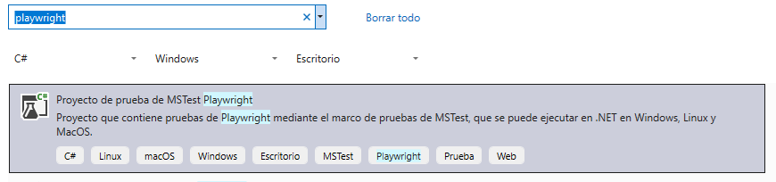
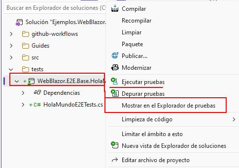
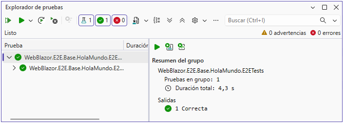

# Pruebas de extremo a extremo (E2E) E2E 

> **Pruebas de extremo a extremo (E2E)**: son un tipo de prueba de software que valida la funcionalidad completa de una aplicación desde el punto de vista del usuario final. Estas pruebas simulan escenarios del mundo real para garantizar que todos los componentes del sistema funcionen correctamente juntos. **La prueba se realiza directamente sobre la interfaz que una persona usa.**

> **PlayWright**: es una biblioteca de automatización de navegadores desarrollada por Microsoft, con soporte oficial para Chromium, Firefox y WebKit. Tiene la ventaja que espera que el elemento exista, tiene aserciones con reintento, cada prueba recibe un contexto de navegador propio, cookies y almacenamientos nuevos.


## Índice detallado

La tabla de arriba dice de qué trata cada capítulo; esta lista lleva directo a cada sección.

- **[1. Creación del proyecto](#1-creacion-del-proyecto)**
- **[2. Ejemplo: Hola Mundo!](#2-ejemplo-hola-mundo)**
- **[2.1 El testigo de hidratación](#el-testigo-de-hidratacion)**
- **[3. Cómo se diseña un caso](#3-como-se-disena-un-caso)**
- **[4. Anexos](#4-anexos)**

---


## 1. Creación del proyecto

Desde la línea de comandos, se puede crear un proyecto NUnit y agregar el paquete Microsoft.Playwright.NUnit con los siguientes comandos:

```bash
dotnet new nunit -n <Proyecto>.E2ETests -o tests/<Proyecto>.E2ETests
dotnet add tests/<Proyecto>.E2ETests package Microsoft.Playwright.NUnit
dotnet sln add tests/<Proyecto>.E2ETests
```
O desde el asistente de creación de proyecto de Visual Studio, seleccionando el tipo de proyecto NUnit y agregando el paquete Microsoft.Playwright.NUnit.



---

## 2. Ejemplo: Hola Mundo!

### Estructura del proyecto

En la carpeta test se alojan todos los proyectos de prueba, y en la carpeta src se alojan todos los proyectos de código fuente. La estructura del proyecto es la siguiente:

```
Lab-E2E.WebBlazor.Base
│   
│   Ejemplos.WebBlazor.E2E.Base.slnx
│
├───.github
│   └───workflows
│
├───src
│   └───WebBlazor.E2E.Base.HolaMundo
│       │   Program.cs
│       │   WebBlazor.E2E.Base.HolaMundo.csproj
│       │
│       └───Components
│           │
│           └───Pages
│                   HolaMundo.razor
│
└───tests
        WebBlazor.E2E.Base.HolaMundo.E2ETests
            HolaMundoE2ETests.cs
            WebBlazor.E2E.Base.HolaMundo.E2ETests.csproj
       
```


### Página blazor de prueba

HolaMundo.razor
```html
@page "/HolaMundo"

@rendermode InteractiveServer
@attribute [StreamRendering]

<h3>HolaMundo</h3>

<div class="card col-3">
    <div class="form-group">

        <!--
            InputText:

            Al elemento del DOM se identifica con: data-testid="campo-frase" 

            Se llena con: await Page.GetByTestId("campo-frase").FillAsync(frase);
         -->

        <InputText data-testid="campo-frase" class="form-control" @bind-Value="Frase"></InputText>

        <!--
            button:

            Al elemento del DOM se identifica con: data-testid="boton-mostrar-frase"

            Se llena con: await Page.GetByTestId("boton-mostrar-frase").ClickAsync();
         -->

        <button data-testid="boton-mostrar-frase" class="btn btn-primary" 
                @onclick="async () => await OnMostrarMensajeAsync()">Mostrar Mensaje</button>
    </div>
</div>

<!--
  div

  Al elemento del DOM se identifica con: data-testid="campo-mensaje"

  Se llena con: 
        para un input: await Expect(Page.GetByTestId("campo-mensaje")).ToHaveValueAsync(frase);
        para un div:   await Expect(Page.GetByTestId("campo-mensaje")).ToHaveTextAsync(frase);
-->
<div class="card col-3" data-testid="campo-mensaje">
    @Mensaje
</div>

@code {
    string Frase = "Hola Mundo";
    string Mensaje = string.Empty;

    async private Task OnMostrarMensajeAsync()
    {
        Mensaje = Frase;
    }
}
```

Cada caso de prueba tiene tres partes, en este orden:

- **Iniciar** a en estado conocido: En NUnit se traduce a un `[SetUp]` que deja la pantalla abierta 

- **Actuar**, y **Verificar**: En NUnit se traduce a un `[Test]` que realiza la acción y verifica el resultado esperado.

HolaMundoE2ETests.cs
```csharp 
public class HolaMundoE2ETests: PageTest
{
    [SetUp]
    public async Task Setup()
    {
        await Page.GotoAsync("https://localhost:7071/HolaMundo");
    }

    [Test]
    [Description("Mostrar Mensaje de texto")]
    public async Task MostrarMensaje()
    {
        string frase = "Hola mundo! - que tal?";

        await Page.GetByTestId("campo-frase").FillAsync(frase);
        await Page.GetByTestId("boton-mostrar-frase").ClickAsync();
        //await Expect(Page.GetByTestId("campo-mensaje")).ToHaveValueAsync(frase);
        await Expect(Page.GetByTestId("campo-mensaje")).ToHaveTextAsync(frase);
    }
}
```

### El testigo de hidratación

Una superficie `InteractiveServer` llega a la pantalla **dos veces**. Primero el
servidor manda el HTML ya armado: se ve completo, pero es una foto. Los manejadores
—`@onclick`, `@bind-Value`, el `EditForm`— viven del lado del servidor y todavía no
hay línea que los conecte. Recién cuando el navegador baja `blazor.web.js` y abre el
WebSocket —el *circuito*— Blazor adopta ese marcado y lo conecta. **Eso es hidratar.**

Entre las dos hay una ventana de decenas o cientos de milisegundos donde la pantalla
parece lista y está muerta. Ahí está la trampa para Playwright: antes de cada clic
verifica que el elemento exista, sea visible, esté habilitado y esté quieto, y en esa
ventana **las cuatro cosas se cumplen**. Hace clic, nadie lo escucha, y no reintenta:
desde su punto de vista el clic salió bien. El fracaso aparece después, en la
aserción, con un mensaje que habla de otra cosa. Es el retrato del caso intermitente.

Peor todavía cuando el control es un `type="submit"` dentro de un `EditForm`: sin
hidratar el clic no es inerte, dispara el envío HTML de toda la vida y recarga la
página entera.

La solución es un **testigo**: un elemento del marcado cuyo único trabajo es afirmar
en el DOM un hecho que la prueba no puede deducir mirando. Su condición de validez es
una sola —**solo lo puede escribir código que ya corre del lado del circuito**—, y por
eso su presencia no es una promesa sino una prueba.

En el marcado:

```razor
<span class="mq-sr-only" data-testid="estado-app" data-interactivo="@_interactivo"></span>

@code {
    // Arranca en `false` y así viaja en el HTML del servidor: el testigo dice que no
    // hay circuito hasta que lo haya.
    private string _interactivo = "false";

    // `OnAfterRender` solo corre del lado del circuito: si esto se ejecutó, la
    // superficie ya responde. Es lo que hace del testigo una prueba y no una promesa.
    protected override void OnAfterRender(bool primeraVez)
    {
        if (!primeraVez || _interactivo == "true") { return; }

        _interactivo = "true";
        StateHasChanged();
    }
}
```

Y en el `[SetUp]`, después de abrir la pantalla:

```csharp
await Expect(Page.GetByTestId("estado-app"))
    .ToHaveAttributeAsync("data-interactivo", "true");
```

`Expect` **sí reintenta**, a diferencia del clic: la carrera se convierte en una espera
con una condición explícita, y si algo se rompe de verdad el error nombra el problema
real. El elemento está fuera de la vista (`mq-sr-only`) porque es un dato para
máquinas; las aserciones de atributo no necesitan que sea visible.

Es la misma disciplina que `campo-frase` y `campo-mensaje` —lo que la prueba necesita
nombrar se declara en el marcado— aplicada a un estado en vez de a un control. Un
matiz: el testigo prueba que **el circuito abrió**, no que un componente en particular
quedó conectado. En una superficie con varias islas interactivas, cada isla quiere el
suyo.

### Correr desde el epxlorador de pruebas

Haciendo click derecho sobre el proyecto de pruebas, se puede ejecutar desde el explorador de pruebas de Visual Studio.


Y luego mostrará el resultado de la ejecución



### workflow de GitHub Actions

e2e.yml
```
name: E2E

on:

  workflow_dispatch:
    inputs:
      navegadores:
        description: Configuraciones a ejecutar.
        type: choice
        default: chromium
        options:
          - chromium
          - chromium,firefox
          - chromium,firefox,webkit
          - chromium,firefox,webkit,mobile-chrome
      url-base:
        description: URL ya desplegada contra la que probar. Vacío = se publica y se levanta localmente.
        type: string
        default: ''

  schedule:
    # Regresión completa todas las noches (03:15 UTC ≈ 00:15 en Argentina).
    - cron: '15 3 * * *'

# Una corrida por rama: si llega un push nuevo, la anterior se cancela.
concurrency:
  group: e2e-${{ github.workflow }}-${{ github.ref }}
  cancel-in-progress: ${{ github.event_name == 'pull_request' }}

permissions:
  contents: read

env:
  # `inputs` está vacío en `schedule`, de ahí los valores por defecto explícitos.
  CI: 'true'
  NAVEGADORES: ${{ inputs.navegadores || 'chromium,firefox,webkit,mobile-chrome' }}
  URL_BASE: ${{ inputs.url-base || '' }}
  RETENCION_DIAS: ${{ inputs.retencion-dias || 7 }}
  ARTEFACTO_APLICACION: aplicacion-publicada
  PROYECTO_PRUEBAS: tests/MovilidadUrbana.E2ETests

jobs:
  # Compila una única vez la aplicación que van a ejercitar todas las configuraciones.
  publicar:
    name: Publicar la aplicación
    # Contra un entorno ya desplegado no hay nada que compilar.
    if: ${{ inputs.url-base == '' }}
    # Runner autoalojado del laboratorio. Se deja comentado como ejemplo de cómo apuntar a uno
    # propio: la etiqueta `i7infra-dev` es la que identifica a ese runner en el repositorio.
    # runs-on: [self-hosted, i7infra-dev]
    runs-on: ubuntu-latest
    timeout-minutes: 20
    steps:
      - name: Descargar el código
        uses: actions/checkout@v7
        with:
          ref: ${{ inputs.referencia || github.ref }}

      - name: Preparar el SDK de .NET
        # En el runner autoalojado el SDK ya estaba instalado; en los runners de GitHub hay que
        # pedirlo, porque la imagen no garantiza la versión que necesita el proyecto.
        uses: actions/setup-dotnet@v6
        with:
          dotnet-version: '10.0.x'

      - name: Verificar que el SDK coincide con el framework del proyecto
        shell: bash
        run: |
          set -euo pipefail
          framework="$(grep -oP '(?<=<TargetFramework>)[^<]+' src/MovilidadUrbana.Web/MovilidadUrbana.Web.csproj)"
          sdk="net$(dotnet --version | cut -d. -f1).0"
          echo "csproj: $framework — runner: $sdk"
          test "$framework" = "$sdk"

      - name: Publicar autocontenido para linux-x64
        # Autocontenido: el binario no depende del runtime que tenga instalado quien lo ejecute,
        # y es exactamente el mismo artefacto que se prueba en la máquina de desarrollo.
        run: >-
          dotnet publish src/MovilidadUrbana.Web/MovilidadUrbana.Web.csproj
          --configuration Release
          --runtime linux-x64
          --self-contained true
          --output publicacion

      - name: Subir la aplicación publicada
        uses: actions/upload-artifact@v7
        with:
          name: ${{ env.ARTEFACTO_APLICACION }}
          path: publicacion
          retention-days: ${{ env.RETENCION_DIAS }}

  # Convierte la lista de configuraciones en la matriz del job siguiente.
  preparar:
    name: Preparar matriz
    # Runner autoalojado del laboratorio. Se deja comentado como ejemplo de cómo apuntar a uno
    # propio: la etiqueta `i7infra-dev` es la que identifica a ese runner en el repositorio.
    # runs-on: [self-hosted, i7infra-dev]
    runs-on: ubuntu-latest
    timeout-minutes: 5
    outputs:
      configuraciones: ${{ steps.matriz.outputs.configuraciones }}
    steps:
      - id: matriz
        shell: bash
        env:
          ENTRADA: ${{ env.NAVEGADORES }}
        run: |
          set -euo pipefail
          lista="$(echo "$ENTRADA" | tr -d ' ' | awk -F, '{for(i=1;i<=NF;i++) printf "\"%s\"%s", $i, (i<NF?",":"")}')"
          echo "configuraciones=[${lista}]" >> "$GITHUB_OUTPUT"
          echo "Configuraciones: [${lista}]" >> "$GITHUB_STEP_SUMMARY"

  pruebas:
    name: Pruebas (${{ matrix.configuracion }})
    needs: [publicar, preparar]
    # `publicar` se saltea cuando se prueba un entorno ya desplegado; eso no debe arrastrar a este job.
    if: ${{ !cancelled() && needs.preparar.result == 'success' && needs.publicar.result != 'failure' }}
    # Runner autoalojado del laboratorio. Se deja comentado como ejemplo de cómo apuntar a uno
    # propio: la etiqueta `i7infra-dev` es la que identifica a ese runner en el repositorio.
    # runs-on: [self-hosted, i7infra-dev]
    runs-on: ubuntu-latest
    timeout-minutes: 30
    strategy:
      fail-fast: false
      matrix:
        configuracion: ${{ fromJSON(needs.preparar.outputs.configuraciones) }}
    steps:
      - name: Descargar el código
        uses: actions/checkout@v7
        with:
          ref: ${{ inputs.referencia || github.ref }}

      - name: Preparar el SDK de .NET
        # En el runner autoalojado el SDK ya estaba instalado; en los runners de GitHub hay que
        # pedirlo, porque la imagen no garantiza la versión que necesita el proyecto.
        uses: actions/setup-dotnet@v6
        with:
          dotnet-version: '10.0.x'

      - name: Traducir la configuración a navegador y emulación
        shell: bash
        run: |
          set -euo pipefail
          # `mobile-chrome` no es un navegador sino chromium con el descriptor de un Pixel 7.
          case "${{ matrix.configuracion }}" in
            mobile-chrome) echo "NAVEGADOR=chromium" >> "$GITHUB_ENV"; echo "EMULAR_MOVIL=true" >> "$GITHUB_ENV" ;;
            *) echo "NAVEGADOR=${{ matrix.configuracion }}" >> "$GITHUB_ENV"; echo "EMULAR_MOVIL=false" >> "$GITHUB_ENV" ;;
          esac

      - name: Compilar las pruebas
        run: dotnet build ${{ env.PROYECTO_PRUEBAS }} --configuration Release

      - name: Caché de los navegadores de Playwright
        # El runner autoalojado conservaba la caché entre corridas por ser un contenedor de larga
        # vida; los de GitHub arrancan limpios cada vez y sin esto bajarían el navegador en cada
        # job de la matriz. La clave se apoya en el csproj: cambia cuando cambia la versión de
        # Playwright, que es cuando cambian las builds de los navegadores.
        uses: actions/cache@v6
        with:
          path: ~/.cache/ms-playwright
          key: playwright-${{ runner.os }}-${{ env.NAVEGADOR }}-${{ hashFiles('tests/MovilidadUrbana.E2ETests/MovilidadUrbana.E2ETests.csproj') }}

      - name: Instalar el navegador y sus dependencias del sistema
        # El CLI viene dentro del paquete Microsoft.Playwright y baja la build que corresponde a
        # su versión, así que la biblioteca y el navegador no se pueden desincronizar.
        # El runner conserva la caché entre corridas: a partir de la segunda es casi instantáneo.
        shell: bash
        run: |
          set -euo pipefail
          cli="${{ env.PROYECTO_PRUEBAS }}/bin/Release/net10.0/.playwright"
          "$cli/node/linux-x64/node" "$cli/package/cli.js" install --with-deps "$NAVEGADOR"

      - name: Traer la aplicación publicada
        if: ${{ inputs.url-base == '' }}
        uses: actions/download-artifact@v8
        with:
          name: ${{ env.ARTEFACTO_APLICACION }}
          path: publicacion

      - name: Devolver el permiso de ejecución
        # Los artefactos de Actions se empaquetan en zip y pierden el bit de ejecución.
        if: ${{ inputs.url-base == '' }}
        run: chmod +x publicacion/MovilidadUrbana.Web

      - name: Ejecutar las pruebas
        env:
          URL_BASE: ${{ inputs.url-base || '' }}
          # El fixture publica la aplicación antes de probar; acá no hace falta, porque llega como
          # artefacto del job `publicar`, autocontenida y compilada una sola vez para toda la matriz.
          PUBLICAR_ANTES_DE_PROBAR: 'false'
        run: >-
          dotnet test ${{ env.PROYECTO_PRUEBAS }}
          --configuration Release
          --no-build
          --settings pruebas.runsettings
          --logger "trx;LogFileName=${{ matrix.configuracion }}.trx"
          --results-directory resultados
          -- Playwright.BrowserName=${{ env.NAVEGADOR }}

      - name: Subir los resultados
        # Sube la carpeta entera: el TRX de la configuración y, si algún caso falló, su traza de
        # Playwright en `trazas/*.zip` —que se abre con `playwright show-trace`—.
        if: ${{ !cancelled() }}
        uses: actions/upload-artifact@v7
        with:
          name: resultados-${{ matrix.configuracion }}
          path: resultados
          retention-days: ${{ env.RETENCION_DIAS }}
          if-no-files-found: ignore

  reporte:
    name: Reporte unificado
    needs: [preparar, pruebas]
    if: ${{ !cancelled() }}
    # Runner autoalojado del laboratorio. Se deja comentado como ejemplo de cómo apuntar a uno
    # propio: la etiqueta `i7infra-dev` es la que identifica a ese runner en el repositorio.
    # runs-on: [self-hosted, i7infra-dev]
    runs-on: ubuntu-latest
    timeout-minutes: 15
    outputs:
      resultado: ${{ needs.pruebas.result }}
    steps:
      - name: Traer los resultados de todas las configuraciones
        uses: actions/download-artifact@v8
        with:
          path: resultados
          pattern: resultados-*
          merge-multiple: true

      - name: Resumen en la corrida
        # El binding de .NET no tiene `merge-reports`: el reporte de cada configuración es un TRX,
        # y acá se juntan los contadores en una única tabla.
        shell: bash
        run: |
          set -euo pipefail
          {
            echo "## Pruebas E2E"
            echo
            echo "| Configuración | Total | Pasaron | Fallaron |"
            echo "| --- | ---: | ---: | ---: |"
          } >> "$GITHUB_STEP_SUMMARY"

          node -e '
            const fs = require("fs"), path = require("path");
            const dir = "resultados";
            const archivos = fs.existsSync(dir) ? fs.readdirSync(dir).filter(f => f.endsWith(".trx")) : [];
            for (const archivo of archivos.sort()) {
              const xml = fs.readFileSync(path.join(dir, archivo), "utf8");
              const c = xml.match(/<Counters\b[^>]*>/);
              const leer = (clave) => (c && c[0].match(new RegExp(clave + '"'"'="(\\d+)"'"'"'))?.[1]) ?? "?";
              const nombre = path.basename(archivo, ".trx");
              console.log(`| \`${nombre}\` | ${leer("total")} | ${leer("passed")} | ${leer("failed")} |`);
            }
            if (archivos.length === 0) console.log("| _sin resultados_ | | | |");
          ' >> "$GITHUB_STEP_SUMMARY"

          {
            echo
            echo "| Concepto | Valor |"
            echo "| --- | --- |"
            echo "| Resultado | \`${{ needs.pruebas.result }}\` |"
            echo "| Configuraciones | \`${{ env.NAVEGADORES }}\` |"
            echo "| Entorno | \`${URL_BASE:-aplicación publicada en el propio job}\` |"
            echo
            echo "Los TRX de cada configuración quedan en los artefactos **resultados-\*** de esta corrida."
          } >> "$GITHUB_STEP_SUMMARY"

      - name: Reflejar el resultado de las pruebas
        if: ${{ needs.pruebas.result != 'success' }}
        run: exit 1
```

## 3. Cómo se diseña un caso

Este capítulo dice cómo se **escriben** las pruebas. Qué probar en cada superficie, y
con qué criterios se decide, está tratado caso por caso:

- [`Caso-HolaMundo-Page.md`](Caso-HolaMundo-Page.md) — una superficie interactiva.
- [`Caso-Login-Page.md`](Caso-Login-Page.md) — una superficie SSR detrás de un acceso.

Se leen mejor juntos: casi todo lo que cambia entre ellos se explica por una sola
diferencia —si la superficie abre circuito o no—, y ese es el punto.

## 4. Anexos

> ¿Por qué HomepageHasPlaywrightInTitleAndGetStartedLinkLinkingtoTheIntroPage produjo una excepción?

> Puede que se haya producido esta excepción porque los binarios del navegador de Playwright no están instalados en el sistema. El cambio que probablemente causó este error es la creación de la clase Tests que hereda de PageTest. Cuando NUnit ejecuta el test Tests.HomepageHasPlaywrightInTitleAndGetStartedLinkLinkingtoTheIntroPage, el método de configuración BrowserTest.BrowserSetup() (clase base de PageTest) intenta lanzar el navegador mediante BrowserType.LaunchAsync(). Este método busca el ejecutable del navegador en la ruta especificada, pero como los navegadores no se han descargado mediante el script de instalación de Playwright, el ejecutable no existe y se lanza la excepción.
Para resolver esto, ejecuta el comando sugerido en el mensaje de error para descargar los navegadores necesarios.

```bash
cd WebBlazor.E2E.Base.HolaMundo.E2ETests\
./bin/Debug/net10.0/playwright.ps1 install
```