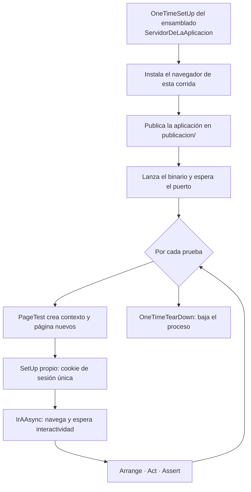

# Montar un E2E de un ABM

Receta para quien ya escribió pruebas de extremo a extremo y necesita el camino corto: qué se copia
tal cual, qué se decide en cada ABM y dónde están las trampas propias de Blazor con render
*interactive server*. Toma como base el ABM de localidades de
[Lab-E2E.WebBlazor](../../Lab-E2E.WebBlazor), que tiene nueve casos en verde.

Si en algún paso falta el fundamento —por qué se elige un localizador y no otro, qué es el circuito
de Blazor, cómo se decide qué testear— está desarrollado en
[Beginner-Guide.md](Beginner-Guide.md); acá se enlaza y no se repite.

## Marcas de evidencia

Se usan las mismas que la guía de estudio, para que las dos se lean igual.

| Marca | Significado |
| --- | --- |
| **[E: ruta]** | *Evidencia en el repositorio*: se comprueba abriendo ese archivo |
| **[V]** | *Verificado por ejecución*: se corrió y se observó el resultado |
| **[C]** | *Criterio*: decisión del laboratorio, defendible y discutible |

---

# 1. El ciclo de una corrida

Conviene tener el ciclo en la cabeza antes de escribir el primer caso, porque define qué es
responsabilidad del fixture y qué de cada prueba.



Las tres primeras cajas no dependen del entorno: corren igual en la consola, en Visual Studio y en
CI. **[E: tests/MovilidadUrbana.E2ETests/Infraestructura/ServidorDeLaAplicacion.cs:37-55]**

---

# 2. Los siete pasos

## 2.1. Poner el contrato en la pantalla

Antes que la prueba va el `data-testid`. Es un contrato explícito entre la pantalla y la prueba: el
texto y las clases cambian con el diseño, un `data-testid` cambia solo si alguien decide romperlo.

El ABM de localidades expone 28. **[E: src/MovilidadUrbana.Web/Components/Pages/Localidades.razor]**
La nomenclatura no es arbitraria y conviene sostenerla en el ABM siguiente **[C]**:

| Familia | Ejemplos | Qué identifica |
| --- | --- | --- |
| `campo-*` | `campo-nombre`, `campo-codigo-postal` | Un control de entrada |
| `error-*` | `error-nombre`, `error-habitantes` | El mensaje de validación de ese control |
| `boton-*` | `boton-guardar`, `boton-confirmar-baja` | Una acción |
| `celda-*` | `celda-nombre`, `celda-habitantes` | Una columna de la tabla |
| Singulares | `fila`, `contador`, `sin-datos`, `aviso` | Estructura y estado del listado |

Un ABM necesita las cinco familias. Si al escribir los casos falta un `data-testid`, se agrega a la
pantalla: es parte del trabajo, no una concesión.

## 2.2. Crear el proyecto

```bash
dotnet new nunit -n <Proyecto>.E2ETests -o tests/<Proyecto>.E2ETests
dotnet add tests/<Proyecto>.E2ETests package Microsoft.Playwright.NUnit
dotnet sln add tests/<Proyecto>.E2ETests
```

**El namespace del `[SetUpFixture]` importa**: cubre su propio namespace y los que cuelgan de él,
nunca el de arriba. Puesto en `...E2ETests.Infraestructura` no corre para las pruebas de
`...E2ETests`, y el síntoma es desconcertante —la URL base llega vacía—. Va en el namespace raíz de
las pruebas, aunque el archivo viva en una subcarpeta.
**[E: tests/MovilidadUrbana.E2ETests/Infraestructura/ServidorDeLaAplicacion.cs, declaración de namespace]**

## 2.3. Copiar la infraestructura

Dos archivos se copian casi sin cambios entre proyectos. Lo único que se toca es el nombre del
ensamblado de la aplicación y el de la cookie de sesión.

`ServidorDeLaAplicacion` levanta y baja la aplicación bajo prueba. Concentra tres responsabilidades
que **no** conviene dejar en el build **[C]**: instalar el navegador, publicar la aplicación y
lanzarla. Atadas al build quedan a merced de que el entorno decida compilar —Visual Studio evalúa
por su cuenta si el proyecto está al día—, y cuando esa decisión no sale como se espera, todas las
pruebas mueren juntas en `OneTimeSetUp`.
**[E: tests/MovilidadUrbana.E2ETests/Infraestructura/ServidorDeLaAplicacion.cs:97, :137, :207]**

`PruebaE2E : PageTest` es la clase base de todos los casos. Aporta el aislamiento por sesión, la
espera de interactividad y la navegación por el menú.
**[E: tests/MovilidadUrbana.E2ETests/Infraestructura/PruebaE2E.cs:14]**

## 2.4. Aislar los datos de cada prueba

Con el estado en el servidor, todas las pruebas comparten la base. La salida es que la aplicación
reparta un espacio de datos por sesión y que cada prueba estrene el suyo:

```csharp
// PruebaE2E.cs:58 — corre después del [SetUp] de PageTest, que es el que crea el contexto
[SetUp]
public async Task EstrenarSesionAsync()
{
    await Context.AddCookiesAsync(
    [
        new Cookie
        {
            Name = CookieDeSesion,
            Value = Guid.NewGuid().ToString("n"),
            Url = ServidorDeLaAplicacion.UrlBase
        }
    ]);
}
```

Del lado de la aplicación hace falta un middleware que emita la cookie y repositorios que filtren
por ella. El desarrollo está en [§7.3 de la guía de estudio](Beginner-Guide.md#73-aislar-el-estado-cuando-vive-en-el-servidor).

Sin esto no hay paralelismo posible y las pruebas se pisan entre sí.

## 2.5. Escribir la matriz de casos

Un ABM tiene una matriz de casos que se repite. Estos son los nueve de localidades, con lo que
protege cada uno. **[E: tests/MovilidadUrbana.E2ETests/LocalidadesTests.cs]**

| # | Caso | Qué se rompería sin él |
| --- | --- | --- |
| 1 | Muestra el listado sembrado | La pantalla no carga, o la siembra dejó de funcionar |
| 2 | Rechaza el alta con campos inválidos | Se guarda basura; los mensajes por campo dejaron de mostrarse |
| 3 | Da de alta y persiste tras recargar | El alta vive solo en el estado del circuito y no llega a la base |
| 4 | No permite duplicar dentro de la misma provincia | La regla de unicidad del dominio se perdió |
| 5 | Modifica una existente | La edición crea en vez de actualizar, o pierde campos |
| 6 | Cancelar la baja deja la tabla intacta | El diálogo de confirmación no confirma nada |
| 7 | Confirmar la baja elimina la fila | La baja no llega, o borra otra fila |
| 8 | Al borrar todo avisa que no hay datos | El estado vacío no existe, o la siembra se repite sola |
| 9 | Cada prueba trabaja sobre sus propios datos | El aislamiento se rompió y las pruebas empezaron a depender del orden |

Los primeros ocho son el ABM; el noveno prueba la infraestructura, no la pantalla, y por eso se
escribe una sola vez por proyecto **[C]**.

Tres decisiones al escribirlos:

**La persistencia se verifica recargando.** Aserciones sobre la pantalla después de guardar prueban
el render; recargar prueba que el dato llegó a la base.

```csharp
// LocalidadesTests.cs:39 — el alta completa
await Page.GetByTestId("campo-nombre").FillAsync("Goya");
await Page.GetByTestId("campo-provincia").SelectOptionAsync("Corrientes");
await Page.GetByTestId("boton-guardar").ClickAsync();

await Expect(Page.GetByTestId("aviso")).ToHaveTextAsync("Se agregó la localidad Goya.");
await Expect(Page.GetByTestId("fila")).ToHaveCountAsync(3);

await Page.ReloadAsync();                                    // acá se prueba la base
await Expect(Page.GetByTestId("fila")).ToHaveCountAsync(3);
```

**Las filas se localizan por contenido, no por índice.** `Filter` sobrevive a un cambio de orden;
`Nth(2)` no:

```csharp
var fila = Page.GetByTestId("fila").Filter(new() { HasText = "Goya" });
await Expect(fila.GetByTestId("celda-habitantes")).ToHaveTextAsync("89.000");
```

**Las aserciones esperan solas.** `Expect(...)` reintenta hasta el tiempo límite. Ninguna espera
fija, ningún `Task.Delay`.

## 2.6. Configurar la corrida

`pruebas.runsettings` fija navegador, tiempo límite de aserción y cantidad de workers; el navegador
se pisa por línea de comandos con `-- Playwright.BrowserName=firefox`.
**[E: pruebas.runsettings]**

El paralelismo tiene un techo que conviene conocer antes de chocarlo:

```csharp
// ParalelismoDelEnsamblado.cs — clases en paralelo, casos de cada clase en secuencia
[assembly: Parallelizable(ParallelScope.Fixtures)]
[assembly: LevelOfParallelism(3)]
```

Subirlo a `ParallelScope.Children` rompe la integración de Playwright con NUnit, que lleva un
registro de servicios por worker: la corrida falla con
`The given key 'Browser' was not present in the dictionary`. **[V]**

## 2.7. Atarlo a la integración continua

El diseño que sostiene el laboratorio: publicar una vez, probar muchas. Un job publica la aplicación
autocontenida y la sube como artefacto; la matriz de configuraciones la reutiliza.
**[E: .github/workflows/e2e.yml]**

En CI se desactivan las dos comodidades locales, porque allá la aplicación ya llega publicada:

| Variable | Valor en CI | Efecto |
| --- | --- | --- |
| `PUBLICAR_ANTES_DE_PROBAR` | `false` | El fixture no republica sobre el artefacto |
| `INSTALAR_NAVEGADORES` | *(sin definir)* | Se instala igual; el job usa `--with-deps` por las librerías del sistema |

Para que el pull request no se pueda integrar con las pruebas en rojo hace falta, además, una regla
de protección de rama que exija el check resumen. El desarrollo está en
[§8.4 de la guía de estudio](Beginner-Guide.md#84-atar-las-pruebas-al-merge-del-pull-request).

---

# 3. Las trampas que cuestan una tarde

Ordenadas por lo que tardan en aparecer.

| Síntoma | Causa | Salida |
| --- | --- | --- |
| El click no hace nada, de forma intermitente | La página está prerenderizada pero el circuito no conectó | Esperar un testigo de interactividad antes del primer click **[E: tests/MovilidadUrbana.E2ETests/Infraestructura/PruebaE2E.cs:86]** |
| La validación rechaza un formulario que se ve completo | `FillAsync` dispara `input`, y `@bind` escucha `change` | `@bind:event="oninput"` en los campos **[E: src/MovilidadUrbana.Web/Components/Pages/Localidades.razor:56]** |
| Las pruebas se pisan entre sí | Estado compartido en el servidor | Cookie de sesión por prueba **[E: tests/MovilidadUrbana.E2ETests/Infraestructura/PruebaE2E.cs:58]** |
| `The given key 'Browser' was not present` | `ParallelScope.Children` | Bajar a `ParallelScope.Fixtures` **[V]** |
| La URL base llega vacía | El `[SetUpFixture]` está en un namespace hijo | Moverlo al namespace de las pruebas |
| Recursos estáticos vacíos, con `200` y `Content-Length: 0` | La aplicación se lanzó desde otra carpeta y no encuentra `wwwroot` | Fijar `WorkingDirectory` en la carpeta de la publicación |
| `No se encontró MovilidadUrbana.Web` en Windows | El apphost lleva `.exe` en Windows | Resolver el nombre según el sistema operativo **[E: tests/MovilidadUrbana.E2ETests/Infraestructura/ServidorDeLaAplicacion.cs:207]** |

---

# 4. Lista de verificación

Antes de dar por montado el E2E de un ABM:

- [ ] Las cinco familias de `data-testid` están en la pantalla.
- [ ] El `[SetUpFixture]` está en el namespace raíz de las pruebas.
- [ ] Cada prueba estrena su sesión y ninguna depende del orden.
- [ ] Los ocho casos del ABM están escritos, más el de aislamiento.
- [ ] Al menos un caso recarga la página para probar persistencia.
- [ ] Ninguna espera fija: solo aserciones que reintentan.
- [ ] La suite corre en verde desde cero, sin publicar ni instalar nada a mano.
- [ ] CI publica una vez y reutiliza el artefacto en toda la matriz.

---

# 5. Evidencia

Lo verificado en la preparación de esta guía, sobre el commit de `main` del 2026-08-24:

| Qué | Resultado |
| --- | --- |
| Suite completa desde cero, borrando `publicacion/` y `.navegadores/` | 22 pruebas en verde en chromium, firefox, webkit y chromium con emulación de Pixel 7 **[V]** |
| Casos del ABM de localidades | 9, todos en verde **[V]** |
| `data-testid` en la pantalla del ABM | 28 **[E: src/MovilidadUrbana.Web/Components/Pages/Localidades.razor]** |

Lo que **no** está verificado: la ejecución desde el Explorador de pruebas de Visual Studio. El
proyecto compila y `dotnet test --list-tests` descubre los casos, pero no se abrió la solución en
Visual Studio en esta ejecución.
