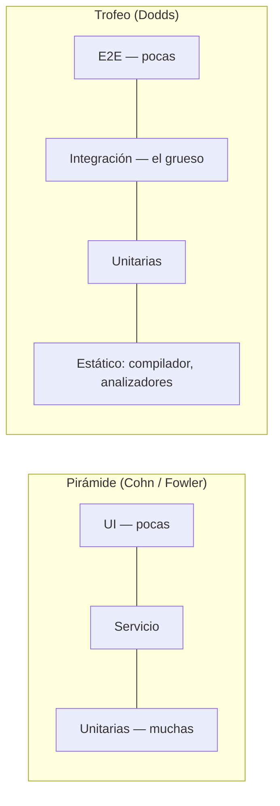
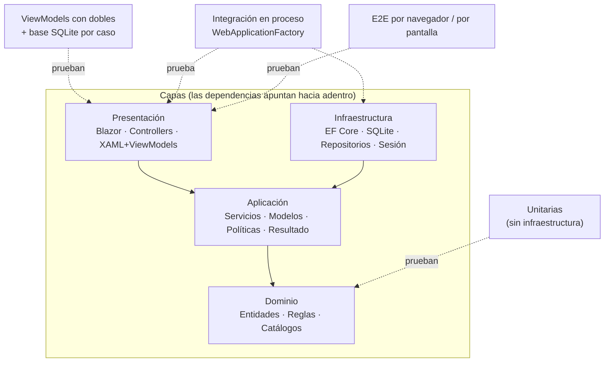
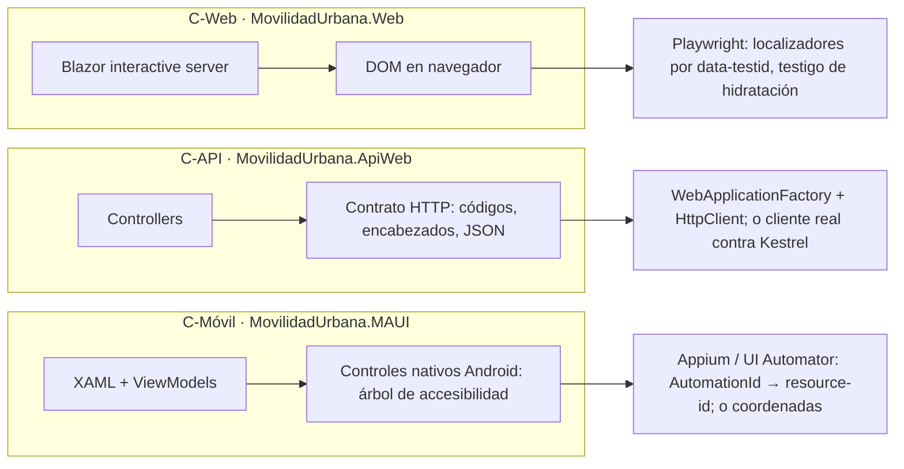

# Panorama de pruebas automatizadas — qué tipos hay y cuál va en qué lugar

> **De qué va** — Los tipos de prueba automatizada que se usan en soluciones .NET —de una regla de dominio a una app Android en un teléfono—, qué verifica cada uno, con qué costo, y el criterio para decidir cuál corresponde en cada situación.
> **Para quién** — Quien ya escribió pruebas E2E con Playwright y ahora tiene que probar una API REST, una app MAUI o una capa de dominio, y no sabe con qué.
> **Qué deja** — Un marco de referencia —escenarios, contextos, actores— que los otros dos documentos de esta carpeta reutilizan; la taxonomía de la industria con su procedencia; la correspondencia entre capas de Clean Architecture y tipos de prueba; y un mapa «estoy acá → aplico esto», anclado a las cinco suites reales del laboratorio.

**Qué es:** el documento de entrada de `Guides/Test-Guide/`. Fija el vocabulario y el marco; los dos
hermanos —[Pruebas-Unitarias-Y-Arquitectura.md](Pruebas-Unitarias-Y-Arquitectura.md) y
[Pruebas-De-Interfaz-Por-Pantalla.md](Pruebas-De-Interfaz-Por-Pantalla.md)— profundizan cada uno un
tramo.

**Por qué existe:** las guías de [`E2E-Guide/`](../E2E-Guide/) enseñan un solo tipo de prueba, la de
extremo a extremo por navegador, y la enseñan bien. Pero ese tipo necesita un DOM, y en una app
Android no lo hay; necesita un navegador, y una API no lo tiene; y es la prueba más cara de escribir
y de correr, así que no puede ser la única. Este documento ubica a la E2E entre las demás.

---

## Índice

- **[Marcas de evidencia](#marcas-de-evidencia)**
- **[1. Definiciones](#1-definiciones)** — prueba automatizada, sistema bajo prueba, doble de prueba (stub: tapar la dependencia; fake: una versión alternativa que funciona; mock: la ilusión de que existe o se la sustituye), nivel, aislamiento
- **[2. El marco de referencia](#2-el-marco-de-referencia)** — escenarios, contextos y actores que usan los tres documentos
- **[3. La taxonomía de la industria](#3-la-taxonomía-de-la-industria)** — unitaria, integración, sistema/E2E, y las dos figuras (pirámide y trofeo) que discuten la proporción
- **[4. Qué prueba cada capa de Clean Architecture](#4-qué-prueba-cada-capa-de-clean-architecture)** — la regla de dependencia convertida en regla de prueba
- **[5. La capa de datos](#5-la-capa-de-datos)** — base real, SQLite como doble, proveedor en memoria, repositorio simulado
- **[6. Qué cambia según el tipo de aplicación](#6-qué-cambia-según-el-tipo-de-aplicación)** — web Blazor, API REST, app MAUI
- **[7. Criterios de diseño](#7-criterios-de-diseño)** — las preguntas que deciden qué prueba escribir; cuándo un `Mock<T>` de Moq es un mock y cuándo un stub; cuánto realismo pagar en cada dependencia, y quién cubre el que se resigna
- **[8. Mapa: estoy acá → aplico esto](#8-mapa-estoy-acá--aplico-esto)**
- **[9. Lo que este documento no cubre](#9-lo-que-este-documento-no-cubre)**
- **[10. Bibliografía](#10-bibliografía)** — con su grado de verificación
- **[11. El criterio, en una línea](#11-el-criterio-en-una-línea)**

---

## Marcas de evidencia

Las mismas del conjunto E2E ([Mapa-Del-Conjunto.md](../E2E-Guide/Mapa-Del-Conjunto.md)):

| Marca | Significado |
| --- | --- |
| **[E: ruta]** | *Evidencia en el repositorio* `Lab-E2E.WebBlazor`, commit `10ce735` (2026-09-12): se comprueba abriendo ese archivo |
| **[V]** | *Verificado por ejecución*: se corrió y se observó el resultado, en la fecha indicada |
| **[B: n]** | *Bibliografía*: la afirmación viene de la fuente `n` de la §10, consultada el 2026-09-12 |
| **[C]** | *Criterio*: decisión de esta guía, defendible y discutible |

---

## 1. Definiciones

Se fijan antes de usarse. Las cuatro primeras vienen de la literatura; la quinta es el vocabulario
del conjunto E2E, que acá se conserva.

**Prueba automatizada.** Un programa que ejercita otro programa y decide solo si el resultado es el
esperado. Microsoft lo formula como la propiedad *self-checking*: «The test should automatically
detect if it passed or failed without any human interaction» **[B: 5]**. Lo que necesita a una
persona mirando no es una prueba automatizada; es una demostración.

**Sistema bajo prueba (SUT).** Lo que la prueba ejercita, delimitado. Puede ser un método, una clase
con sus colaboradores, un proceso entero o un dispositivo con la app instalada. **Cada tipo de
prueba se define, sobre todo, por dónde pone ese límite.**

**Doble de prueba (test double).** Un objeto que reemplaza a un colaborador real del SUT durante la
prueba. Meszaros distingue cinco, y Fowler los resume así **[B: 2]**:

| Doble | Definición literal | Para qué sirve |
| --- | --- | --- |
| *Dummy* | «passed around but never actually used» | Rellenar un parámetro que el caso no toca |
| *Fake* | «actually have working implementations, but usually take some shortcut» | Una base en memoria, un reloj fijo |
| *Stub* | «provide canned answers to calls made during the test» | Que el colaborador devuelva lo que el caso necesita |
| *Spy* | «stubs that also record some information based on how they were called» | Después, preguntar qué se le pidió |
| *Mock* | «objects pre-programmed with expectations» | Verificar la interacción, no el estado |

La tabla alcanza para reconocerlos; no alcanza para distinguir los dos que más se confunden, el
*stub* y el *mock*. Conviene verlos por lo que cada uno le promete a la prueba.

**Stub: tapar la dependencia.** Es una implementación mínima que ocupa el lugar de una dependencia y
no intenta reproducir su comportamiento real: solo tiene que dejar que el código que depende de ella
siga funcionando. La palabra viene de ahí. Un *method stub* es «a short and simple placeholder for a
method that is not yet written», y contiene «just enough code to allow it to be used – a declaration
with any parameters, and if applicable, a return value» **[B: 15]**:

```csharp
// Stub: alcanza con que devuelva algo del tipo correcto.
public User GetUser(int id)
{
    return new User();
}
```

En una prueba el stub aparece aunque la dependencia real **sí** exista, y por otra razón: no para
cubrir lo que falta, sino para controlar lo que responde. El `ReadThermometer` que devuelve siempre
28 del ejemplo de la misma fuente **[B: 15]** es un buen caso: con el termómetro real la prueba
dependería del clima.

**Mock: la ilusión de que la dependencia existe, o de que se la sustituye.** El punto de partida es
que sí hay una implementación real, con su lógica:

```csharp
// La dependencia real: consulta, reglas, lo que haga falta.
public class UserService : IUserService
{
    public User GetUser(int id)
    {
        // Lógica real
    }
}
```

El mock no la tapa con cualquier cosa: la **sustituye** por algo que parece ser ella y se comporta de
una manera determinada —«cuando me pidas el usuario 15, te respondo exactamente esto»—, y que además
registra cómo se lo usó, para que la prueba pueda preguntarle después: «¿me llamaste exactamente una
vez con el 15?». Es lo que dice la definición de Meszaros —«objects pre-programmed with
expectations»— y lo que Fowler llama *behavior verification* **[B: 2]**. La diferencia con el stub se
lee en las dos metáforas: el stub **tapa un hueco** para que el código siga andando; el mock
**representa** a la dependencia, lo bastante bien como para interrogarlo después.

**Fake: hago una versión alternativa que funciona.** No pretende simplemente ocupar el lugar ni fingir
determinadas respuestas: es una implementación alternativa, simplificada pero funcional, de la
dependencia. Si la real consulta SQL Server,

```csharp
public class SqlUserRepository : IUserRepository
{
    public User GetUser(int id)       { /* consulta SQL Server */ }
    public void AddUser(User user)    { /* INSERT */ }
    public void DeleteUser(int id)    { /* DELETE */ }
}
```

para las pruebas se puede construir otra que guarde en una lista y opere sobre ella:

```csharp
public class InMemoryUserRepository : IUserRepository
{
    private readonly List<User> _users =
    [
        new User { Id = 15, Name = "Fernando", IsActive = true }
    ];

    public User GetUser(int id) => _users.FirstOrDefault(x => x.Id == id);

    public void AddUser(User user) => _users.Add(user);

    public void DeleteUser(int id) => _users.RemoveAll(x => x.Id == id);
}
```

Lo que lo distingue se ve cuando se lo usa **más de una vez**:

```csharp
repository.GetUser(15);                                         // Fernando
repository.GetUser(20);                                         // null: no existe
repository.AddUser(new User { Id = 20, Name = "Ana", IsActive = true });
repository.GetUser(20);                                         // Ana: lo agregado ahora está
repository.DeleteUser(15);
repository.GetUser(15);                                         // null: lo borrado ya no está
```

Nadie programó que `GetUser(20)` devuelva `null` la primera vez y a Ana la segunda: sale solo, porque
el fake **tiene estado y reglas**, como la dependencia real. Un stub habría devuelto siempre lo mismo;
un mock habría devuelto lo que se le configuró para cada llamada.

Es la definición de Meszaros al pie de la letra: «actually have working implementations, but usually
take some shortcut» **[B: 2]**. Pedirle el 15 devuelve el 15; pedirle el 99 devuelve `null`, igual
que la base, sin que nadie lo haya programado caso por caso. **El atajo es también su riesgo:** la
versión alternativa funciona, pero no necesariamente igual. El equipo de EF Core lo muestra con la
base: SQLite compara cadenas distinguiendo mayúsculas y SQL Server no, así que una prueba puede pasar
contra el fake y fallar contra la real **[B: 3]**. Por eso la §5.1 prefiere la base real, y por eso el
`RepositorioEnMemoria` de [Pruebas-Unitarias-Y-Arquitectura.md](Pruebas-Unitarias-Y-Arquitectura.md#43-cómo-se-ve-un-stub-a-mano-de-un-repositorio)
—que es un fake— se reserva para lo que la base no puede simular.

En una línea cada uno:

> **Stub: reemplaza una ausencia. Mock: simula un comportamiento. Fake: implementa el comportamiento de otra manera.**

Puestos uno al lado del otro:

```
STUB ──── «te doy algo»                               tapar la dependencia

FAKE ──┬─ «te doy algo»                               una versión alternativa que funciona
       └─ «funciono de verdad, por un atajo»

MOCK ──┬─ «te doy algo»                               la ilusión de que existe o se la sustituye
       ├─ «me comporto de determinada manera»
       └─ «puedo decirte cómo me usaste»
```

El esquema tiene una trampa, y es la que más confunde en .NET: **la segunda línea del mock también
la puede cumplir un stub.** Un stub que devuelve un usuario activo para el id 15 ya «se comporta de
determinada manera». Lo que separa a los dos es solo la tercera línea, y no depende de cómo se
construyó el doble sino de **si la prueba afirma sobre él**. Microsoft lo formula así: «mocks are just
like stubs, except for the Assert process. You run Assert operations against a mock object, but not
against a stub» **[B: 5]**. La §7.4 lo muestra con el mismo objeto de Moq funcionando de las dos formas.

**Una progresión: cuánto de la dependencia real reproduce cada doble.** Ordenados por fidelidad al
comportamiento real, los dobles forman una escalera:

```
                REAL
                 ▲
                 │
          comportamiento
                 │
               FAKE
                 │
          comportamiento
           simplificado
                 │
               MOCK
                 │
          comportamiento
            programado
                 │
               STUB
                 │
          presencia mínima
                 │
               DUMMY
                 │
          ni siquiera se usa
```

Leída de abajo hacia arriba, cada peldaño agrega algo: el *dummy* solo ocupa un parámetro; el
*stub* devuelve algo del tipo correcto; el *mock* devuelve lo que se le programó para cada llamada;
el *fake* calcula sus respuestas con una implementación propia; lo *real* es la dependencia de
producción. **Cuanto más arriba, más confianza en que la prueba dice algo sobre producción, y más
costo** —de construirlo, de mantenerlo y, en el caso de lo real, de correrlo—.

La escalera mide una sola cosa, y hay otra que no entra en ella: **si la prueba interroga al doble
después.** Esa dimensión es la que separa al mock del stub, y no tiene que ver con cuánto se parece a
la dependencia —un mock y un stub pueden devolver exactamente lo mismo— sino con dónde va la
afirmación. Por eso conviene leerla como dos ejes:

| | Fidelidad al comportamiento real (la escalera) | ¿La prueba lo interroga después? |
| --- | --- | --- |
| **Dummy** | Ninguna: no se usa | No |
| **Stub** | Presencia mínima o respuestas fijas | No: se afirma sobre el SUT |
| **Spy** | La de un stub | Sí: registra y se le pregunta |
| **Mock** | Comportamiento programado por llamada | Sí: sus expectativas son la afirmación |
| **Fake** | Comportamiento simplificado, con estado | Normalmente no: se afirma sobre el SUT o sobre el estado del fake |
| **Real** | Total | No aplica |

El primer eje decide **cuánto se puede confiar** en lo que la prueba verifica; el segundo decide
**qué** verifica —el resultado o la interacción—. La §7.3 elige el doble por el segundo; la §7.5 decide el peldaño del primero, dependencia por
dependencia, y la §5.1 lo aplica a la base.

En el uso corriente de .NET las palabras se mezclan: la guía de Microsoft advierte que «Testing
literature and tools use the terms fake, stub, and mock inconsistently» y que en su propio uso «a
fake can be a stub or a mock» **[B: 5]**. Esta guía usa las cinco de Meszaros, porque distinguen cosas
que después importan en el diseño (§7.3). El fake y el mock se confunden por la segunda línea del
esquema, y se separan por la tercera y por el origen de las respuestas: el fake **calcula** lo que
devuelve con su propia implementación; el mock **recita** lo que se le programó y además rinde cuentas
de cómo se lo usó.

**Nivel de prueba.** El tamaño del SUT y cuántas de sus dependencias son reales. Microsoft fija los
tres que usa toda la industria: la unitaria «exercises individual software components or methods»
y «don't test infrastructure concerns»; la de integración «exercises two or more software
components' ability to function together» y «often … include infrastructure concerns»; la de carga
mide «whether or not a system can handle a specified load» **[B: 6]**. La E2E es la integración
llevada al borde: todo real, incluida la interfaz.

**Aislamiento.** Que una prueba no dependa del resultado ni de los restos de otra. Es una propiedad
de la suite, no de cada prueba, y es la que suele romperse primero cuando hay estado compartido —una
base, un archivo, un servidor—. Cómo se resolvió en el laboratorio está en la §5.3.

**Superficie, promesa, estado, testigo.** El vocabulario del conjunto E2E, definido en
[Marco-La-Superficie-Verificable.md](../E2E-Guide/Marco-La-Superficie-Verificable.md). Acá se usa
sin redefinirlo: una *superficie* es lo que una persona ve y puede hacer; una *promesa* es lo que
esa superficie afirma; un *estado* es cada forma en que puede quedar; un *testigo* es la marca
observable que dice que un estado se alcanzó.

---

## 2. El marco de referencia

Los tres documentos de esta carpeta hablan de las mismas situaciones, con los mismos nombres. Se
definen una sola vez, acá.

### 2.1 Escenarios — qué se quiere saber

| Escenario | La pregunta que responde la prueba | Ejemplo en el laboratorio |
| --- | --- | --- |
| **S1 · Regla** | ¿Esta regla de negocio decide bien, para cada entrada? | «Goya» es un nombre válido; «Ab» no **[E: tests/MovilidadUrbana.UnitTests/ReglasDeLocalidadTests.cs:13-19]** |
| **S2 · Caso de uso** | ¿Este servicio, con sus colaboradores, produce el resultado y los errores por campo correctos? | `ServicioDeLocalidades.GuardarAsync` con nombre duplicado devuelve el error en `nombre` |
| **S3 · Contrato** | ¿Este proceso, visto desde afuera por su protocolo, cumple lo que promete? | `POST /api/v1/localidades` devuelve `201` con `Location` **[E: tests/MovilidadUrbana.ApiWeb.Tests/LocalidadesTests.cs:43-57]** |
| **S4 · Superficie** | ¿Esta pantalla, usada como la usaría una persona, cumple su promesa en cada estado? | El asistente no avanza del paso 1 con datos inválidos; las 22 E2E de la web |
| **S5 · Persistencia** | ¿Lo que se guarda se recupera igual, con las reglas del motor real? | La siembra por sesión y el filtro por `SesionId` sobre SQLite |
| **S6 · Regresión visual y de plataforma** | ¿La pantalla se ve y se comporta bien en este dispositivo, tamaño y sistema? | Las 27 capturas del moto e6 play **[E: evidencia/2026-09-12-maui/README.md]** |

### 2.2 Contextos — dónde cambian las respuestas

| Contexto | Qué cambia | Consecuencia para la prueba |
| --- | --- | --- |
| **C-Web** | La interfaz es un DOM en un navegador, y en Blazor *interactive server* hay un circuito que hidratar | Hay localizadores (`data-testid`) y hay que esperar al testigo de hidratación |
| **C-API** | No hay interfaz: hay un contrato HTTP con códigos, encabezados y cuerpos | La superficie es el contrato; se prueba en proceso o contra el servidor |
| **C-Móvil** | Hay pantalla pero no DOM: la app se dibuja con controles nativos | Se localiza por el árbol de accesibilidad o por posición; hace falta dispositivo o emulador |
| **C-Escritorio** | Igual que móvil, con ventanas y otro driver | WinAppDriver / Appium Windows / FlaUI; fuera del alcance verificado de esta guía |
| **C-CI** | Sin pantalla física ni dispositivo conectado; tiempo y runners cuestan | Lo que necesita un teléfono no corre acá salvo con emulador o granja de dispositivos |

### 2.3 Actores — quién decide qué

| Actor | Decide | No decide |
| --- | --- | --- |
| **Quien diseña la solución** | Dónde viven las reglas (capa), qué se abstrae (interfaces) y por lo tanto qué se puede probar sin infraestructura | Qué casos concretos se escriben |
| **Quien escribe la prueba** | El límite del SUT, los dobles, los datos, los identificadores que pide al marcado | La arquitectura que hace posible o imposible ese límite |
| **Quien mantiene el pipeline** | Qué suites son puerta de integración, en qué runner, con qué presupuesto de tiempo | Qué verifica cada prueba |
| **Quien evalúa (revisor, docente)** | Si el SUT elegido responde la pregunta del escenario, o si la prueba pasa por otra razón | — |

**Un tema que no se cruza con ningún escenario ni contexto de estas tablas no pertenece a esta guía.**
Esa es la prueba de pertinencia que se aplicó al escribirla.

---

## 3. La taxonomía de la industria

### 3.1 ¿Cuáles son los tres niveles, y por qué justo tres?

**Respuesta: unitaria, integración y de extremo a extremo; y son tres porque son las tres respuestas posibles a «¿cuánto de lo real participa?».**

| Nivel | SUT | Dependencias reales | Velocidad | Qué detecta que los otros no |
| --- | --- | --- | --- | --- |
| **Unitaria** | Un método o una clase | Ninguna de infraestructura **[B: 6]** | Milisegundos **[B: 5]** | Un error en una regla, en el lugar exacto |
| **Integración** | Dos o más componentes juntos | Algunas: la base, el host HTTP en proceso | Segundos | Que las piezas no encajan: un mapeo, un filtro, una configuración |
| **E2E / sistema** | El proceso entero, usado desde afuera | Todas | Decenas de segundos a minutos | Que la promesa hecha a la persona se cumple, o no |

La tabla no es una escalera de calidad. Cada fila ve algo que las otras no ven, y cada fila deja de
ver algo. Una unitaria de `ReglasDeLocalidad` no sabe si el formulario muestra el error; una E2E que
ve el error no sabe cuál de las cuatro reglas lo produjo.

### 3.2 ¿Cuántas de cada una?

**Respuesta: la pirámide dice «muchas unitarias, pocas de interfaz»; el trofeo dice «el grueso en integración»; y las dos coinciden en lo que importa: la de interfaz es la más cara y no puede ser la única.**

La **pirámide de pruebas** viene de Mike Cohn (2009) y Fowler la resume: pruebas unitarias en la
base, de servicio en el medio, de UI en la cúspide, con la advertencia de que las de UI son «brittle,
expensive to write, and time consuming to run» **[B: 1]**.

El **trofeo** de Kent C. Dodds (2018, escrito en 2021) agrega un nivel abajo —el análisis estático:
compilador, analizadores— y engrosa la integración, con el argumento «The more your tests resemble
the way your software is used, the more confidence they can give you» **[B: 4]**.



| | |
| --- | --- |
| ✅ | Una suite donde cada regla tiene su unitaria, cada caso de uso su prueba con base real, y cada promesa de superficie una E2E |
| ⚠️ | Solo E2E: verde hasta que una regla cambia y hay que rastrear cuál de las 22 falló y por qué |
| ❌ | Solo unitarias con todo simulado: cada pieza funciona y el producto no |

**En el laboratorio [C]:** 49 unitarias de reglas, 13 de la API en proceso, 18 de ViewModels, 22 E2E
de la web (más 10 de Login y 1 de Hola Mundo). Es una forma de pirámide con integración ancha, y la
distribución no se eligió por la figura sino por lo que había que verificar en cada capa (§4).

### 3.3 ¿Qué distingue una prueba de integración de una E2E, si las dos usan cosas reales?

**Respuesta: desde dónde se entra. La integración entra por el código; la E2E entra por donde entra la persona.**

`MovilidadUrbana.ApiWeb.Tests` levanta la API entera —controllers, servicios, EF Core, SQLite— pero
en proceso, con `WebApplicationFactory` **[E: tests/MovilidadUrbana.ApiWeb.Tests/FabricaDeApi.cs:10-18]**.
No hay Kestrel ni red: `_fabrica.CreateClient()` habla con el servidor de pruebas por memoria. Es una
integración completa que **no** es E2E, porque nadie la usa como la usaría un cliente real por la red.

`MovilidadUrbana.E2ETests` publica el binario y lo arranca como proceso aparte
**[E: tests/MovilidadUrbana.E2ETests/Infraestructura/ServidorDeLaAplicacion.cs:155-162]**, y el
navegador entra por `http://localhost`. Eso es E2E: el mismo artefacto y el mismo camino que en
producción.

| | |
| --- | --- |
| ✅ | Llamar a la API de la web de Movilidad Urbana «integración en proceso» y a la de Playwright «E2E» |
| ❌ | Llamar E2E a una prueba con `WebApplicationFactory` porque «usa la base real»: la base es real, el camino de entrada no |

---

## 4. Qué prueba cada capa de Clean Architecture

### 4.1 ¿Qué tiene que ver la arquitectura con las pruebas?

**Respuesta: todo. La regla de dependencia es lo que permite probar una capa sin las de afuera.**

Clean Architecture fija una sola regla: «Source code dependencies can only point inwards. Nothing in
an inner circle can know anything at all about something in an outer circle» **[B: 8]**. Y de ella se
deduce la propiedad que acá importa: «The business rules can be tested without the UI, Database, Web
Server, or any other external element» **[B: 8]**.

En el laboratorio, las tres aplicaciones de Movilidad Urbana —web, API y Android— llevan cada una sus
capas como carpetas: `Dominio/`, `Aplicacion/`, `Infraestructura/` y la presentación
**[E: README.md, «Estructura»]**. El comentario de cabecera de las reglas dice para qué:
«Viven en el dominio, no en atributos del modelo de pantalla, para que la validación no dependa de
la interfaz que la invoque» **[E: src/MovilidadUrbana.Web/Dominio/Reglas/ReglasDeLocalidad.cs:5-8]**.
Esa frase es una decisión de arquitectura que es, a la vez, una decisión de prueba.



### 4.2 ¿Qué se prueba en cada capa, y con qué?

**Respuesta: adentro, sin dobles y sin infraestructura; en el borde, con todo lo real; en el medio, según cuál de las dos preguntas se quiera responder.**

| Capa | Escenario (§2.1) | Tipo de prueba | Dobles | En el laboratorio |
| --- | --- | --- | --- | --- |
| **Dominio** | S1 | Unitaria pura: entrada → salida | Ninguno; no hay colaboradores | `ReglasDeLocalidadTests`, `ReglasDeEncuestaTests`: 49 casos **[V 2026-09-12]** |
| **Aplicación** | S2 | Unitaria con dobles del repositorio, **o** integración con repositorio real | Stub/fake de `IRepositorioDeLocalidades`, o ninguno | No hay pruebas directas: se cubre desde la API y los ViewModels **[C]** |
| **Infraestructura** | S5 | Integración contra el motor real | Ninguno: la base es la real, aislada por archivo | `FabricaDeApi` y `Entorno` crean un SQLite por corrida o por caso |
| **Presentación — API** | S3 | Integración en proceso | Ninguno | 13 casos con `WebApplicationFactory` **[V 2026-09-12]** |
| **Presentación — ViewModel** | S2 + S4 (lógica de pantalla) | Unitaria de la lógica con dobles de la plataforma | `NavegadorFalso`, `AvisosFalsos` **[E: tests/MovilidadUrbana.MAUI.Tests/Entorno.cs:55-71]** | 18 casos **[V 2026-09-12]** |
| **Presentación — superficie** | S4, S6 | E2E: navegador o pantalla | Ninguno | 22 E2E web **[V]**; 27 capturas en el teléfono **[V]** |

**El hueco de la tabla es deliberado y está declarado [C]:** la capa de aplicación no tiene suite
propia. Sus dos servicios se ejercitan desde la API (13 casos) y desde los ViewModels (18 casos),
siempre con el repositorio real sobre SQLite. Si mañana un servicio tuviera lógica que no se alcanza
desde ninguna cabeza, ahí iría una unitaria con el repositorio stubeado. Hasta entonces, sería una
capa más de pruebas que verifica lo mismo dos veces.

### 4.3 ¿Y si la arquitectura no es Clean?

**Respuesta: la pregunta sigue siendo la misma —«¿puedo llegar a esta regla sin levantar lo de afuera?»—; lo que cambia es cuánto cuesta responder que sí.**

| Arquitectura | Dónde suelen estar las reglas | Consecuencia |
| --- | --- | --- |
| Clean / hexagonal / cebolla | En el centro, sin dependencias | Unitaria directa; los adaptadores se prueban aparte |
| N capas clásica (UI → BLL → DAL) | En la BLL, que suele depender de la DAL concreta | Hace falta un doble de la DAL, o una base de prueba |
| MVVM (WPF, MAUI) | En el ViewModel, con la plataforma detrás de interfaces | Unitaria del ViewModel con dobles de navegación, diálogos, preferencias |
| Reglas en la vista (atributos del modelo de pantalla, código en el evento del botón) | En la vista | Solo se alcanzan por la interfaz: E2E o refactor |

La última fila es el caso que la frase de `ReglasDeLocalidad.cs` evita. Cuando las reglas viven en
la vista, la única prueba posible es la más cara, y la arquitectura decidió eso sin que nadie lo
eligiera.

---

## 5. La capa de datos

### 5.1 ¿Base real o doble?

**Respuesta: base real, salvo que sea imposible o que se quiera simular una falla; y si es doble, que sea por la interfaz del repositorio, no por EF Core.**

Es la posición del equipo de EF Core, con una cifra que la respalda: «EF Core itself contains over
30,000 tests against SQL Server alone; these complete reliably in a few minutes» **[B: 3]**. Y su
resumen literal: «We recommend that developers have good test coverage of their application running
against their actual production database system» **[B: 3]**.

Las alternativas, con el juicio de la misma fuente:

| Técnica | Tipo de doble | Qué dice EF Core **[B: 3]** |
| --- | --- | --- |
| Base real, aislada por prueba | Ninguno | Recomendado; «testing against a local database … is usually extremely fast» |
| SQLite (en memoria o archivo) reemplazando a otro motor | Fake | Fácil de empezar, pero «testing against SQLite does not guarantee the same results as against SQL Server» |
| Proveedor *in-memory* de EF Core | Fake | «Doing so is highly discouraged»: sin transacciones, sin SQL crudo, más lento que SQLite |
| Mockear `DbSet` para consultas | Fake disfrazado | «properly mocking DbSet query functionality is not possible»; evitarlo |
| Repositorio como interfaz, stubeado | Stub/mock | «the only approach allowing the comprehensive and reliable stubbing/mocking of the data layer», a costo de una capa más |

### 5.2 ¿Cuál usa el laboratorio, y por qué no cuenta como «SQLite como doble»?

**Respuesta: SQLite real, porque el motor de producción de las tres aplicaciones es SQLite. No hay reemplazo: es la primera fila de la tabla.**

`FabricaDeApi` apunta la cadena de conexión a un archivo temporal por corrida
**[E: tests/MovilidadUrbana.ApiWeb.Tests/FabricaDeApi.cs:12,17]**; `Entorno` de las pruebas de
ViewModels crea uno por caso **[E: tests/MovilidadUrbana.MAUI.Tests/Entorno.cs:20,32]**. Las
consultas, el `EnsureCreated`, el `PRAGMA journal_mode=WAL` y el filtro por sesión corren contra el
mismo motor que en la aplicación.

| | |
| --- | --- |
| ✅ | «Probamos contra SQLite porque producimos sobre SQLite» |
| ⚠️ | «Probamos contra SQLite porque es rápido» — cierto, pero si producción fuera SQL Server sería la segunda fila, con sus diferencias de comparación de cadenas y de SQL |
| ❌ | «Usamos el proveedor in-memory para no tocar disco» — la fuente lo desaconseja explícitamente |

### 5.3 ¿Cómo se aísla una base compartida entre pruebas paralelas?

**Respuesta: o un archivo por prueba, o un espacio de datos por prueba dentro del mismo archivo. El laboratorio usa las dos, según el nivel.**

| Nivel | Técnica | Evidencia |
| --- | --- | --- |
| ViewModels | Un archivo SQLite por caso, borrado en `Dispose` | **[E: tests/MovilidadUrbana.MAUI.Tests/Entorno.cs:20,46-52]** |
| API en proceso | Un archivo por fixture, y una **sesión** por caso vía el encabezado `X-Sesion-Id` | **[E: tests/MovilidadUrbana.ApiWeb.Tests/LocalidadesTests.cs:17-22]** |
| E2E web | Una base para toda la corrida, y una **cookie de sesión** por caso: cada prueba ve solo su juego de datos | **[E: tests/MovilidadUrbana.E2ETests/Infraestructura/PruebaE2E.cs:63-78]** |

La sesión por prueba no es una técnica de testing agregada al producto: es una decisión del dominio
—cada visitante tiene su espacio de datos— que las pruebas aprovechan. El comentario lo dice: «Cada
prueba estrena su cookie de sesión y, con ella, su propio conjunto de datos en el servidor: por eso
pueden correr en paralelo contra una única instancia y una única base»
**[E: tests/MovilidadUrbana.E2ETests/Infraestructura/PruebaE2E.cs:63-65]**.

---

## 6. Qué cambia según el tipo de aplicación

### 6.1 ¿Por qué la misma temática necesita tres estrategias?

**Respuesta: porque la superficie es distinta en cada una, y la superficie decide desde dónde se puede entrar.**

Las tres aplicaciones de Movilidad Urbana implementan las mismas reglas y los mismos casos de uso.
Lo que cambia es el borde:



| Aplicación | Superficie | Cómo se entra | Cómo se localiza | Qué se espera antes de actuar |
| --- | --- | --- | --- | --- |
| Web Blazor | DOM | Navegador (Playwright) | `data-testid` **[E: src/MovilidadUrbana.Web/Components/Pages/Localidades.razor:11,38,42]** | El testigo `estado-app[data-interactivo=true]` **[E: tests/MovilidadUrbana.E2ETests/Infraestructura/PruebaE2E.cs:156-157]** |
| API REST | Contrato HTTP | `HttpClient` en proceso o por red | Rutas, códigos, encabezados | Nada: una respuesta HTTP está completa cuando llega |
| App MAUI | Controles nativos | Driver de plataforma (Appium/UIAutomator2) o `adb` | `AutomationId` **[E: src/MovilidadUrbana.MAUI/Paginas/LocalidadEditorPage.xaml:21,40]**, que Android expone como `resource-id` **[V 2026-09-12]** | Que el elemento exista en el árbol; no hay «hidratación», pero sí animaciones y teclado |

Cada columna tiene su documento: la primera fila en [`E2E-Guide/`](../E2E-Guide/); la última en
[Pruebas-De-Interfaz-Por-Pantalla.md](Pruebas-De-Interfaz-Por-Pantalla.md); la del medio, más abajo.

### 6.2 ¿Qué es «la superficie» de una API?

**Respuesta: el contrato. Lo que ve un cliente es un código, unos encabezados y un cuerpo; eso es lo que promete y eso es lo que se verifica.**

El vocabulario del conjunto E2E se traslada sin forzarlo:

| En la web | En la API | Ejemplo **[E: tests/MovilidadUrbana.ApiWeb.Tests/LocalidadesTests.cs]** |
| --- | --- | --- |
| Superficie | Recurso y verbo | `GET /api/v1/localidades` |
| Promesa | Código + cuerpo + encabezados | «una sesión nueva arranca con las localidades sembradas» (líneas 24-31) |
| Estado de error | `ProblemDetails` con errores por campo | `400` con `ValidationProblemDetails` y la clave `nombre` |
| Testigo | El encabezado que devuelve la sesión | `X-Sesion-Id` en la respuesta cuando el cliente no lo mandó (líneas 33-41) |
| Identificador | La ruta y la clave del error | `api/v1/…`, `errors.nombre` |

Lo que **no** se traslada: no hay estados intermedios ni hidratación. Una respuesta HTTP es atómica;
por eso la API no necesita testigo de «listo», y por eso sus 13 casos corren en 2 segundos
**[V 2026-09-12]**.

### 6.3 ¿La app móvil se prueba con las mismas herramientas que la web?

**Respuesta: no. Playwright automatiza en Android solo Chrome y WebView, y de forma experimental; una app nativa MAUI necesita un driver de plataforma.**

Playwright declara «experimental support for Android automation» limitado a «Chrome for Android» y
«Android WebView» **[B: 9]**. Una app MAUI dibuja controles nativos, no un WebView: queda fuera. La
recomendación de Microsoft para MAUI es Appium, con el driver UIAutomator2 para Android **[B: 7]**.
Lo que sí se comparte con la web es el **criterio**: identificadores estables declarados en el
marcado (`data-testid` allá, `AutomationId` acá) y esperas por condición, no por tiempo.

---

## 7. Criterios de diseño

Las preguntas que hay que poder responder antes de escribir una prueba, en el orden en que conviene
hacérselas.

### 7.1 ¿Qué pregunta quiero que responda esta prueba?

**Respuesta: una sola, y nombrada con uno de los escenarios de la §2.1.**

| | |
| --- | --- |
| ✅ | «¿`EdadValida(15)` es falso?» → S1, unitaria |
| ✅ | «¿El alta con nombre repetido devuelve `400` con la clave `nombre`?» → S3, integración en proceso |
| ⚠️ | «¿Funciona el alta?» → cierto, pero abarca S1, S2, S3 y S4; hay que partirla |
| ❌ | «¿Está bien la app?» → no es una pregunta que una prueba pueda responder |

### 7.2 ¿Cuál es el SUT más chico que responde esa pregunta?

**Respuesta: el más chico. Cada dependencia real que se agrega compra realismo y paga velocidad y diagnóstico.**

Si la pregunta es S1, el SUT es la regla. Subir a la API para verificar que `Ab` es un nombre corto
verifica lo mismo con cien veces más costo y, cuando falle, con diez sospechosos en vez de uno.

| | |
| --- | --- |
| ✅ | 49 reglas en 25 ms **[V 2026-09-12]**, y la E2E verifica solo que *un* error de nombre se muestra junto al campo |
| ❌ | Una E2E por cada valor límite de cada regla: 49 E2E que tardan minutos y fallan por el navegador |

### 7.3 ¿Qué reemplazo con un doble, y de qué clase?

**Respuesta: solo lo que no puede o no debe estar —la plataforma, una falla, un reloj—; y la clase la decide qué se quiere verificar: estado o interacción.**

Fowler separa dos estilos: *state verification* mira el estado final; *behavior verification* mira
qué llamadas se hicieron **[B: 2]**. La elección del doble sigue de ahí:

| Quiero verificar | Doble | Ejemplo del laboratorio |
| --- | --- | --- |
| El estado que quedó | Fake o stub, y afirmar sobre el SUT | `AvisosFalsos.RespuestaAConfirmar = false` y afirmar que la localidad sigue **[E: tests/MovilidadUrbana.MAUI.Tests/LocalidadEditorViewModelTests.cs:76-90]** |
| Que se pidió algo a un colaborador | Spy | `NavegadorFalso.Vueltas` cuenta cuántas veces el ViewModel pidió volver **[E: tests/MovilidadUrbana.MAUI.Tests/Entorno.cs:58,61]** |
| Que se pidió *exactamente* eso y nada más | Mock con expectativas | No hay en el laboratorio; aparece cuando el orden o la ausencia de llamadas es la promesa |

Y lo que **no** se reemplaza: la base. `Entorno` compone `AgregarInfraestructura` con SQLite real
**[E: tests/MovilidadUrbana.MAUI.Tests/Entorno.cs:32]**, por la razón de la §5.1.

| | |
| --- | --- |
| ✅ | Doble de `INavegador`: la navegación es de la plataforma y no hay Shell en una prueba |
| ✅ | Doble de `IAvisos` que responde «cancelar»: es la única forma de ejercitar la rama sin diálogo |
| ❌ | Doble de `IRepositorioDeLocalidades` en una prueba del ViewModel: se pierde la única verificación de que el filtro por sesión funciona, y no se gana velocidad apreciable |

### 7.4 ¿Cuándo un `Mock<T>` de Moq es un mock, y cuándo es un stub?

**Respuesta: lo decide la afirmación, no la biblioteca. Un `Mock<T>` sobre el que no se hace `Verify` es un stub con otro nombre.**

El ejemplo es ilustrativo —**no está en el laboratorio**— y usa la API documentada de Moq: `Setup`,
`Returns`, `Object` y `Verify` **[B: 16]**, y `Times.Once()` **[B: 17]**. El código bajo prueba decide
si se puede crear un pedido según el usuario que le devuelve un servicio:

```csharp
public interface IUserService
{
    User GetUser(int id);
}

public class OrderService
{
    private readonly IUserService _userService;

    public OrderService(IUserService userService) => _userService = userService;

    public bool CanCreateOrder(int userId)
    {
        User user = _userService.GetUser(userId);
        return user != null && user.IsActive;
    }
}
```

La costura es `IUserService` recibida por constructor (§7.7). Sin ella no habría dónde poner ningún
doble.

**Primera forma — el doble como stub.** La promesa que se verifica es «un usuario activo puede crear
pedidos». El doble solo tiene que responder:

```csharp
[Test]
public void UsuarioActivoPuedeCrearPedido()
{
    var userService = new Mock<IUserService>();
    userService.Setup(x => x.GetUser(15))
               .Returns(new User { Id = 15, IsActive = true });
    var orderService = new OrderService(userService.Object);

    bool resultado = orderService.CanCreateOrder(15);

    Assert.That(resultado, Is.True);      // se afirma sobre el SUT
}
```

El objeto se llama `Mock` porque así se llama la clase de Moq, pero funciona como **stub**: la
afirmación va sobre `resultado`. Es la misma situación del ejemplo de Microsoft con
`Mock<IDateTimeProvider>`, al que la guía nombra `dateTimeProviderStub` **[B: 5]**.

**Segunda forma — el doble como mock.** La promesa es otra: «para decidir, `OrderService` consulta el
servicio de usuarios una sola vez, con el id que recibió». Ahora la afirmación va sobre el doble:

```csharp
[Test]
public void ConsultaAlServicioUnaSolaVezConElIdRecibido()
{
    var userService = new Mock<IUserService>();
    userService.Setup(x => x.GetUser(15))
               .Returns(new User { Id = 15, IsActive = true });
    var orderService = new OrderService(userService.Object);

    orderService.CanCreateOrder(15);

    userService.Verify(x => x.GetUser(15), Times.Once());   // se afirma sobre el doble
}
```

El mock mantiene la ilusión de que hay un `IUserService` real que responde a `GetUser(15)`, y además
responde la pregunta que ningún stub puede responder: **¿el sistema llamó a la dependencia como se
esperaba?**

| | |
| --- | --- |
| ✅ | Stub con `Setup`/`Returns` y `Assert` sobre el resultado, cuando la promesa es la decisión |
| ✅ | Mock con `Verify(..., Times.Once())`, cuando la promesa es la llamada: que se consulte una sola vez porque la consulta es cara, o que no se consulte cuando el id es inválido (`Times.Never()`) |
| ⚠️ | Las dos cosas en la misma prueba —`Assert` sobre el resultado **y** `Verify`— cierto, pero son dos promesas: si falla, no se sabe cuál se rompió (§7.1) |
| ❌ | `Verify` en todas las pruebas «por las dudas»: la prueba se ata a *cómo* está escrito `OrderService`, y cualquier refactor que cambie el número de llamadas la rompe sin que el comportamiento haya cambiado |

La última fila es la razón por la que la tabla de la §7.3 pone al mock en la fila de «exactamente eso y
nada más», y por la que el laboratorio no tiene ninguno: **en pantallas y casos de uso, lo que la
persona observa es el estado; la llamada rara vez es la promesa.**

### 7.5 ¿Cuánto realismo necesito en cada dependencia?

**Respuesta: el que pida la pregunta de esa prueba, y ni un peldaño más; lo que no se paga en un nivel se paga en otro, pero se paga.**

La escalera del §1 no dice qué doble es mejor. Dice cuánto cuesta cada grado de realismo, y eso
convierte la elección en un **compromiso** que se resuelve **dependencia por dependencia**: una
misma prueba puede tener la base real, la navegación con un fake y el reloj con un stub, porque cada
dependencia le aporta a la pregunta algo distinto.

Tres fuerzas empujan en sentidos opuestos:

| Fuerza | Empuja hacia | Por qué |
| --- | --- | --- |
| **Lo que la pregunta necesita** | Arriba (más real) | Si la promesa depende de cómo se comporta la dependencia —una consulta que filtra por sesión—, un doble que no lo reproduce hace que la prueba pase por la razón equivocada |
| **Costo y velocidad** | Abajo (más simple) | Cuanto más real, más lento de correr y más caro de preparar y aislar; la pirámide existe por esto **[B: 1]** |
| **Control** | Abajo (más programable) | Una falla de red, un «cancelar» en un diálogo, el martes del ejemplo de Microsoft **[B: 5]**: lo real no se deja provocar a voluntad |

Y una cuarta que se olvida: **el riesgo de divergencia.** Cuanto más elaborado el doble —un fake con
estado, un mock con muchas expectativas—, más fácil que se aleje de la dependencia real sin que
nadie lo note. El fake de base de datos que compara cadenas distinto que el motor real es el ejemplo
de EF Core **[B: 3]**.

#### El compromiso que tomó el laboratorio

En las pruebas de los ViewModels de Android, cada dependencia está en un peldaño distinto, y cada
uno tiene su razón:

| Dependencia | Peldaño | Por qué ahí | Qué realismo se resignó, y quién lo cubre |
| --- | --- | --- | --- |
| Reglas de dominio | Real | No hay nada que doblar | — |
| Servicios de aplicación | Real | Son la lógica que se quiere ver | — |
| Repositorio y base SQLite | Real, un archivo por caso **[E: tests/MovilidadUrbana.MAUI.Tests/Entorno.cs:32]** | La promesa depende de la consulta y del filtro por sesión (§5.1) | — |
| Navegación (`INavegador`) | Spy **[E: tests/MovilidadUrbana.MAUI.Tests/Entorno.cs:55-62]** | En un proceso de pruebas no hay Shell; la promesa es «vuelve», no cómo | La navegación real de Shell → las pruebas Appium en el teléfono |
| Diálogos y avisos (`IAvisos`) | Stub **[E: tests/MovilidadUrbana.MAUI.Tests/Entorno.cs:64-71]** | Hay que poder responder «cancelar» a voluntad (fuerza *control*) | El diálogo y el Toast reales → el teléfono |
| Teclado del sistema, enlaces XAML, estilos | Ausentes | No existen fuera del dispositivo | Todo → el teléfono |

La última fila es la que muestra que el compromiso **tiene consecuencias**. Con el teclado ausente, un
ViewModel que recibe «12,5» lo interpreta bien, y las 18 pruebas pasan. En el teléfono, el teclado
numérico descartaba la coma y la distancia se registraba como «125» sin ningún error: lo encontró el
recorrido en el dispositivo **[E: evidencia/2026-09-12-maui/README.md, capturas `24` → `35`]**, y
desde entonces lo vigila una prueba Appium que escribe «12,5» y espera «12,5 km» en el resumen
**[E: tests/MovilidadUrbana.MAUI.UITests/EncuestaTests.cs:31-45]**. El realismo que las unitarias no
pagaron lo pagó otro nivel. **Si ningún nivel lo hubiera pagado, el defecto estaba en producción.**

#### Las preguntas para decidir el peldaño

Para cada dependencia de una prueba, en este orden:

1. **¿La promesa depende de cómo se comporta esta dependencia?** Si sí, subir: real o fake fiel. Si
   no, bajar: stub o dummy.
2. **¿Necesito provocar algo que lo real no deja provocar?** Una falla, una respuesta rara, un
   «cancelar». Si sí, un stub o un mock para ese caso —y el caso normal, más arriba—.
3. **¿Lo que resigno acá lo cubre algún otro nivel?** Nombrarlo: «la navegación real la cubre la suite
   Appium». Si no se puede nombrar, **o se sube el peldaño o se acepta el riesgo por escrito**.
4. **¿Cuánto cuesta mantener este doble parecido a lo real?** Un fake con estado es una segunda
   implementación que hay que mantener; si la dependencia real es barata de usar, suele salir más
   caro el fake.

| | |
| --- | --- |
| ✅ | «Base real porque la promesa es el filtro por sesión; navegación con spy porque la cubre Appium; diálogo con stub porque necesito el cancelar» |
| ⚠️ | «Todo real, así es más confiable» — cierto para la confianza, pero la suite deja de ser rápida y el «cancelar» no se puede probar |
| ❌ | «Todo con mocks, así es unitaria» — cada pieza verificada contra lo que se programó, y nada verificado contra lo que existe |
| ❌ | «Doblamos el teclado… no, no se puede, lo dejamos» — el realismo resignado sin nombrar quién lo cubre es exactamente el hueco por donde pasó el «125» |

### 7.6 ¿Cómo sé que la prueba prueba algo?

**Respuesta: haciéndola fallar a propósito una vez. Una prueba que nunca se vio en rojo no demostró nada.**

Es el criterio del conjunto E2E, y en el laboratorio se aplicó a la API: «una falsificación (200 en
vez de 201 pone un caso en rojo)» **[E: CHANGELOG.md, entrada `evidencia/2026-09-12-capas-y-api/`]**.
En las unitarias, `[TestCase("Ab", ExpectedResult = false)]` hace el trabajo: si la regla dejara
pasar «Ab», el caso falla. La versión de esta idea para pipelines está en
[Beginner-Guide.md](../E2E-Guide/Beginner-Guide.md).

### 7.7 ¿Qué tiene que hacer el código para poder probarse?

**Respuesta: exponer costuras: interfaces en los bordes con la plataforma, identificadores en el marcado, reglas fuera de la vista.**

Microsoft lo llama *seam* y da el ejemplo de `DateTime.Now` envuelto en `IDateTimeProvider`
**[B: 5]**. Las costuras del laboratorio:

| Costura | Dónde | Qué habilita |
| --- | --- | --- |
| `IContextoDeSesion`, `IRepositorio*` | `Aplicacion/Abstracciones/` | Cambiar la base o la sesión sin tocar los servicios |
| `INavegador`, `IAvisos` | `MovilidadUrbana.MAUI/Presentacion/Abstracciones/` | Probar los ViewModels sin MAUI ni teléfono |
| `data-testid` | Las páginas Blazor | Localizar sin depender del texto ni del CSS |
| `AutomationId` | Las páginas XAML | Lo mismo, en el árbol de accesibilidad de Android |
| `estado-app[data-interactivo]` | `MainLayout` de la web | Saber cuándo el circuito está listo |

**Regla [C]:** si para escribir una prueba hay que agregar una costura, se agrega —y se documenta por
qué—. Las cinco de la tabla existen porque una prueba las pidió.

---

## 8. Mapa: estoy acá → aplico esto

### 8.1 Por escenario

| Estoy verificando… | Escenario | Tipo | Herramienta en .NET | Documento |
| --- | --- | --- | --- | --- |
| Una regla, un cálculo, un catálogo | S1 | Unitaria | NUnit / xUnit / MSTest; `[TestCase]` | [Pruebas-Unitarias-Y-Arquitectura.md](Pruebas-Unitarias-Y-Arquitectura.md) §3 |
| Un servicio con sus colaboradores | S2 | Unitaria con dobles, o integración | Dobles a mano o con biblioteca; base real aislada | [Pruebas-Unitarias-Y-Arquitectura.md](Pruebas-Unitarias-Y-Arquitectura.md) §4-5 |
| Un ViewModel | S2/S4 | Unitaria con dobles de la plataforma | CommunityToolkit.Mvvm + fakes de `INavegador`/`IAvisos` | [Pruebas-Unitarias-Y-Arquitectura.md](Pruebas-Unitarias-Y-Arquitectura.md) §6 |
| Un contrato HTTP | S3 | Integración en proceso | `WebApplicationFactory` (`Microsoft.AspNetCore.Mvc.Testing`) | Este documento, §6.2 |
| Que lo guardado se recupera | S5 | Integración con la base | EF Core sobre el motor real, un archivo o sesión por prueba | Este documento, §5 |
| Una pantalla web | S4 | E2E por navegador | Playwright.NUnit | [`E2E-Guide/`](../E2E-Guide/) |
| Una pantalla nativa | S4/S6 | E2E por árbol de accesibilidad o por posición | Appium + UIAutomator2; `adb` para observar | [Pruebas-De-Interfaz-Por-Pantalla.md](Pruebas-De-Interfaz-Por-Pantalla.md) |

### 8.2 Por síntoma

| Me pasa que… | Casi siempre es | Qué hacer |
| --- | --- | --- |
| La suite tarda minutos y casi todo es E2E | Pirámide invertida (§3.2) | Bajar cada regla a S1; dejar en E2E una promesa por estado |
| Una prueba pasa sola y falla en paralelo | Aislamiento roto (§5.3) | Un archivo o un espacio de datos por prueba |
| Todo pasa y producción falla en la base | Doble de la base que no es el motor real (§5.1) | Probar contra el motor de producción |
| No puedo probar una regla sin levantar la pantalla | Regla en la vista (§4.3) | Moverla a Dominio; queda una unitaria y la E2E se achica |
| El mock verifica llamadas que a nadie le importan | Behavior verification donde iba state verification (§7.3) | Afirmar sobre el estado; el doble pasa a fake o stub |

---

## 9. Lo que este documento no cubre

- **Pruebas de carga y rendimiento.** Microsoft las define **[B: 6]** pero no hay ninguna en el
  laboratorio; no se afirma nada sobre cómo diseñarlas.
- **Pruebas de contrato entre servicios (consumer-driven), de mutación, de propiedades, de
  seguridad.** Existen, tienen herramientas en .NET, y quedan fuera porque nada de este laboratorio
  las ejercita.
- **Cobertura como métrica.** Se menciona solo la advertencia de Microsoft: «A high code coverage
  percentage isn't an indicator of success» **[B: 5]**.
- **iOS, Mac Catalyst y Windows.** La tabla de drivers de Appium los cubre **[B: 7]**; esta guía solo
  verificó Android, en un dispositivo físico.
- **Pruebas de UI de Blazor con bUnit.** Es un nivel intermedio —componentes Razor renderizados en
  proceso, sin navegador— que el laboratorio no usa. Se nombra para que se sepa que existe; no se
  describe.

---

## 10. Bibliografía

Todas consultadas el **2026-09-12**. La columna «Verificación» dice qué se comprobó de cada una.

| # | Fuente | Qué aporta | Verificación |
| --- | --- | --- | --- |
| 1 | Fowler, M. *TestPyramid*. https://martinfowler.com/bliki/TestPyramid.html | La pirámide, su origen en Cohn (2009) y la advertencia sobre las pruebas de UI | Leída entera; cita literal |
| 2 | Fowler, M. *Mocks Aren't Stubs*. https://martinfowler.com/articles/mocksArentStubs.html | Los cinco dobles de Meszaros; state vs. behavior verification | Leída entera; citas literales |
| 3 | Microsoft. *Choosing a testing strategy — EF Core*. https://learn.microsoft.com/en-us/ef/core/testing/choosing-a-testing-strategy | Base real vs. dobles; in-memory desaconsejado; repositorio como único doble fiable | Leída entera; citas literales; página fechada 2021-11-07, actualizada 2026-06-26 |
| 4 | Dodds, K. C. *The Testing Trophy and Testing Classifications* (2021). https://kentcdodds.com/blog/the-testing-trophy-and-testing-classifications | El trofeo y la frase sobre la confianza | Leída; cita literal |
| 5 | Microsoft. *Best practices for writing unit tests — .NET*. https://learn.microsoft.com/en-us/dotnet/core/testing/unit-testing-best-practices | Fast/Isolated/Repeatable/Self-Checking/Timely; AAA; fake/stub/mock en uso .NET; seams; cobertura | Leída entera; citas literales; fechada 2025-03-20 |
| 6 | Microsoft. *Testing in .NET*. https://learn.microsoft.com/en-us/dotnet/core/testing/ | Definiciones de unitaria, integración y carga; MSTest, NUnit, xUnit, TUnit; VSTest y MTP | Leída entera; citas literales; fechada 2025-10-22 |
| 7 | Microsoft. *UI testing with Appium — .NET MAUI*. https://learn.microsoft.com/en-us/dotnet/maui/deployment/ui-testing | Appium como herramienta recomendada; drivers por plataforma; `AutomationId` | Leída entera; fechada 2026-04-14 |
| 8 | Martin, R. C. *The Clean Architecture* (2012). https://blog.cleancoder.com/uncle-bob/2012/08/13/the-clean-architecture.html | La regla de dependencia y la testabilidad como consecuencia | Leída; citas literales |
| 9 | Playwright. *Android* (API). https://playwright.dev/docs/api/class-android | Soporte experimental, limitado a Chrome y WebView | Leída; cita literal |
| 10 | Playwright para .NET. *Installation*. https://playwright.dev/dotnet/docs/intro | Chromium, WebKit y Firefox; clases base para NUnit, MSTest y xUnit | Leída |
| 11 | Microsoft. *Unit testing — .NET MAUI*. https://learn.microsoft.com/en-us/dotnet/maui/deployment/unit-testing | xUnit recomendado; multi-target `net9.0;net9.0-android;…` con `OutputType` condicional; device runners y las plantillas MTP de .NET 11 | Leída entera; fechada 2026-09-02 |
| 12 | Appium. *Introduction*. https://appium.io/docs/en/latest/intro/ | Qué es Appium; protocolo WebDriver; drivers que «implement connectivity to specific platforms» | Leída |
| 13 | Android Developers. *Write automated tests with UI Automator*. https://developer.android.com/training/testing/other-components/ui-automator | Pruebas fuera del proceso de la app; localización por `viewIdResourceName`, texto, `contentDescription` | Leída; citas literales |
| 14 | Android Developers. *Espresso*. https://developer.android.com/training/testing/espresso | Pruebas dentro del proceso; sincronización automática; `ViewMatchers`/`ViewActions`/`ViewAssertions` | Leída; citas literales |
| 15 | Wikipedia. *Method stub*. https://en.wikipedia.org/wiki/Method_stub | El stub como «placeholder for a method that is not yet written» y el ejemplo del termómetro | Leída; citas literales. Fuente enciclopédica: se usa para el origen del término, no para la definición técnica, que viene de **[B: 2]** |
| 16 | Moq. *readme.md* (devlooped/moq, rama `main`). https://github.com/devlooped/moq | `Setup(...)`, `Returns(...)`, `mock.Object`, `Verify(...)` | Leído en el repositorio |
| 17 | Moq. `src/Moq/Times.cs` (devlooped/moq, commit `b5bd0cf`, 2026-06-22). https://github.com/devlooped/moq/blob/main/src/Moq/Times.cs | `public static Times Once()`, `Never()`, `AtMostOnce()` | Leído en el código fuente: `Times.Once()` no figura en el readme ni en el Quickstart de la wiki |

**No consultadas, y por eso no citadas:** el syllabus de ISTQB (niveles de prueba), *xUnit Test
Patterns* de Meszaros en su texto original (se cita a través de Fowler), *The Art of Unit Testing*
de Osherove (Microsoft lo agradece en **[B: 5]**). Quien quiera ir más lejos, empieza por ahí.

---

## 11. El criterio, en una línea

> **Cada prueba responde una sola pregunta, con el sistema bajo prueba más chico que pueda responderla; la arquitectura decide qué tan chico puede ser.**
