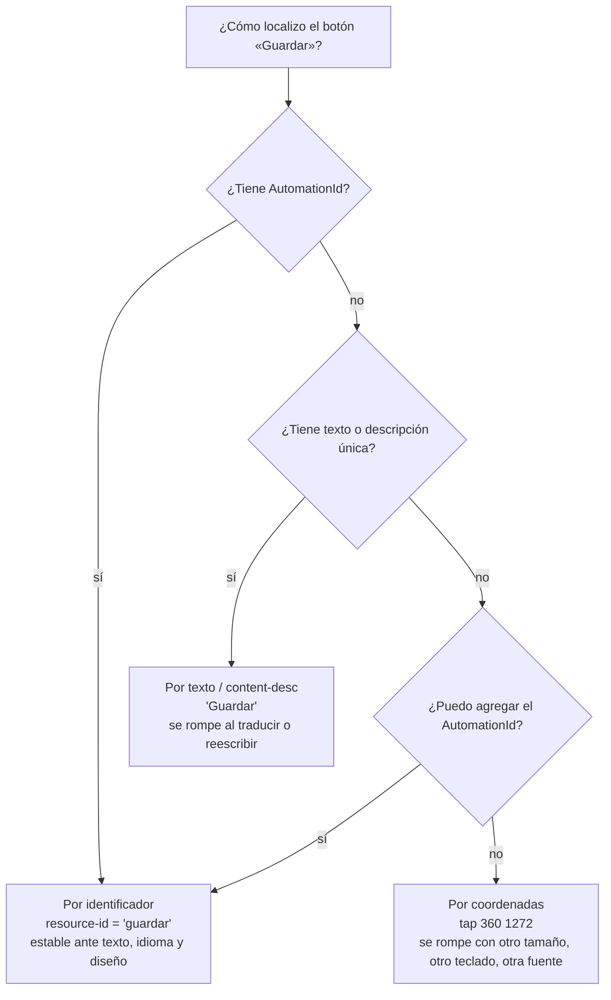

# Pruebas de interfaz por pantalla — cuando no hay DOM

> **De qué va** — Cómo se prueba una interfaz que no es un documento HTML: una app Android o de escritorio, donde no hay DOM que consultar y lo que existe es un árbol de controles nativos, una pantalla de píxeles y un dispositivo. Qué localiza cada enfoque, qué cuesta, y qué se traslada del método E2E de la web.
> **Para quién** — Quien ya sabe escribir una E2E con Playwright y tiene que probar `MovilidadUrbana.MAUI` —o cualquier app MAUI, WPF o WinUI— sin `page.GetByTestId`.
> **Qué deja** — Los tres niveles de localización (árbol de accesibilidad, texto, coordenadas) con su fragilidad; la herramienta que Microsoft recomienda para MAUI y cómo se conecta con `AutomationId`; lo que se hizo de verdad en el laboratorio con `adb` en un teléfono físico, con su alcance declarado; y el criterio para decidir qué probar en el dispositivo y qué dejar en el ViewModel.

**Qué es:** el tercer documento de `Guides/Test-Guide/`. Cubre el escenario S4 en el contexto
C-Móvil (y, por extensión declarada, C-Escritorio) del
[Panorama §2](Panorama-De-Pruebas-Automatizadas.md#2-el-marco-de-referencia), y el escenario S6.

**Por qué existe:** el conjunto E2E enseña a probar por el DOM, y el DOM no existe en una app nativa.
Lo que sí existe es equivalente —un árbol de elementos con identificadores— pero se llega distinto,
con otras herramientas, y con una diferencia que cambia el diseño: **hace falta un dispositivo o un
emulador**, y eso decide qué corre en CI y qué no.

---

## Índice

- **[1. Definiciones](#1-definiciones)** — árbol de accesibilidad, identificador de automatización, driver, coordenadas lógicas y físicas
- **[2. Qué promete una prueba de pantalla](#2-qué-promete-una-prueba-de-pantalla)** — lo mismo que la E2E web, con un dispositivo en el medio
- **[3. Los tres niveles de localización](#3-los-tres-niveles-de-localización)** — accesibilidad, texto, posición; y la fragilidad de cada uno
- **[4. Las herramientas](#4-las-herramientas)** — Appium para MAUI, UI Automator y Espresso en Android, `adb` como instrumento mínimo
- **[5. Lo que se hizo en el laboratorio](#5-lo-que-se-hizo-en-el-laboratorio)** — el teléfono por USB, el volcado del árbol, los toques por coordenadas y las capturas
- **[6. Lo que se traslada de la E2E web y lo que no](#6-lo-que-se-traslada-de-la-e2e-web-y-lo-que-no)**
- **[7. Criterios de diseño](#7-criterios-de-diseño)** — qué va al dispositivo, qué va al ViewModel, cómo se espera, cómo se aísla
- **[8. Lo que este documento no cubre](#8-lo-que-este-documento-no-cubre)**
- **[9. El criterio, en una línea](#9-el-criterio-en-una-línea)**

Las marcas **[E:]**, **[V]**, **[B: n]** y **[C]** son las del Panorama; los números de bibliografía
remiten a su §10.

---

## 1. Definiciones

**Árbol de accesibilidad.** La estructura de elementos que el sistema operativo expone para lectores
de pantalla y automatización: cada control con su clase, su texto, su descripción, su identificador
y su rectángulo en pantalla. Es el equivalente funcional del DOM para una app nativa, con una
diferencia: **no lo define la app, lo publica la plataforma** a partir de los controles nativos.

**Identificador de automatización.** El valor estable que la app declara sobre un control para que
una prueba lo encuentre. En MAUI es `AutomationId`; en Android termina siendo el `resource-id` del
árbol; en Windows, el `AutomationId` de UI Automation **[B: 7]**. Es el `data-testid` de este mundo.

**Driver.** El componente que traduce las órdenes de la prueba —«tocá esto», «leé aquello»— al
mecanismo de cada plataforma. Appium los llama así y tiene uno por plataforma: UIAutomator2 para
Android, XCUITest para iOS, Mac2, Windows **[B: 7]** **[B: 12]**.

**Coordenadas físicas y lógicas.** Un punto de la pantalla se expresa en píxeles (físicas) o en
unidades independientes de densidad (lógicas, *dp* en Android). El moto e6 play del laboratorio tiene
720×1440 píxeles a densidad 320 **[E: evidencia/2026-09-12-maui/dispositivo.txt]**, es decir factor
2: el `Margin` de 48 dp de un control ocupa 96 píxeles. **Una prueba por coordenadas que no dice en
cuál de las dos está expresada no es reproducible.**

**Captura (screenshot).** Una imagen de la pantalla en un instante. No es una afirmación: es
evidencia para que alguien —o un comparador de imágenes— la juzgue.

---

## 2. Qué promete una prueba de pantalla

### 2.1 ¿Es otra clase de prueba, o la E2E de siempre?

**Respuesta: es la E2E de siempre —superficie, promesa, estado, testigo— con el dispositivo como parte del sistema bajo prueba.**

Microsoft la define para MAUI así: «UI tests exercise the full app on a real device or emulator to
catch regressions that only surface through actual user interaction» **[B: 7]**. Las cinco preguntas
que [Caso-HolaMundo-Page.md](../E2E-Guide/Caso-HolaMundo-Page.md) le hace a una promesa se hacen igual.
Lo que se agrega es una sexta, que la web no tenía: **¿en qué dispositivo?** La misma pantalla se
comporta distinto en 720×1440 que en 1080×2400, con teclado físico o virtual, con Android 9 o 14.
Por eso el escenario S6 —regresión de plataforma— existe aparte de S4.

### 2.2 ¿Qué cuesta que la web no costaba?

**Respuesta: el dispositivo. Hay que tenerlo, prepararlo, instalar la app en él, y no está en el runner de CI.**

| Costo | En la web | En el teléfono |
| --- | --- | --- |
| Levantar el SUT | `dotnet publish` + proceso en un puerto libre **[E: tests/MovilidadUrbana.E2ETests/Infraestructura/ServidorDeLaAplicacion.cs]** | Compilar el APK, instalarlo por `adb install`, abrirlo; con el keystore de Debug estable o desinstalar antes **[E: .devcontainer/dev.sh]** |
| Entrar | Un navegador que Playwright descarga | Un driver que habla con el dispositivo por USB o red |
| Correr en CI | Sí, en `ubuntu-latest` con los navegadores de Playwright **[E: .github/workflows/e2e.yml]** | No sin emulador o granja de dispositivos: `android.yml` compila el APK y **no lo ejecuta** **[E: .github/workflows/android.yml]** |
| Paralelizar | Un contexto de navegador por prueba | Un dispositivo es una sola pantalla: las pruebas van en serie, o hay N dispositivos |

Esta última fila es la que más cambia el diseño: **una suite de pantalla no escala como la de
navegador**, y por eso conviene que sea chica y que la lógica esté probada antes en el ViewModel
([Pruebas-Unitarias-Y-Arquitectura.md §6](Pruebas-Unitarias-Y-Arquitectura.md#6-la-unidad-en-mvvm)).

---

## 3. Los tres niveles de localización

### 3.1 ¿Cómo encuentro un control si no hay DOM?

**Respuesta: por el árbol de accesibilidad si la app declaró identificadores; por texto si no; por coordenadas solo como último recurso —y sabiendo por qué—.**



| Nivel | Qué usa | Se rompe cuando… | Equivalente web |
| --- | --- | --- | --- |
| **Identificador** | `resource-id` / accessibility id | Alguien borra el `AutomationId` (y eso se ve en el diff) | `data-testid` |
| **Texto** | `text`, `content-desc` | Cambia la etiqueta, el idioma, la capitalización | `GetByText`, `GetByRole(name:)` |
| **Coordenadas** | `(x, y)` en píxeles o dp | Cambia el tamaño de pantalla, la densidad, la fuente del sistema, el teclado abierto, el scroll | No tiene: Playwright no expone «clic en (x, y)» como método principal |

### 3.2 ¿Cuándo son legítimas las coordenadas?

**Respuesta: cuando se derivan del árbol en el momento de usarlas —el centro del rectángulo de un elemento localizado por identificador—; nunca escritas a mano.**

Es exactamente lo que hizo el laboratorio (§5.3): el toque fue `input tap X Y`, pero `X Y` salieron
del atributo `bounds` del nodo con `resource-id="…/guardar"` en ese mismo instante. La coordenada es
un **medio de ejecución**, no un **criterio de localización**.

| | |
| --- | --- |
| ✅ | «Buscar el nodo `guardar`, leer sus `bounds` `[32,1224][688,1320]`, tocar en el centro `(360, 1272)`» |
| ⚠️ | «Tocar en `(360, 1272)` porque ahí está Guardar en el moto e6» — cierto hoy, en ese teléfono, sin teclado abierto |
| ❌ | «Tocar en `(360, 1272)`» sin decir por qué — nadie puede saber qué se quiso tocar cuando falle |

### 3.3 ¿Y la comparación de imágenes?

**Respuesta: es un cuarto nivel que no localiza: juzga. Sirve para S6, y solo con una referencia aprobada y una tolerancia declarada.**

Una captura comparada píxel a píxel contra una de referencia detecta regresiones visuales que ningún
árbol ve —un color, un margen, un texto cortado—. Su costo es que **cualquier cambio deliberado
invalida la referencia**, y que la comparación depende del dispositivo exacto. En el laboratorio las
capturas se usaron como evidencia para juicio humano, no como afirmación automática
**[E: evidencia/2026-09-12-maui/README.md]**; el comparador automático queda fuera (§8).

---

## 4. Las herramientas

### 4.1 ¿Qué recomienda Microsoft para MAUI?

**Respuesta: Appium, con el driver de cada plataforma, y `AutomationId` en todo lo que la prueba vaya a tocar.**

La guía oficial (fechada 2026-04-14) lo dice sin alternativa: «Appium is an open-source UI testing
framework that works with native, hybrid, and web apps across multiple platforms», y la instrucción
sobre identificadores es literal: «All UI elements that you want to interact with from your tests
need to have the AutomationId property set to a unique value. This property maps to
platform-specific accessibility identifiers that Appium uses to locate elements» **[B: 7]**.

| Plataforma | Driver de Appium **[B: 7]** | Cómo se localiza el `AutomationId` **[B: 7]** |
| --- | --- | --- |
| Android | UIAutomator2 | `MobileBy.Id()` |
| iOS | XCUITest | `MobileBy.Id()` |
| Mac Catalyst | Mac2 | `MobileBy.Id()` |
| Windows | Windows (sobre WinAppDriver 1.2.1) | `MobileBy.AccessibilityId()` |

La forma de una prueba, tomada de la misma guía **[B: 7]**:

```csharp
[Test]
public void ClickCounterTest()
{
    // Arrange
    var element = FindUIElement("CounterBtn");   // MobileBy.Id o AccessibilityId según plataforma

    // Act
    element.Click();
    Task.Delay(500).Wait();

    // Assert
    App.GetScreenshot().SaveAsFile($"{nameof(ClickCounterTest)}.png");
    Assert.That(element.Text, Is.EqualTo("Clicked 1 time"));
}
```

Es NUnit, es AAA, y tiene la misma forma que una E2E web. **Lo que no conviene copiar es el
`Task.Delay(500)`:** es una espera por tiempo, el patrón que [Beginner-Guide.md](../E2E-Guide/Beginner-Guide.md)
enseña a evitar; la §7.3 dice qué poner en su lugar.

Appium habla el protocolo WebDriver y separa el servidor (Node.js) de los drivers, que
«implement connectivity to specific platforms» **[B: 12]**. El paquete .NET es `Appium.WebDriver`
(8.0.0 en el ejemplo de Microsoft) **[B: 7]**.

### 4.2 ¿Qué hay debajo de Appium en Android?

**Respuesta: UI Automator, el marco de Android para probar «desde fuera del proceso de la app»; y Espresso, el marco para probar desde adentro. MAUI queda del lado de UI Automator.**

| | UI Automator **[B: 13]** | Espresso **[B: 14]** |
| --- | --- | --- |
| Posición | Fuera del proceso: «lets you test an app from outside of the app's process. This lets you test release versions with minification applied» | Dentro del proceso: «targeted at developers, who believe that automated testing is an integral part of the development lifecycle» |
| Alcance | Cualquier app, incluso varias en el mismo flujo (caja negra) | La app propia, con acceso a su código |
| Localiza por | `viewIdResourceName`, `textAsString()`, `contentDescription`, `className` | `withId`, `withText`, y los `ViewMatchers` |
| Sincronización | La prueba espera por condición | Automática: espera a que la cola de mensajes esté vacía y los *idling resources* en reposo |
| Para MAUI | Es lo que usa el driver UIAutomator2 de Appium | No aplica directamente: los controles los genera MAUI, no un proyecto Android con `R.id` |

La sincronización automática de Espresso es lo que una app MAUI no tiene, y por eso la §7.3 importa.

### 4.3 ¿Y sin Appium, con lo mínimo?

**Respuesta: `adb` alcanza para observar, tocar y escribir. No es un framework de pruebas —no afirma nada— pero es lo que había en el laboratorio, y con eso se recorrió la app entera.**

El SDK de Android trae `adb`, y con tres comandos se tiene un ciclo completo:

| Necesito | Comando **[V 2026-09-12]** | Qué devuelve |
| --- | --- | --- |
| Ver el árbol | `adb shell uiautomator dump /sdcard/ui.xml && adb shell cat /sdcard/ui.xml` | XML con un `<node>` por control: `class`, `text`, `resource-id`, `content-desc`, `bounds` |
| Tocar | `adb shell input tap <x> <y>` | — |
| Escribir en el campo enfocado | `adb shell input text "Goya"` | — |
| Tecla | `adb shell input keyevent KEYCODE_BACK` | — |
| Desplazar | `adb shell input swipe 360 1000 360 400 300` | — |
| Capturar | `adb shell screencap -p /sdcard/s.png && adb pull /sdcard/s.png` | El PNG |
| Saber si el teclado está abierto | `adb shell dumpsys input_method` → `mInputShown=true` | — |

Es el nivel «driver» a mano. Lo que falta para que sea una *prueba* es el bucle que localiza por
identificador, deriva la coordenada, actúa y **afirma** sobre el árbol siguiente. En el laboratorio
ese bucle fue un guion de apoyo de la sesión de trabajo, no un proyecto de pruebas: por eso la §5
declara su alcance con cuidado.

---

## 5. Lo que se hizo en el laboratorio

### 5.1 ¿Cómo se conectó el teléfono?

**Respuesta: por USB a un contenedor con el SDK de Android, que es el único dueño del servidor `adb`.**

`.devcontainer/dev.sh up` levanta un contenedor con `--privileged` y `/dev/bus/usb` montado, arranca
`adb start-server` y lista los dispositivos **[E: .devcontainer/dev.sh]**. El resultado observado:

```
List of devices attached
ZE22223QKV             device usb:1-1.4 product:bali model:moto_e6_play device:bali transport_id:1
```
**[V 2026-09-12]**

La regla que el script codifica: **un solo servidor `adb` por vez**. Dos contenedores con `adb` se
disputan el mismo USB y el síntoma aparece en el otro; por eso `up` apaga el `adb` del contenedor que
lo tenía y `devolver` lo restituye **[E: .devcontainer/dev.sh, encabezado]**.

### 5.2 ¿Qué expone la app en el árbol?

**Respuesta: cada `AutomationId` del XAML, como `resource-id`, con su rectángulo. Es verificable con un volcado.**

El editor de localidad declara `AutomationId="nombre"`, `"provincia"`, `"codigo-postal"`,
`"habitantes"`, `"guardar"`, `"eliminar"`, `"aviso"`
**[E: src/MovilidadUrbana.MAUI/Paginas/LocalidadEditorPage.xaml:15,21,31,40,50,58,64]**. Un volcado
con la pantalla abierta, filtrado a texto y `resource-id`, devolvió **[V 2026-09-12]**:

```
resource-id       | text                                          | bounds
------------------+-----------------------------------------------+-------------------
                  | Nueva localidad                               | [144,69][530,139]
nombre            | Ej.: Goya                                     | [50,252][670,350]
provincia         | Elegir provincia                              | [50,552][628,650]
codigo-postal     | Ej.: 3450                                     | [50,806][670,904]
habitantes        | Ej.: 90000                                    | [50,1060][670,1158]
guardar           | Guardar                                       | [32,1224][688,1320]
```

(el `resource-id` completo es `ar.lab.movilidadurbana:id/nombre`, etc.; se muestra la cola). Tres
cosas que ese volcado enseña:

1. **`AutomationId` → `resource-id` funciona sin configuración**, igual que promete **[B: 7]**.
2. Los `bounds` están en píxeles físicos: `guardar` ocupa 96 px de alto, que a densidad 320 son
   48 dp —el objetivo táctil mínimo que fija el estilo `BotonPrimario`
   **[E: src/MovilidadUrbana.MAUI/Resources/Styles/Movilidad.xaml, `MinimumHeightRequest` 48]**—.
3. Lo que no tiene `AutomationId` —el título— solo se encuentra por texto.

### 5.3 ¿Cómo se recorrió la app?

**Respuesta: con un bucle localizar-por-identificador → derivar el centro → tocar → volcar de nuevo, y una captura en cada estado que valía la pena guardar.**

El bucle, en pseudocódigo fiel a lo ejecutado **[V 2026-09-12]**:

```
tap(id):
    xml = uiautomator dump
    nodo = el <node> cuyo resource-id termina en id, o cuyo text == id
    (x1,y1,x2,y2) = nodo.bounds
    si y2 <= y1: el nodo está recortado por el borde visible → no se toca; primero desplazar
    input tap ((x1+x2)/2, (y1+y2)/2)

espera(id):   hasta 40 veces, cada 1 s: si tap podría localizar id, seguir
ver(id):      desplazar de a poco hasta que id quede entero en pantalla
teclado():    si dumpsys input_method dice mInputShown=true → keyevent BACK
```

Con ese bucle se ejercitaron, en orden: filtro sin resultados y su salida; alta con errores por
campo; alta válida; edición; baja cancelada y confirmada; los tres pasos de la encuesta con sus
errores; el registro; el resumen; y «cargar otra encuesta». Cada estado tiene su captura numerada e
indexada **[E: evidencia/2026-09-12-maui/README.md]**.

**Lo que ese recorrido es y lo que no es [C]:**

| Es | No es |
| --- | --- |
| Una verificación por ejecución de cada promesa de las dos pantallas, con evidencia guardada | Una suite de pruebas: nadie la corre con `dotnet test` y ninguna afirmación es automática |
| El mismo método de localización que usaría Appium (identificador → elemento → acción) | Reproducible sin el teléfono: depende de `ZE22223QKV` conectado |
| La base para escribir la suite Appium: los identificadores ya están y se sabe qué se ve en cada estado | Regresión: si mañana se rompe el editor, nada lo avisa |

### 5.4 ¿Qué encontró el recorrido que las 18 unitarias no vieron?

**Respuesta: seis cosas, y todas eran de vista o de plataforma —justo lo que el ViewModel no puede ver—.**

| Hallazgo | Quién lo ve | Corrección |
| --- | --- | --- |
| Los selectores parecían texto fijo: sin indicador de despliegue | Solo la pantalla | Un `▾` al lado del `Picker` |
| El subrayado nativo de Android dentro de la caja del campo | Solo la pantalla | Mapper del handler que lo vuelve transparente |
| El error de un grupo de opciones aparecía debajo de la tarjeta, lejos del rótulo | Solo la pantalla | Mover el `Label` de error junto al rótulo (capturas `21` → `32`) |
| El teclado numérico en es-AR descartaba la coma: «12,5» llegaba como «125» y **se registraba sin error** | Solo la plataforma: el ViewModel recibió «125» y lo validó bien | `EntradaDecimal` con `DigitsKeyListener("0123456789,.")` (capturas `24` → `35`) |
| El aviso breve (Toast) dura menos que un ciclo de captura | La pantalla, y `logcat` | Se documentó con la línea de `logcat` **[E: evidencia/2026-09-12-maui/toast-logcat.txt]** |
| En la página apilada el teclado tapaba «Guardar»; `SafeAreaEdges` dejaba un hueco al cerrarlo | Solo la plataforma, y solo en esa página | `TecladoEnPantalla`: medir la barra contra `GetWindowVisibleDisplayFrame` y corregir el margen **[E: src/MovilidadUrbana.MAUI/Servicios/TecladoEnPantalla.cs:27-33]** |

La cuarta fila es la que justifica todo el documento: **un dato mal capturado por el teclado del
sistema pasó la validación de dominio, la de aplicación y las 18 pruebas del ViewModel**, porque
para todas ellas «125» es una distancia válida. Solo se vio tocando el teléfono.

---

## 6. Lo que se traslada de la E2E web y lo que no

### 6.1 ¿Qué sigue valiendo?

**Respuesta: el método entero: superficie, promesa, estados, identificadores declarados, esperas por condición, una prueba que se vio fallar.**

| Del conjunto E2E | En la pantalla nativa |
| --- | --- |
| «Lo que la prueba necesita nombrar, se declara en el marcado» | `AutomationId` en cada control que la prueba toca **[B: 7]** |
| El testigo de hidratación | No hay hidratación; el testigo es que el elemento **exista en el árbol** y, si aplica, que el teclado esté cerrado |
| Estado por prueba (cookie de sesión) | Un dispositivo, una sesión: el aislamiento es **desinstalar** o **borrar los datos de la app** entre suites (`adb shell pm clear <paquete>`) |
| La prueba que falla a propósito | Igual: cambiar un `AutomationId` y ver la suite en rojo antes de confiar en ella |
| Estados excluyentes con su testigo | `estado-vacio`, `estado-sin-resultados`, `encuesta-completada` como `AutomationId` de los contenedores **[E: src/MovilidadUrbana.MAUI/Paginas/LocalidadesPage.xaml, EncuestaPage.xaml]** |

### 6.2 ¿Qué no se traslada?

**Respuesta: la paralelización por contexto, la ejecución en CI sin más, y el «clic» como acto atómico.**

| En la web | En el dispositivo | Consecuencia |
| --- | --- | --- |
| N contextos de navegador en paralelo sobre un servidor | Una pantalla | Suite chica y en serie; o N dispositivos |
| `ubuntu-latest` trae todo | Hace falta emulador (lento en runners sin virtualización anidada) o dispositivo | `android.yml` solo compila; la ejecución es local **[E: .github/workflows/android.yml]** |
| `click()` sobre un elemento visible | El elemento puede existir en el árbol y estar bajo el teclado, o recortado por el borde | Antes de tocar: cerrar el teclado, desplazar hasta que `bounds` sea válido (§5.3) |
| El DOM no cambia si no cambia el HTML | El árbol cambia con el idioma del sistema, el tamaño de fuente, el tema | Localizar por identificador, no por texto; declarar el dispositivo en la evidencia |

---

## 7. Criterios de diseño

### 7.1 ¿Qué va al dispositivo y qué va al ViewModel?

**Respuesta: al ViewModel, toda la lógica; al dispositivo, una prueba por estado visible y las que dependen de la plataforma.**

| Pregunta | Dónde | Por qué |
| --- | --- | --- |
| ¿Con nombre «Go» aparece error en nombre? | ViewModel **[E: tests/MovilidadUrbana.MAUI.Tests/LocalidadEditorViewModelTests.cs:11-28]** | Es lógica; 2 s para 18 casos |
| ¿El error se **ve** junto al campo, en rojo, y el campo tiene borde? | Dispositivo | Es enlace y estilo; el ViewModel no lo sabe |
| ¿«12,5» llega como 12,5? | Dispositivo | Es el teclado del sistema |
| ¿Cancelar la confirmación no borra? | ViewModel (con `AvisosFalsos`) | Es lógica; el diálogo real es de la plataforma |
| ¿El diálogo dice «¿Eliminar Goya?» y tiene los dos botones? | Dispositivo | Es la plataforma |
| ¿«Guardar» queda visible con el teclado abierto? | Dispositivo | Es la plataforma, y además cambia por página (§5.4) |

**Regla [C]:** si la pregunta se puede formular sin la palabra «se ve», «toca», «teclado» o
«dispositivo», va al ViewModel.

### 7.2 ¿Qué identificadores declaro?

**Respuesta: los mismos que en la web: cada control que la prueba toca o lee, y cada contenedor de estado.**

| | |
| --- | --- |
| ✅ | `AutomationId="guardar"` en el botón, `"nombre"` en el campo, `"encuesta-completada"` en el contenedor del estado de éxito |
| ✅ | El mismo nombre que el `data-testid` de la web cuando la promesa es la misma: la persona que lee las dos suites agradece |
| ❌ | `AutomationId` en cada `Label` decorativo «por si acaso»: ruido en el árbol |
| ❌ | Localizar «Guardar» por texto teniendo el identificador: se rompe con el primer cambio de etiqueta |

### 7.3 ¿Cómo espero?

**Respuesta: por condición sobre el árbol —«existe el nodo», «el teclado se cerró», «el texto cambió»— con un tope; nunca por `Task.Delay` fijo.**

Sin la sincronización de Espresso, la prueba tiene que sondear. El bucle de la §5.3 esperó hasta 40
veces con 1 s entre intentos a que un identificador apareciera; Appium ofrece lo mismo con
*implicit/explicit waits* de WebDriver. Lo que hay que evitar es el `Task.Delay(500)` del ejemplo de
Microsoft **[B: 7]**: pasa en el emulador rápido y falla en el moto e6 play, donde la app tardó 25 s
en mostrar la primera pantalla en frío **[V 2026-09-12, `ActivityManager: Displayed … +25s163ms`]**.

| | |
| --- | --- |
| ✅ | «Hasta 40 s: existe un nodo con `resource-id` `agregar`» |
| ✅ | «Hasta 5 s: `dumpsys input_method` no dice `mInputShown=true`» |
| ❌ | `Task.Delay(500)` |
| ❌ | «Esperar 30 s porque el teléfono es lento»: 30 s por prueba, y el día que tarde 31 falla igual |

### 7.4 ¿Cómo aíslo una prueba de la siguiente?

**Respuesta: el dispositivo es una sola sesión, así que el aislamiento es de datos: borrar los de la app antes de la suite, y que cada prueba deje lo que encontró.**

`MovilidadUrbana.MAUI` guarda su base y su sesión en el almacenamiento privado de la app
**[E: src/MovilidadUrbana.MAUI/MauiProgram.cs; Servicios/SesionDelDispositivo.cs]**. `adb shell pm
clear ar.lab.movilidadurbana` los borra y la siguiente apertura vuelve a sembrar. Dentro de la suite,
la alternativa barata es la que usó el recorrido: cada flujo deshace lo que hizo (la baja de Goya
después del alta de Goya), así la lista vuelve a las dos sembradas
**[E: evidencia/2026-09-12-maui/README.md, capturas `09` y `15`]**.

### 7.5 ¿Qué dejo como evidencia?

**Respuesta: el dispositivo, el APK, el volcado o la captura de cada estado afirmado, y el `logcat` de lo que no se deja capturar.**

Es lo que hay en `evidencia/2026-09-12-maui/`: `dispositivo.txt` (modelo, versión, ABI, tamaño,
densidad), un README que dice qué muestra cada captura y en qué iteración, y `toast-logcat.txt` para
el aviso que dura menos que una captura **[E: evidencia/2026-09-12-maui/]**. Sin el primero, las
coordenadas y los tamaños no significan nada; sin el último, la promesa «muestra un aviso breve»
quedaría sin respaldo.

---

## 8. Lo que este documento no cubre

- **Una suite Appium escrita y corriendo.** No existe en el laboratorio; la §4.1 muestra la forma
  según la guía de Microsoft y la §5 muestra que los identificadores y los estados ya están. Es el
  paso siguiente natural, y está fuera del alcance de este documento.
- **iOS, Mac Catalyst, Windows y escritorio en general** (WinAppDriver, FlaUI, WinUI). La tabla de
  drivers de **[B: 7]** los nombra; nada de esta guía los verificó.
- **Emuladores en CI** y granjas de dispositivos. Se afirma solo que `android.yml` no ejecuta la
  app; cómo hacerlo ejecutar en un runner no se probó.
- **Comparación automática de imágenes.** Se describe como nivel de juicio (§3.3); no se usó ninguna
  herramienta.
- **Pruebas en el proceso de la app** (device runners, XHarness, las plantillas `androidtest` de
  .NET 11 **[B: 11]**). Son otra clase —unitarias que corren en el dispositivo— y no se ejercitaron.
- **Playwright sobre Android.** Solo automatiza Chrome y WebView, experimentalmente **[B: 9]**; no
  sirve para una app MAUI nativa y no se intentó.

---

## 9. El criterio, en una línea

> **Sin DOM, el árbol de accesibilidad es el DOM: se localiza por el identificador que la app declaró, se toca donde ese identificador está ahora, y se afirma sobre lo que el árbol dice después —con el dispositivo nombrado en la evidencia—.**
