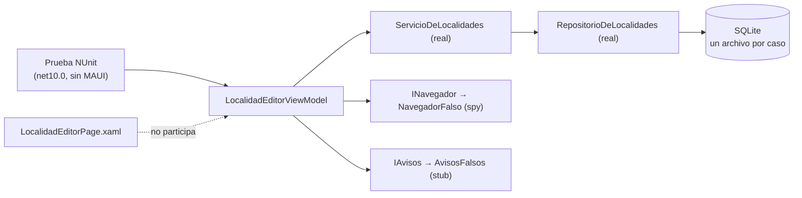

# Pruebas unitarias y arquitectura — qué es una unidad según dónde vive el código

> **De qué va** — Qué es una prueba unitaria en serio, qué la separa de una de integración, y cómo cambia lo que se puede aislar según la arquitectura: reglas de dominio puras, servicios con colaboradores, ViewModels detrás de una plataforma.
> **Para quién** — Quien tiene que escribir la primera prueba que no abre un navegador, y quien tiene que decidir qué reemplazar por un doble y qué dejar real.
> **Qué deja** — La definición operativa de «unidad»; las cinco propiedades de una buena unitaria con su verificación en el laboratorio; el criterio para elegir el doble; y tres recetas ancladas al código: la regla de dominio, el servicio de aplicación y el ViewModel MVVM.

**Qué es:** el segundo documento de `Guides/Test-Guide/`. Usa el marco de referencia del
[Panorama](Panorama-De-Pruebas-Automatizadas.md) —escenarios S1, S2 y la parte lógica de S4; los
tres contextos— y no lo repite.

**Por qué existe:** «unitaria» es la palabra más usada y peor definida del vocabulario de pruebas.
Se le dice unitaria a una prueba de un método puro, a una que levanta EF Core con SQLite, y a una
que mockea seis interfaces para verificar que se llamó a la séptima. Las tres son legítimas y no son
lo mismo, y confundirlas produce suites lentas que se creen rápidas y suites rápidas que no prueban
nada.

---

## Índice

- **[1. Definiciones](#1-definiciones)** — unidad, aislamiento, colaborador, costura, verificación de estado y de comportamiento
- **[2. Qué promete una prueba unitaria](#2-qué-promete-una-prueba-unitaria)** — las cinco propiedades y qué pasa cuando falta cada una
- **[3. La unidad en el dominio](#3-la-unidad-en-el-dominio)** — la regla pura: entrada, salida, y los bordes
- **[4. La unidad en la aplicación](#4-la-unidad-en-la-aplicación)** — el servicio con colaboradores, y la decisión doble-o-real
- **[5. Los dobles, en la práctica](#5-los-dobles-en-la-práctica)** — a mano o con biblioteca, y cómo elegir la clase
- **[6. La unidad en MVVM](#6-la-unidad-en-mvvm)** — el ViewModel detrás de interfaces, sin plataforma
- **[7. El caso especial de MAUI](#7-el-caso-especial-de-maui)** — cómo se compila lo que vive en `net10.0-android` sin el workload
- **[8. Criterios de calidad](#8-criterios-de-calidad)** — nombres, AAA, un acto por prueba, sin lógica en la prueba
- **[9. Lo que este documento no cubre](#9-lo-que-este-documento-no-cubre)**
- **[10. El criterio, en una línea](#10-el-criterio-en-una-línea)**

Las marcas **[E:]**, **[V]**, **[B: n]** y **[C]** son las del Panorama; los números de bibliografía
remiten a su §10.

---

## 1. Definiciones

**Unidad.** Lo más chico que tiene una responsabilidad nombrable y una interfaz por la que se la
puede ejercitar. En .NET, casi siempre una clase pública o un método estático. Microsoft lo llama
«unit of work» **[B: 6]**. **No es «una clase» por definición:** un ViewModel con sus dobles de
plataforma es una unidad, aunque sean tres objetos.

**Aislamiento (de una unitaria).** Que la prueba no toque «infrastructure concerns»: «interacting
with databases, file systems, and network resources» **[B: 6]**. Es la línea que separa unitaria de
integración; la §4.2 muestra que en el laboratorio se cruza a propósito, y con qué nombre.

**Colaborador.** Un objeto del que la unidad depende para hacer su trabajo: el repositorio del
servicio, el navegador del ViewModel. Lo que se decide en cada prueba es cuáles colaboradores son
reales y cuáles dobles.

**Costura (seam).** Un punto del código diseñado para que un colaborador pueda reemplazarse: una
interfaz recibida por constructor, un parámetro. Microsoft muestra el caso canónico, `DateTime.Now`
envuelto en `IDateTimeProvider` **[B: 5]**. Sin costura no hay doble; sin doble, la unidad arrastra
al colaborador real.

**Verificación de estado / de comportamiento.** Fowler: *state verification* comprueba el estado
final después de ejercitar el SUT; *behavior verification* comprueba «si se realizaron las llamadas
de método correctas» **[B: 2]**. La primera afirma sobre el SUT; la segunda, sobre el doble.

**Dobles.** Los cinco de Meszaros, definidos en el [Panorama §1](Panorama-De-Pruebas-Automatizadas.md#1-definiciones).

---

## 2. Qué promete una prueba unitaria

### 2.1 ¿Qué tiene que cumplir para llamarse unitaria?

**Respuesta: las cinco propiedades de Microsoft —rápida, aislada, repetible, autoverificable, oportuna—; y la que primero se pierde es «aislada».**

| Propiedad | Definición **[B: 5]** | En el laboratorio | Verificación |
| --- | --- | --- | --- |
| **Fast** | «Unit tests should take little time to run. Milliseconds» | 49 casos de reglas en 25 ms | **[V 2026-09-12]** `dotnet test tests/MovilidadUrbana.UnitTests` |
| **Isolated** | «have no dependencies on any outside factors, such as a file system or database» | Las reglas no reciben nada: `ReglasDeLocalidad.NombreValido(nombre)` | **[E: src/MovilidadUrbana.Web/Dominio/Reglas/ReglasDeLocalidad.cs:18-19]** |
| **Repeatable** | «always returns the same result if you don't change anything» | Sin reloj, sin azar, sin red | Las 49 pasaron en cada corrida de CI observada **[E: .github/workflows/ci.yml]** |
| **Self-Checking** | «automatically detect if it passed or failed» | `ExpectedResult = false` decide solo | **[E: tests/MovilidadUrbana.UnitTests/ReglasDeLocalidadTests.cs:15]** |
| **Timely** | «shouldn't take a disproportionately long time to write compared to the code being tested» | Un `[TestCase]` por valor límite: una línea por caso | Ídem, líneas 13-19 |

### 2.2 ¿Qué se pierde cuando falta una?

**Respuesta: cada propiedad que falta convierte a la prueba en otra cosa —a veces útil, nunca unitaria—.**

| Falta | En qué se convierte | Ejemplo |
| --- | --- | --- |
| Fast | Una integración que se corre poco | Una «unitaria» de repositorio que abre SQLite: sigue valiendo, pero va en otra suite y otro presupuesto |
| Isolated | Una prueba que falla por el entorno | La que lee `DateTime.Now` y pasa los martes **[B: 5]** |
| Repeatable | Una intermitente | Cualquier prueba con `Task.Delay` como sincronización |
| Self-Checking | Una demostración | Un método que imprime el resultado y nadie compara |
| Timely | Una señal de diseño | Si probar una clase cuesta más que escribirla, «consider a more testable design» **[B: 5]** |

La última fila es la que más enseña: **una unitaria difícil de escribir es un diagnóstico del
código, no de la prueba.**

---

## 3. La unidad en el dominio

### 3.1 ¿Qué se prueba de una regla?

**Respuesta: los bordes. Un valor de cada lado de cada límite, y los valores que no son valores: vacío, blancos, nulo.**

`ReglasDeLocalidad.NombreValido` exige al menos 3 caracteres después de recortar espacios
**[E: src/MovilidadUrbana.Web/Dominio/Reglas/ReglasDeLocalidad.cs:11,18-19]**. Su prueba:

```csharp
[TestCase("Goya", ExpectedResult = true)]
[TestCase("  Goya  ", ExpectedResult = true, Description = "Los espacios de los extremos no cuentan")]
[TestCase("Ab", ExpectedResult = false)]
[TestCase("  A  ", ExpectedResult = false)]
[TestCase("", ExpectedResult = false)]
[TestCase(null, ExpectedResult = false)]
public bool NombreValido(string? nombre) => ReglasDeLocalidad.NombreValido(nombre);
```
**[E: tests/MovilidadUrbana.UnitTests/ReglasDeLocalidadTests.cs:13-19]**

Seis casos, y cada uno tiene un motivo: el válido, el válido que parece inválido (espacios), el corto,
el corto disfrazado de largo (espacios), el vacío y el nulo. El comentario de la otra fixture explica
por qué acá y no en el navegador: «son los valores que una prueba por navegador tardaría minutos en
recorrer y acá cuestan milisegundos» **[E: tests/MovilidadUrbana.UnitTests/ReglasDeEncuestaTests.cs:5-8]**.

| | |
| --- | --- |
| ✅ | `EdadValida`: 15, 16, 110, 111, null — dos bordes, los dos lados de cada uno, y el ausente |
| ⚠️ | `EdadValida`: 30 — cierto, pero no distingue una regla correcta de una que acepta todo |
| ❌ | `EdadValida`: 16 y 110 solamente — pasa aunque la regla sea `>= 0` |

### 3.2 ¿Por qué el dominio no recibe colaboradores?

**Respuesta: porque es la capa más adentro, y la regla de dependencia le prohíbe conocer nada de afuera.**

Es la consecuencia directa de Clean Architecture: «The business rules can be tested without the UI,
Database, Web Server, or any other external element» **[B: 8]**. En el laboratorio se cumple al pie:
`Dominio/` no referencia paquetes ni proyectos —es la primera carpeta de cada aplicación y no depende
de nada **[E: README.md, «Estructura»]**—. Por eso sus pruebas no necesitan dobles: no hay a quién
reemplazar.

**La señal de alarma:** si para probar una regla hace falta construir un `DbContext`, un `HttpClient`
o un `ViewModel`, la regla no está en el dominio. Está en otra capa disfrazada de regla.

### 3.3 ¿Y los catálogos y las entidades?

**Respuesta: se prueban si tienen comportamiento; si son datos, la prueba es el compilador.**

`Catalogos.Provincias` es una lista. Probar que tiene siete elementos es probar que nadie editó el
archivo, y eso lo hace el control de versiones. `ModeloDeEncuesta.AlternarMedio` sí tiene
comportamiento —agrega o quita del conjunto— y se ejercita indirectamente desde los ViewModels: el
`EncuestaViewModel` lo llama al armar el modelo con los medios marcados, y la prueba afirma sobre el
conjunto resultante **[E: tests/MovilidadUrbana.MAUI.Tests/EncuestaViewModelTests.cs:72-87]**.

| | |
| --- | --- |
| ✅ | Probar `AlternarMedio` cuando se llama dos veces con el mismo medio |
| ❌ | Probar que `Catalogos.Medios[0].Clave == "colectivo"` — es una copia del archivo, no una verificación |

---

## 4. La unidad en la aplicación

### 4.1 ¿Qué cambia cuando la unidad tiene colaboradores?

**Respuesta: aparece una decisión que el dominio no tenía: para cada colaborador, ¿real o doble?**

`ServicioDeLocalidades` recibe un `IRepositorioDeLocalidades` por constructor
**[E: src/MovilidadUrbana.Web/Aplicacion/Localidades/ServicioDeLocalidades.cs:8]** y su lógica
propia es: validar con las reglas, consultar duplicados, devolver un `Resultado` con errores por
campo **[E: ídem, 13-25]**. Hay dos formas de probarlo, y las dos son correctas para preguntas
distintas:

| Forma | Colaborador | Responde | Cuesta |
| --- | --- | --- | --- |
| Unitaria con stub | `IRepositorioDeLocalidades` devuelve lo que el caso necesita («ya existe Goya en Corrientes») | ¿El servicio traduce bien la situación a un `Resultado`? | Escribir el stub; no verifica el filtro por sesión ni la consulta real |
| Integración con repositorio real | EF Core sobre SQLite aislado | ¿El servicio *y su repositorio* producen el resultado correcto? | Milisegundos más; verifica también la persistencia |

### 4.2 ¿Cuál eligió el laboratorio, y por qué se llama «unitaria» igual?

**Respuesta: la segunda, desde las cabezas; y no se la llama unitaria —se la llama por lo que es—.**

No hay una suite `MovilidadUrbana.Aplicacion.Tests`. Los servicios se ejercitan desde
`ApiWeb.Tests` (13 casos, en proceso, repositorio real) y desde `MAUI.Tests` (18 casos, ViewModel +
servicio + repositorio real). El README de las pruebas de ViewModels lo dice sin rodeos: «contra sus
capas reales y una base SQLite propia de cada caso» **[E: tests/MovilidadUrbana.MAUI.Tests/MovilidadUrbana.MAUI.Tests.csproj:3-4]**.

Según la §2.1, esas pruebas **no son unitarias**: tocan un archivo. Son integraciones chicas y
rápidas —2 segundos las 18 **[V 2026-09-12]**— que responden S2 y S5 a la vez. El Panorama §4.2
declara el hueco de la capa de aplicación como criterio **[C]**; acá se agrega la regla para
cerrarlo:

**Regla [C]:** una unitaria del servicio con repositorio stubeado aparece cuando el servicio tenga
una rama que ninguna cabeza alcance con datos reales —una falla del repositorio, una condición de
carrera simulada—. Mientras toda rama se alcance desde una cabeza con base real, la unitaria con stub
verificaría lo mismo con menos realismo.

| | |
| --- | --- |
| ✅ | Stub del repositorio que lanza `DbUpdateException` para probar que el servicio devuelve un `Resultado` y no propaga |
| ⚠️ | Stub del repositorio que devuelve «existe Goya» para probar el duplicado — cierto, pero la API ya lo prueba con base real en `LocalidadesTests` |
| ❌ | Stub del repositorio en *todas* las pruebas del servicio «para que sean unitarias» — se pierde la única verificación de las consultas |

### 4.3 ¿Cómo se ve un stub a mano de un repositorio?

**Respuesta: una clase que implementa la interfaz con una lista en memoria. Es un fake según Meszaros, y suele alcanzar.**

Ejemplo ilustrativo —**no está en el laboratorio**, se muestra para fijar la forma—:

```csharp
// Ilustrativo: un fake de IRepositorioDeLocalidades con una lista en memoria.
sealed class RepositorioEnMemoria : IRepositorioDeLocalidades
{
    public List<Localidad> Datos { get; } = [];

    public Task<IReadOnlyList<Localidad>> ListarAsync(CancellationToken c = default) =>
        Task.FromResult<IReadOnlyList<Localidad>>(Datos);

    public Task<bool> ExisteAsync(string nombre, string provincia, int? salvoId, CancellationToken c = default) =>
        Task.FromResult(Datos.Any(l => l.Nombre == nombre && l.Provincia == provincia && l.Id != salvoId));

    // … el resto de la interfaz, con la misma idea
}
```

La firma exacta de la interfaz está en `Aplicacion/Abstracciones/IRepositorioDeLocalidades.cs` de
cada aplicación; el ejemplo la simplifica. Lo que importa es la forma: **una implementación que
funciona pero atajando** —«usually take some shortcut» **[B: 2]**—, sin base.

---

## 5. Los dobles, en la práctica

### 5.1 ¿A mano o con una biblioteca?

**Respuesta: a mano mientras el doble sea chico y se lea; con biblioteca cuando haya que configurar respuestas por llamada o verificar interacciones.**

El laboratorio no usa ninguna biblioteca de mocks: sus dos dobles son clases de diez líneas
**[E: tests/MovilidadUrbana.MAUI.Tests/Entorno.cs:55-71]**. Las bibliotecas —Moq, NSubstitute,
FakeItEasy son las más usadas en .NET; Microsoft ejemplifica con `Mock<IDateTimeProvider>` **[B: 5]**—
sirven cuando el doble tiene que responder distinto según los argumentos, o cuando la afirmación es
«se llamó a X con Y».

| | |
| --- | --- |
| ✅ | `NavegadorFalso` a mano: dos métodos, una lista y un contador; se lee entero en la prueba |
| ✅ | `Mock<IReloj>` de biblioteca cuando cinco pruebas necesitan cinco fechas distintas |
| ❌ | Una biblioteca de mocks para reemplazar `INavegador`: configurar `Setup(...)` para dos métodos que no devuelven nada es más texto que el fake |
| ❌ | Un fake a mano de veinte métodos para una interfaz de la que la prueba usa uno: ahí la biblioteca genera lo que sobra |

### 5.2 ¿Cómo se elige la clase de doble?

**Respuesta: por lo que se va a afirmar. Si se afirma sobre el SUT, alcanza un stub o un fake; si se afirma sobre el doble, es un spy o un mock.**

`NavegadorFalso` es las dos cosas a la vez, y conviene verlo:

```csharp
public sealed class NavegadorFalso : INavegador
{
    public List<LocalidadItem?> EditoresAbiertos { get; } = [];
    public int Vueltas { get; private set; }

    public Task IrAlEditorDeLocalidadAsync(LocalidadItem? localidad) { EditoresAbiertos.Add(localidad); return Task.CompletedTask; }
    public Task VolverAsync() { Vueltas++; return Task.CompletedTask; }
}
```
**[E: tests/MovilidadUrbana.MAUI.Tests/Entorno.cs:55-62]**

Cuando una prueba afirma `Assert.That(_entorno.Navegador.Vueltas, Is.Zero)`
**[E: tests/MovilidadUrbana.MAUI.Tests/LocalidadEditorViewModelTests.cs:27]**, el doble está
funcionando como **spy**: registró y después se le pregunta. Cuando `AvisosFalsos.RespuestaAConfirmar
= false` hace que el ViewModel no borre, está funcionando como **stub**: devolvió lo que el caso
necesitaba, y la afirmación va sobre la base **[E: ídem, 76-90]**.

| Afirmo sobre… | Clase | Cuándo es la correcta |
| --- | --- | --- |
| El estado del SUT o de la base | Stub / fake | Casi siempre: es lo que la persona vería |
| Cuántas veces o con qué se llamó al doble | Spy | Cuando la llamada *es* la promesa: «vuelve a la lista», «muestra el aviso» |
| Que se llamó exactamente así y nada más | Mock | Cuando el orden o la ausencia importa; raro en lógica de pantalla |

### 5.3 ¿Qué no se debe doblar?

**Respuesta: lo que se está probando, y lo que se probaría mejor real.**

| | |
| --- | --- |
| ❌ | Doblar `ServicioDeLocalidades` en una prueba del ViewModel: el ViewModel casi no tiene lógica propia; sin el servicio real la prueba verifica el fake |
| ❌ | Doblar `DbSet` para consultas: «properly mocking DbSet query functionality is not possible» **[B: 3]** |
| ❌ | Doblar `Catalogos`: son datos estáticos, no un colaborador |
| ✅ | Doblar `INavegador`, `IAvisos`, un reloj, un servicio externo, una falla |

---

## 6. La unidad en MVVM

### 6.1 ¿Qué es la unidad en una pantalla MVVM?

**Respuesta: el ViewModel con la plataforma detrás de interfaces. La vista XAML no se prueba acá: se prueba en el teléfono.**

MVVM existe, entre otras cosas, para esto. El ViewModel tiene el estado de la pantalla —campos,
errores, `Paso`, `Completada`— y los comandos; la vista solo enlaza. Lo que el ViewModel necesita de
la plataforma entra por dos interfaces
**[E: src/MovilidadUrbana.MAUI/Presentacion/Abstracciones/INavegador.cs, IAvisos.cs]**, y eso es lo
que permite construirlo en un proceso sin MAUI:

```csharp
public LocalidadEditorViewModel Editor() => new(Localidades, Navegador, Avisos);
```
**[E: tests/MovilidadUrbana.MAUI.Tests/Entorno.cs:43]**



### 6.2 ¿Qué se afirma de un ViewModel?

**Respuesta: lo que la vista mostraría —propiedades— y lo que le pediría a la plataforma —el spy—. Nunca cómo lo hizo.**

```csharp
[Test]
[Description("Con campos inválidos muestra un error por campo y no vuelve a la lista")]
public async Task GuardarInvalidoMuestraErrores()
{
    var vm = _entorno.Editor();
    vm.Preparar(null);
    vm.Nombre = "Go";
    vm.CodigoPostal = "12";

    await vm.GuardarCommand.ExecuteAsync(null);

    Assert.That(vm.ErrorNombre, Is.Not.Null);
    Assert.That(vm.ErrorProvincia, Is.Not.Null);
    Assert.That(vm.ErrorCodigoPostal, Is.Not.Null);
    Assert.That(vm.ErrorHabitantes, Is.Not.Null);
    Assert.That(vm.Aviso, Is.Not.Null);
    Assert.That(_entorno.Navegador.Vueltas, Is.Zero);
}
```
**[E: tests/MovilidadUrbana.MAUI.Tests/LocalidadEditorViewModelTests.cs:11-28]**

Las cinco primeras afirmaciones son lo que la pantalla mostraría (S4, la parte lógica). La sexta es
lo que la pantalla *no* habría hecho: volver. Las dos juntas son la promesa del estado «error de
validación».

| | |
| --- | --- |
| ✅ | `Assert.That(vm.ErrorNombre, Is.Not.Null)` — la vista enlaza esa propiedad; si es null, no hay error visible |
| ✅ | `Assert.That(_entorno.Navegador.Vueltas, Is.EqualTo(1))` tras un alta válida — la promesa es «vuelve» |
| ❌ | Afirmar que `AplicarErrores` se llamó con cuatro claves — es un método privado; es *cómo* |
| ❌ | Afirmar sobre `PropertyChanged` disparado N veces — es el mecanismo de enlace, no la promesa |

### 6.3 ¿Qué queda sin probar acá, y dónde se prueba?

**Respuesta: el enlace, el diseño y la plataforma; y se prueban en el dispositivo.**

Un ViewModel perfecto con un `{Binding ErrorNombre}` mal escrito en el XAML muestra nada y pasa las
18 pruebas. Eso no lo ve ninguna unitaria; lo vieron las capturas del teléfono, y de hecho la
iteración que llevó los errores «junto al rótulo» salió de mirar la pantalla, no de una prueba
**[E: evidencia/2026-09-12-maui/README.md, capturas 21 → 32]**. Ese tramo es el tema de
[Pruebas-De-Interfaz-Por-Pantalla.md](Pruebas-De-Interfaz-Por-Pantalla.md).

---

## 7. El caso especial de MAUI

### 7.1 ¿Por qué no se puede referenciar el proyecto MAUI desde una prueba?

**Respuesta: porque su único target es `net10.0-android`, y un proyecto `net10.0` no puede referenciar un ensamblado de Android sin el workload y sin dispositivo.**

Microsoft propone dos salidas **[B: 11]**: multi-target del proyecto de la app (`net9.0;net9.0-android;…`)
con `<OutputType Condition="'$(TargetFramework)' != 'net9.0'">Exe</OutputType>`, o mover el código
probable a una biblioteca de clases MAUI con multi-target. En las dos, el proyecto de pruebas
referencia al proyecto y el código se compila dos veces.

El laboratorio eligió una tercera **[C]**, por la restricción de que `MovilidadUrbana.MAUI` sea un
proyecto autocontenido sin referencias: **archivos enlazados**. El proyecto de pruebas compila las
carpetas `Dominio/`, `Aplicacion/`, `Infraestructura/` y `Presentacion/` de la app como fuentes
propias, con `<Compile Include="..\..\src\MovilidadUrbana.MAUI\Dominio\**\*.cs" LinkBase="MAUI\Dominio" />`
**[E: tests/MovilidadUrbana.MAUI.Tests/MovilidadUrbana.MAUI.Tests.csproj:24-27]**. Lo que queda
afuera es justo lo que toca la plataforma: `Paginas/`, `Servicios/`, `Controles/` y `MauiProgram`.

| Opción | Compila la app | Requiere workload en CI | Costo |
| --- | --- | --- | --- |
| Multi-target de la app **[B: 11]** | Sí, dos veces | Sí, para el target Android | El `.csproj` de la app cambia por las pruebas |
| Biblioteca MAUI multi-target **[B: 11]** | La biblioteca, dos veces | Sí | Un proyecto más, con referencia |
| Archivos enlazados **[C]** | Solo las carpetas de capa, una vez, en `net10.0` | No: `ci.yml` corre las 18 sin workload **[E: .github/workflows/ci.yml]** | Las carpetas de capa no pueden usar APIs de MAUI, y eso es una virtud |

### 7.2 ¿Qué pasa si una capa de la app usa `Preferences` o `FileSystem`?

**Respuesta: la prueba deja de compilar, y eso es la costura avisando.**

`SesionDelDispositivo` usa `Preferences.Default` y vive en `Servicios/`, fuera de las carpetas
enlazadas **[E: src/MovilidadUrbana.MAUI/Servicios/SesionDelDispositivo.cs:22-27]**. Si alguien
moviera esa lectura a `Infraestructura/`, `MAUI.Tests` fallaría al compilar: `Preferences` no existe
en `net10.0`. **El error de compilación es la regla de dependencia haciéndose cumplir.** La
respuesta correcta no es agregar el paquete de MAUI a las pruebas; es devolver la lectura a
`Servicios/` detrás de una interfaz.

---

## 8. Criterios de calidad

### 8.1 ¿Cómo se nombra una prueba?

**Respuesta: por lo que verifica, en el idioma del equipo; y con la descripción cuando el nombre no alcanza.**

Microsoft propone tres partes: método, escenario, resultado esperado —`Add_SingleNumber_ReturnsSameNumber`—
**[B: 5]**. El laboratorio usa nombres en español sin guiones bajos más un `[Description]` que dice la
promesa completa **[E: tests/MovilidadUrbana.MAUI.Tests/LocalidadEditorViewModelTests.cs:12-13]**.
Las dos convenciones cumplen lo que importa: **el nombre solo, en el reporte de fallas, dice qué se
rompió.**

| | |
| --- | --- |
| ✅ | `GuardarInvalidoMuestraErrores` + «Con campos inválidos muestra un error por campo y no vuelve a la lista» |
| ✅ | `Add_EmptyString_ReturnsZero` |
| ❌ | `Test1`, `GuardarTest`, `Prueba_Guardar_2` |

### 8.2 ¿Cómo se estructura?

**Respuesta: preparar, actuar, afirmar —un acto por prueba—.**

AAA es la convención de Microsoft **[B: 5]** y de la guía de MAUI **[B: 11]**, y el ejemplo de la §6.2
la sigue con líneas en blanco entre las tres partes. La regla que más se rompe es la del **acto
único**: «Avoid multiple Act tasks» **[B: 5]**. Cuando hay dos, la segunda afirmación no se ejecuta
si falla la primera, y el reporte miente.

| | |
| --- | --- |
| ✅ | `EliminarCanceladoNoBorra` y `EliminarConfirmadoBorra` como dos pruebas **[E: tests/MovilidadUrbana.MAUI.Tests/LocalidadEditorViewModelTests.cs:76-105]** |
| ❌ | Una prueba `Eliminar` que primero cancela, afirma, después confirma, afirma |

### 8.3 ¿Qué no va dentro de una prueba?

**Respuesta: lógica. Ni `if`, ni bucles, ni cálculos del valor esperado.**

«Avoid coding logic in unit tests» **[B: 5]**: la alternativa es la prueba parametrizada, que en NUnit
es `[TestCase]` —la forma de las 49 del dominio— y en xUnit `[Theory]`/`[InlineData]`.

| | |
| --- | --- |
| ✅ | Seis `[TestCase]` con el resultado esperado escrito a mano en cada uno |
| ❌ | Un `foreach` sobre una lista de entradas calculando el esperado con la misma fórmula que el código |

### 8.4 ¿Cuándo conviene un `[SetUp]`?

**Respuesta: cuando lo que prepara es el mismo entorno para todos los casos —una base limpia— sí; cuando cada caso necesita algo distinto, un método auxiliar.**

Microsoft prefiere métodos auxiliares a `Setup`/`Teardown` **[B: 5]**. El laboratorio usa `[SetUp]`
para crear el `Entorno` y `[TearDown]` para borrar su archivo
**[E: tests/MovilidadUrbana.MAUI.Tests/LocalidadEditorViewModelTests.cs:8-9]**, y métodos auxiliares
—`Editor()`, `Lista()`, `CompletarPaso1(vm)`— para lo que varía. Es la combinación que la guía admite:
el `[SetUp]` hace una sola cosa igual para todos, y lo que cambia se ve dentro de cada prueba.

---

## 9. Lo que este documento no cubre

- **TDD como proceso** —escribir la prueba antes—. Se menciona en **[B: 6]** y **[B: 11]**; acá se
  documentan las pruebas, no el orden en que se escribieron.
- **xUnit, MSTest y TUnit en detalle.** Todo el laboratorio usa NUnit 4.3.2
  **[E: tests/MovilidadUrbana.UnitTests/MovilidadUrbana.UnitTests.csproj]**; las diferencias entre
  frameworks son de sintaxis, no de criterio.
- **Bibliotecas de mocks.** No se usa ninguna; se nombran tres sin compararlas.
- **Pruebas de componentes Razor con bUnit** y **de controles MAUI con device runners** (XHarness,
  las plantillas MTP de .NET 11 que **[B: 11]** anuncia). Son niveles intermedios que este
  laboratorio no ejercita.
- **Cobertura.** Ver la advertencia en el Panorama §9.

---

## 10. El criterio, en una línea

> **Una prueba unitaria afirma sobre lo que la unidad devuelve o deja, con dobles solo donde termina lo que se está probando; si para escribirla hay que doblar la mitad del sistema, el problema es el sistema.**
