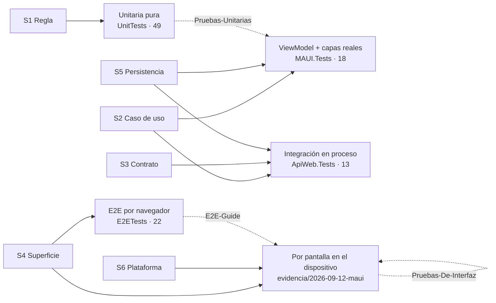

# Test-Guide — pruebas automatizadas más allá del navegador

Tres documentos que ubican a la prueba E2E por navegador —la que enseña [`E2E-Guide/`](../E2E-Guide/)—
entre los demás tipos de prueba que una solución .NET necesita, desde una regla de dominio hasta una
app Android en un teléfono. Comparten un marco de referencia (escenarios, contextos, actores) que se
define una sola vez, en el primero, y las marcas de evidencia del conjunto E2E.

Todo lo que afirman está anclado: a un archivo de `Lab-E2E.WebBlazor` en el commit `10ce735`
(**[E:]**), a una corrida observada (**[V]**), a una fuente de la industria consultada el 2026-09-12
(**[B: n]**), o declarado como criterio propio (**[C]**).

## Los documentos

Se leen en este orden si es la primera vez; si no, por la columna del medio.

| Documento | Para quién | De qué va |
| --- | --- | --- |
| [Panorama-De-Pruebas-Automatizadas.md](Panorama-De-Pruebas-Automatizadas.md) | Quien ya escribió E2E y tiene que probar una API, una app MAUI o una capa de dominio, y no sabe con qué | Los tipos de prueba con su procedencia (pirámide, trofeo, dobles de Meszaros); qué prueba cada capa de Clean Architecture; base real o doble; qué cambia entre web, API y móvil; y el mapa «estoy acá → aplico esto». **Define el marco de referencia** que los otros dos usan |
| [Pruebas-Unitarias-Y-Arquitectura.md](Pruebas-Unitarias-Y-Arquitectura.md) | Quien tiene que escribir la primera prueba que no abre un navegador | Qué es una unidad según dónde vive el código: la regla pura, el servicio con colaboradores, el ViewModel detrás de la plataforma. Cómo elegir el doble. Cómo se prueba lo que vive en `net10.0-android` sin el workload |
| [Pruebas-De-Interfaz-Por-Pantalla.md](Pruebas-De-Interfaz-Por-Pantalla.md) | Quien tiene que probar `MovilidadUrbana.MAUI` sin `GetByTestId` | Cuando no hay DOM: el árbol de accesibilidad, los tres niveles de localización, Appium y `AutomationId`, lo que se hizo con `adb` en el moto e6 play, la suite Appium que corre contra él, y qué va al dispositivo y qué al ViewModel |

## El mapa, en una pantalla

Los escenarios S1–S6 y los contextos C-Web, C-API, C-Móvil, C-Escritorio y C-CI están definidos en
el [Panorama §2](Panorama-De-Pruebas-Automatizadas.md#2-el-marco-de-referencia).

## Cómo se relaciona con `E2E-Guide/`

`E2E-Guide/` es dueña del vocabulario *superficie, promesa, estado, testigo* y del método para llegar
de un requerimiento a un caso. `Test-Guide/` no lo redefine: lo usa, y lo extiende a las superficies
que no son un DOM —el contrato de una API, el árbol de controles de una app— y a los niveles que están
debajo de la superficie. Cuando un tema tiene documento en las dos carpetas, el enlace va hacia la
que es dueña; el criterio compartido vive en un solo lugar.

## Lo que no hay acá, declarado

Ninguno de los tres documentos cubre pruebas de carga, de contrato entre servicios, de mutación, de
seguridad ni de cobertura como métrica; tampoco iOS, Windows ni emuladores en CI. Cada documento lo declara en su sección «Lo que no cubre», con el motivo: nada del
laboratorio lo ejercita, y la regla es no afirmar lo que no se verificó.
