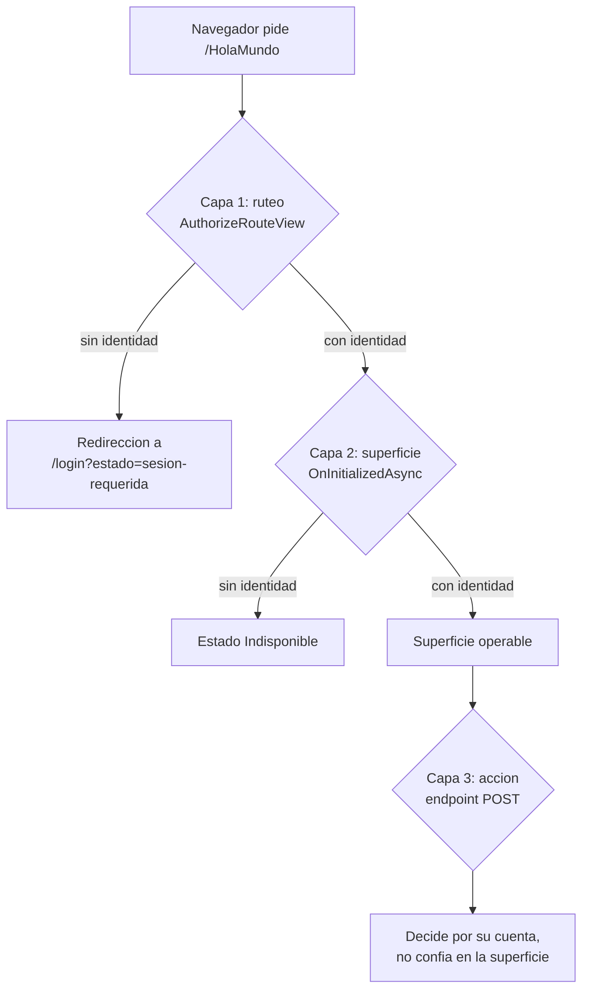
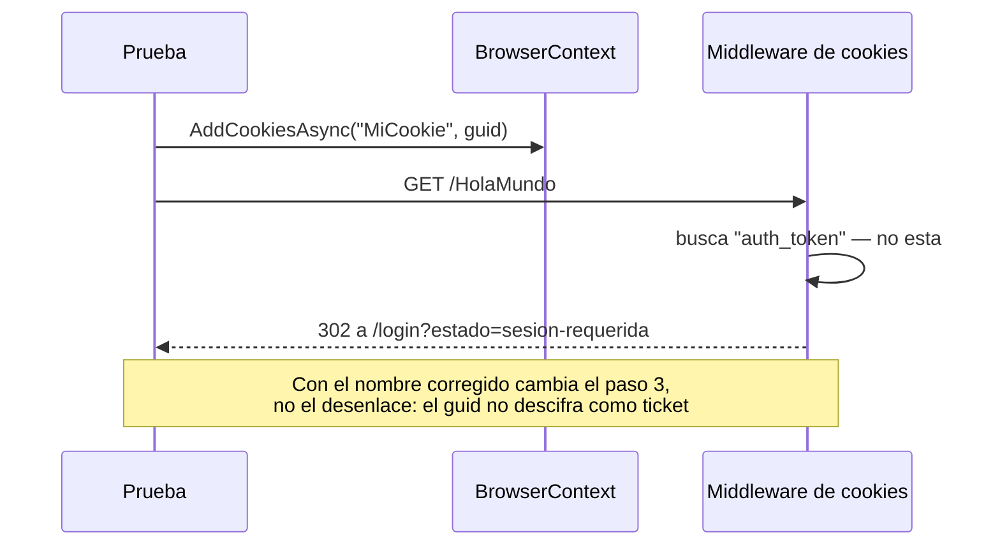
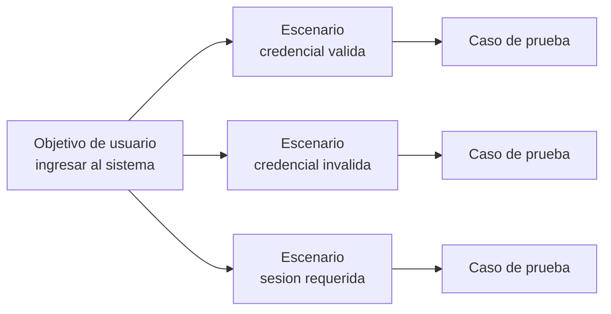
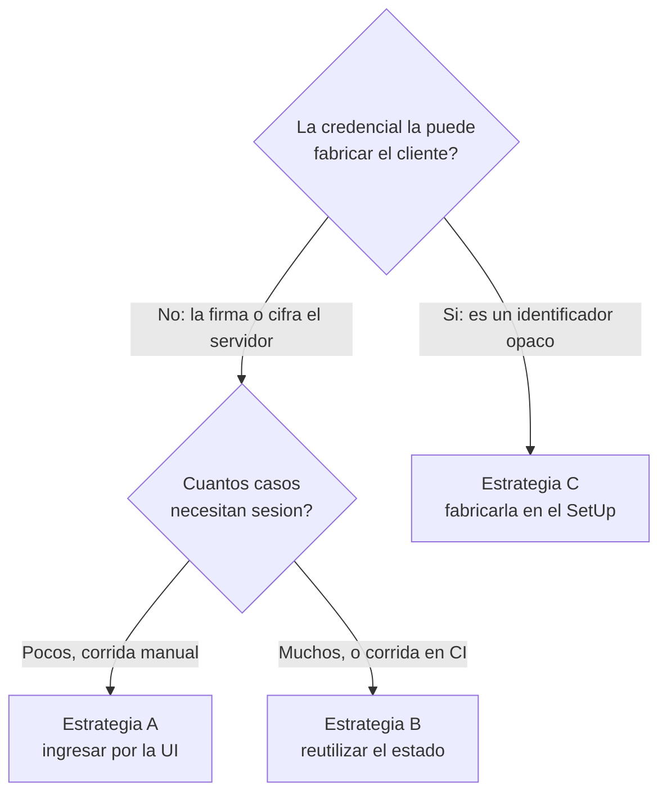

# Probar una página autorizada

Una página con `[Authorize]` no se prueba distinto que una abierta: se navega, se escribe, se
aprieta el botón y se afirma sobre lo que aparece. Lo que cambia es todo lo que hay que hacer
**antes** de que esa página exista para el navegador de la prueba. Ese «antes» es el tema de este
documento, y en `WebBlazor.E2E.Base.Login` tiene un nudo concreto: la credencial vive en una cookie
que la prueba no puede inventar.

Estas notas nacen del debate abierto por
[`Estudiando-Probar-Pagina-Authorized.md`](../Estudiando-Probar-Pagina-Authorized.md) y no lo
cierran. El alcance es deliberadamente angosto: **cómo se llega al estado de sesión y qué se hace
con las cookies**, corriendo a mano desde Visual Studio (**CTX-01**). No se propone montar la
infraestructura de `Lab-E2E.WebBlazor` —`[SetUpFixture]`, `runsettings`, trazas—; eso está descripto
en [Beginner-Guide.md](../../../../../Lab-Documentos.Documentacion/Guides/E2E-Guide/Beginner-Guide.md)
y acá se referencia sin repetirse.

El vocabulario —escenarios `ESC-`, contextos `CTX-`, actores `ACT-`— es el de esa guía. No se
redefine acá: un solo glosario para las dos.

## Marcas de evidencia

Las mismas de la guía de estudio, más una para lo que quedó sin comprobar.

| Marca | Significado |
| --- | --- |
| **[E: ruta]** | *Evidencia en el repositorio*. Se comprueba abriendo ese archivo |
| **[V]** | *Verificado por ejecución*. Se corrió y se observó el resultado |
| **[F: id]** | *Fundamentado*. Respaldado por la documentación externa del [Anexo C](#anexo-c--fuentes) |
| **[C]** | *Criterio*. Decisión defendible del autor, no obligación |
| **[?]** | *Pendiente de verificación*. Se explica cómo comprobarlo en [§11](#11-observaciones) |

**Sobre las marcas [V].** El host no admite instalar el SDK de .NET, así que la primera versión de
estas notas fue análisis puro por lectura. Desde el 2026-09-02 la batería se corre dentro de un
contenedor ([Anexo E](#anexo-e--correr-las-pruebas-sin-instalar-nada-en-el-host)), y lo que esa
corrida comprobó lleva **[V]** con su registro en
`evidencia/2026-09-02-contenedor-de-pruebas/corrida.log`. El resto sigue siendo lectura.

## Contenido

| § | Tema | Qué deja |
| --- | --- | --- |
| [1](#1-definición-del-problema) | Definición del problema | Qué es el «estado de partida» y qué cambió respecto de HolaMundo |
| [2](#2-las-dos-cookies) | Las dos cookies | La distinción que ordena todo lo demás |
| [3](#3-cómo-se-formaliza-quiero-ingresar) | Cómo se formaliza «quiero ingresar» | Objetivo, escenario y caso; dónde encajan «sujeto» y «precondición» |
| [4](#4-las-tres-estrategias-para-la-precondición-de-sesión) | Las tres estrategias | Ingresar por UI, reutilizar el estado o fabricar la cookie |
| [5](#5-el-momento-ssr-estático-y-circuito) | El momento | Qué esperar antes de actuar en cada superficie |
| [6](#6-qué-se-afirma-el-rechazo-indiferenciado) | Qué se afirma | Por qué la prueba no puede afirmar el motivo del rechazo |
| [7](#7-diagnóstico-del-archivo-actual) | Diagnóstico | Los cinco problemas del archivo de prueba, con línea |
| [8](#8-forma-propuesta) | Forma propuesta | Cómo quedarían los casos |
| [9](#9-preguntas-formadoras-de-criterio) | Preguntas formadoras de criterio | El cuestionario, con la respuesta explicada |
| [10](#10-criterios-de-calidad) | Criterios de calidad | Cómo se distingue un buen caso de acceso de uno pobre |
| [11](#11-observaciones) | Observaciones | Hechos, interpretaciones y lo no verificado |
| [12](#12-puntos-abiertos-del-debate) | Puntos abiertos | Lo que hay que decidir |
| [Anexos](#anexo-a--plantilla-comentada) | A–D | Plantilla, glosario, fuentes e inventario de `data-testid` |

---

## 1. Definición del problema

### 1.1. Qué es el estado de partida

**Estado de partida** es el conjunto de condiciones que tienen que valer para que el caso pueda
empezar a hacer lo que vino a hacer. En la jerga de las pruebas es el *arrange* del patrón
*arrange–act–assert*: lo que se prepara, no lo que se verifica.

La distinción no es académica. Lo que está en el estado de partida **no se afirma**: si falla, el
caso no falla informando un defecto, falla informando que no se pudo ni empezar. De ahí sale el
criterio que gobierna todo este documento: cuanto más caro y más frágil sea el estado de partida,
más conviene que esté aislado, sea explícito y falle con un mensaje propio.

`WebBlazor.E2E.Base.HolaMundo` no tiene estado de partida: se navega y la página está
**[E: tests/WebBlazor.E2E.Base.HolaMundo.E2ETests/HolaMundoE2ETests.cs:7-11]**. Ese es exactamente
el motivo por el que resulta «fácil de visualizar».

### 1.2. Qué cambió en el proyecto con login

| Eje | `HolaMundo` | `Login` |
| --- | --- | --- |
| Guard sobre la superficie | Ninguno | `@attribute [Authorize]` **[E: src/…Login/Components/Paginas/HolaMundo.razor:2]** |
| Superficies en juego | Una | Dos: `/login` SSR estático y `/HolaMundo` interactiva **[E: Ingreso.razor:1-8; HolaMundo.razor:3]** |
| Estado de partida | Ninguno | Una sesión autenticada |
| Dónde vive ese estado | — | Cookie `auth_token` en el navegador, validada en el servidor **[E: Program.cs:24]** |
| Qué pasa si falta | — | El ruteo redirige a `/login` **[E: Components/Routes.razor:4-9]** |

El guard no está en un solo lugar, y eso importa para elegir qué se prueba. La aplicación lo
resuelve en tres capas, cada una con su responsabilidad:



**[E: Routes.razor:4-9; HolaMundo.razor:117-130; IdentidadEndpoints.cs:29-36]**

Una prueba E2E ejercita la capa 1 y la 2 sin proponérselo, porque navega como navegaría una
persona. La capa 3 solo se ejercita si se le pega al endpoint directamente, y eso ya no es una
prueba de extremo a extremo sino de contrato HTTP. **[C]**

### 1.3. Qué no es este documento

No es una guía de cómo montar un proyecto E2E: eso está en
[Beginner-Guide.md](../../../../../Lab-Documentos.Documentacion/Guides/E2E-Guide/Beginner-Guide.md)
§4. No es una receta de ABM: eso está en
[Quick-Guide-ABM.md](../../../../../Lab-Documentos.Documentacion/Guides/E2E-Guide/Quick-Guide-ABM.md).
Y no es una decisión tomada: [§12](#12-puntos-abiertos-del-debate) lista lo que sigue abierto.

---

## 2. Las dos cookies

### 2.1. Definición: partición y credencial

El archivo de prueba actual trae una cookie copiada del laboratorio grande. La copia es razonable
—el código se parece— y equivocada, porque las dos cookies resuelven problemas distintos.

Una **cookie de partición** es un identificador opaco que la prueba inventa para que el servidor le
sirva un espacio de datos propio. La inventa la prueba justamente porque no significa nada: es un
`Guid`, y su único requisito es ser distinto del de las otras pruebas.

Una **cookie de credencial** es la prueba de que alguien se autenticó. No la puede inventar el
cliente, porque entonces cualquiera se autenticaría escribiendo una cookie.

| | Laboratorio grande | Este proyecto |
| --- | --- | --- |
| Nombre | `sesion-…` **[E: Beginner-Guide.md:1646]** | `auth_token` **[E: Program.cs:24]** |
| Para qué | Particionar filas de SQLite | Autenticar |
| Quién la crea | La prueba | El servidor, con `SignInAsync` **[E: IdentidadEndpoints.cs:39]** |
| Qué lleva adentro | Un `Guid` opaco | Un ticket serializado y cifrado **[F: DP]** |
| ¿La prueba la puede fabricar? | Sí | No ([§2.2](#22-por-qué-acá-no-se-puede-fabricar)) |

Hay un dato que cierra el argumento antes incluso de mirar el cifrado: **esta aplicación no
persiste nada** —«Persistencia: Ninguna: no hay base de datos ni EF Core»
**[E: ia-db/Base/README.md]**—, así que el problema que la cookie de partición resuelve allá, acá
no existe. La cookie del archivo actual no está mal implementada: sobra.

### 2.2. Por qué acá no se puede fabricar

Tres razones, en orden de importancia. La primera basta.

**El nombre no coincide.** La prueba escribe `MiCookie`
**[E: tests/…Login.E2ETests/HolaMundoE2ETest.cs:13]** y el esquema de autenticación lee `auth_token`
**[E: Program.cs:24]**. Ningún middleware de esta aplicación mira `MiCookie`: agregarla no cambia
absolutamente nada.

**El valor tampoco serviría.** Suponiendo el nombre corregido, el contenido de la cookie de
autenticación por cookies de ASP.NET Core es un ticket serializado y protegido por Data Protection
**[F: DP]**. La configuración no reemplaza el formato —no hay `TicketDataFormat` propio en el bloque
de opciones **[E: Program.cs:21-34]**—, así que rige el de fábrica. Un `Guid` en ese lugar no
descifra, el ticket se descarta, la petición sigue como anónima y el guard vuelve a mandar a
`/login`.



**Lo que *no* es el obstáculo.** `Cookie.HttpOnly = true` **[E: Program.cs:32]** impide leer la
cookie desde JavaScript, pero `Context.AddCookiesAsync` escribe en el almacén del contexto del
navegador, no por script **[F: PW-AUTH]**. Conviene tenerlo claro para no atribuirle el fracaso a
la bandera equivocada.

> **Conclusión de método.** En esta aplicación la credencial **no se fabrica: se obtiene**. La única
> forma de tenerla es que el servidor la emita, y eso significa pasar por el POST a
> `/identidad/ingreso` **[E: IdentidadEndpoints.cs:22-42]** — sea recorriendo el formulario o
> guardando el estado que ese recorrido deja.

### 2.3. El código actual, línea por línea

```csharp
// tests/WebBlazor.E2E.Base.Login.E2ETests/HolaMundoE2ETest.cs, líneas 13-28
string CookieDeSesion = "MiCookie";          // nombre que la aplicación no lee (§2.2)
static string UrlBase = "https://localhost:7212";   // correcto, pero no se usa para navegar (§7)

[SetUp]
async public Task Setup()
{
    await Context.AddCookiesAsync(
    [
        new Cookie
        {
            Name  = CookieDeSesion,
            Value = Guid.NewGuid().ToString("n"),   // no descifra como ticket
            Url   = UrlBase
        }
    ]);
}
```

El fragmento es correcto **como Playwright**: así se agrega una cookie a un contexto. Lo que falla
es la premisa de que agregar una cookie alcance para estar autenticado en esta aplicación.

---

## 3. Cómo se formaliza «quiero ingresar»

Pensar desde el usuario —«quiero ingresar; ¿qué pasa si pongo mal el secreto?»— es el punto de
partida correcto, y tiene un vocabulario propio que evita tener que reinventarlo en cada proyecto.
Esta sección lo fija, porque de él salen las dos palabras que venían sin definir: *sujeto* y
*precondición*.

### 3.1. El vocabulario

Cuatro términos, del más general al más concreto **[F: UC]**:

| Término | Definición | En este proyecto |
| --- | --- | --- |
| **Actor** | Quien persigue algo del sistema | Una persona con credencial de laboratorio |
| **Objetivo de usuario** | Lo que quiere lograr, enunciado **sin mencionar la interfaz** | «Ingresar al sistema» |
| **Escenario** | Un camino concreto desde el disparador hasta **un** desenlace. El de éxito es el *curso normal*; los demás, *cursos alternativos* | «Ingreso aceptado», «credencial rechazada», … |
| **Caso de prueba** | La ejecución de un escenario con datos concretos y una aserción sobre su desenlace | `MostrarMensaje`, y los que faltan |

La cadena es siempre la misma: **un objetivo → varios escenarios → un caso de prueba por
escenario**. La intuición de «qué pasa si pone bien y qué pasa si pone mal» es exactamente el paso
del medio: enumerar los escenarios de un objetivo.

Enunciar el objetivo sin mencionar la interfaz no es purismo. «Ingresar al sistema» sobrevive a que
mañana el formulario sea un modal o el ingreso pase a ser por proveedor externo; «llenar los dos
campos y apretar Ingresar» no sobrevive a nada. El objetivo es lo estable; la interfaz, el detalle.



### 3.2. Dado–Cuando–Entonces, y de dónde salen «sujeto» y «precondición»

Un escenario se escribe en tres partes **[F: GWT]**:

| Parte | Qué contiene | Cómo se llama en el código de la prueba |
| --- | --- | --- |
| **Dado** | El estado de partida ([§1.1](#11-qué-es-el-estado-de-partida)) | El `[SetUp]` |
| **Cuando** | La acción del actor. **Una sola** | El cuerpo del caso |
| **Entonces** | El desenlace observable | Las aserciones |

Sobre esa forma, la regla que ordena todo lo demás:

> Lo que está en el **Dado** no se afirma. Lo que está en el **Entonces** no se prepara.

Y de ahí sale la distinción que quedó sin definir en la primera versión de estas notas. **No son dos
conceptos rivales: son dos casilleros.** El mismo acto —ingresar— es una cosa u otra según en qué
parte del escenario aparezca:

| | Escenario «ingreso aceptado» | Escenario «mostrar una frase» |
| --- | --- | --- |
| **Dado** | que no tengo sesión | que ingresé con credencial válida ← *el login acá es **precondición*** |
| **Cuando** | envío `admin` / `admin` ← *el login acá es **sujeto*** | escribo una frase y aprieto «Mostrar la frase» |
| **Entonces** | quedo con sesión en `/` | la frase aparece en `campo-mensaje` |

El login es el mismo en los dos. Lo que cambia es si es lo que se verifica o lo que se prepara para
poder verificar otra cosa. Cuando aparece en el **Cuando**, es sujeto y se le escribe un caso
propio; cuando aparece en el **Dado**, es precondición y se resuelve en el `[SetUp]`
([§4](#4-las-tres-estrategias-para-la-precondición-de-sesión) discute con cuál de las tres
estrategias).

### 3.3. Los escenarios reales de esta aplicación

Enumerados desde el código, no desde la imaginación. La columna que importa es la última: un
escenario que la interfaz no puede alcanzar **no es un escenario E2E**.

| id | Escenario | Cuando | Entonces observable | ¿Alcanzable desde la interfaz? |
| --- | --- | --- | --- | --- |
| **EU-1** | Ingreso aceptado | Se envía `admin` / `admin` | Cookie emitida y redirección a destino seguro **[E: IdentidadEndpoints.cs:39-41]** | Sí **[E: verificar.mjs:76-84]** |
| **EU-2** | Credencial rechazada | Se envía cualquier otra combinación | `/login?estado=credenciales-rechazadas` y la banda «No pudimos validar el ingreso…» **[E: ServicioDeIdentidad.cs:30-33; IdentidadEndpoints.cs:35]** | Sí **[E: verificar.mjs:68-74]** |
| **EU-3** | Sesión requerida | Se pide `/HolaMundo` sin sesión | `/login?estado=sesion-requerida` **[E: Routes.razor:8]** | Sí **[E: verificar.mjs:63-65]** |
| **EU-4** | Cierre de sesión | Se aprieta «Cerrar sesión» | `/login?estado=sesion-cerrada` **[E: IdentidadEndpoints.cs:44-48]** | Sí **[E: verificar.mjs:96-100]** |
| **EU-5** | Datos incompletos | Se envía el formulario sin datos | `/login?estado=datos-incompletos` **[E: ServicioDeIdentidad.cs:24-27]** | **Solo en parte**: ver abajo |
| **EU-6** | Volver a lo que pedía | Se ingresa después de que el guard interrumpió | Redirección a la superficie originalmente pedida **[E: IdentidadEndpoints.cs:55-61]** | **No por el camino del guard**: ver abajo |

**EU-5 tiene un borde fino.** Los dos campos llevan `required`, así que el navegador bloquea el
envío con el campo vacío y el servidor nunca se entera **[E: Ingreso.razor:29,35; F: HTML]**. Pero
el servicio rechaza con `IsNullOrWhiteSpace` **[E: ServicioDeIdentidad.cs:24]**, y un espacio en
blanco satisface a `required`. Conclusión: el escenario **es** alcanzable desde la interfaz, pero
solo escribiendo espacios —no dejando el campo vacío—. Es un caso de prueba legítimo y bastante
menos obvio de lo que parecía.

**EU-6 parece existir y por el camino del guard no se alcanza.** El endpoint sabe volver a
`returnurl` y lo valida contra redirecciones abiertas **[E: IdentidadEndpoints.cs:55-61]**, y la
superficie de ingreso sabe recibirlo **[E: Ingreso.razor:24,56-57]**. Pero el guard de ruteo arma el
destino con el código de estado **y nada más**: no agrega `returnurl`
**[E: Routes.razor:8]**. Quien es interrumpido pidiendo `/HolaMundo` termina en `/` después de
ingresar, no en `/HolaMundo`. **[?]** — es lectura, no ejecución; cómo comprobarlo, en
[§11.4](#114-lo-no-verificado).

### 3.4. Cuántos casos salen de ahí

La cantidad de casos **no la fija la cantidad de causas, sino la cantidad de desenlaces
distinguibles desde afuera**. Es la regla que responde de una vez la pregunta «¿pruebo también el
usuario inexistente?».

Usuario inexistente y secreto equivocado son dos causas. Producen **un solo** desenlace, por diseño
([§6](#6-qué-se-afirma-el-rechazo-indiferenciado)), así que son **un** caso: dos casos que afirman
exactamente lo mismo no agregan cobertura, agregan tiempo de corrida y una segunda cosa que
mantener.

De los seis escenarios, entonces, la batería E2E se queda con cuatro —EU-1 a EU-4— más EU-5 con su
variante de espacios. EU-6 no se puede probar por la interfaz mientras el guard no pase el
`returnurl`; si interesa cubrirlo hoy, es una prueba del endpoint, que es otro nivel y otro
proyecto. **[C]**

### 3.5. Dos usos de la palabra «escenario»

Vale desambiguar, porque la palabra aparece con dos sentidos en documentos que se leen juntos:

| Uso | Qué enumera | Ejemplo |
| --- | --- | --- |
| **Escenario de caso de uso** (`EU-`, esta sección) | Caminos del **usuario** dentro de un objetivo | EU-2, credencial rechazada |
| **Escenario del marco de referencia** (`ESC-`, la guía de estudio) | Situaciones del **equipo de desarrollo** en las que se aplican las E2E | ESC-01, se escribe una pantalla nueva |

Este documento vive en **ESC-01** —hay una superficie nueva que cubrir— y en el contexto
**CTX-01**, máquina de desarrollo con ejecución manual. Ese recorte cambia varias respuestas:

| Eje | Cómo afecta a la decisión |
| --- | --- |
| **CTX-01** máquina de desarrollo | Se corre de a un caso y se mira fallar. El costo por caso importa poco: un ingreso por interfaz de más no molesta. Esto habilita la estrategia A de [§4](#4-las-tres-estrategias-para-la-precondición-de-sesión) |
| **CTX-02** runner de CI | Cambiaría la respuesta: en una corrida completa, N ingresos por interfaz sí se pagan, y ahí el estado guardado empieza a rendir |
| **ACT-01** quien desarrolla | Decide la estrategia de sesión y publica los `data-testid`. Ya están publicados ([Anexo D](#anexo-d--inventario-de-data-testid)) |
| **ACT-02** QA | Decidiría si el flujo de acceso es recorrido crítico. En este laboratorio los dos roles son la misma persona **[C]** |

La aplicación no se despliega en ningún lado, así que **CTX-03** y **CTX-04** no aplican. Anotarlo
evita la tentación de resolver problemas que este proyecto no tiene.

---

## 4. Las tres estrategias para la precondición de sesión

Antes de comparar hay que deshacer un equívoco de la pregunta original: *«¿incluyo el login en el
test E2E?»* mezcla dos papeles distintos del login.

Como **sujeto**, el login es lo que se está verificando: ¿acepta la credencial válida?, ¿rechaza la
inválida?, ¿el guard manda a `/login`? Como **precondición**, el login es apenas el peaje para
llegar a otra página. La respuesta es distinta en cada caso.

**Como sujeto, sí, sin discusión.** El flujo de identidad tiene conducta propia y hoy no tiene
ningún caso en la batería. Lo único que lo cubre es el guion de evidencia
`verificar.mjs` **[E: evidencia/2026-09-01-aplicacion-template/verificar.mjs:57-101]**, que es
Playwright para Node, no forma parte de la corrida de NUnit y no lo dispara ningún workflow
**[E: ia-db/Base/indexes/03_Pruebas.md]**.

**Como precondición, es un intercambio.** Ahí entran las tres estrategias.

### 4.1. Estrategia A — ingresar por la interfaz

El `[SetUp]` recorre el formulario igual que una persona: llena `campo-usuario` y `campo-clave` y
aprieta `boton-ingresar` **[E: Ingreso.razor:28,34,40]**.

Es el camino real y no supone nada sobre las tripas de la aplicación. Ya está demostrado que
funciona: el guion de evidencia hace exactamente eso y su log del 2026-09-01 lo registra en verde
**[E: verificar.mjs:76-84; evidencia/2026-09-01-aplicacion-template/verificacion.log]**.

Tiene un costo real y uno oculto. El real es un envío de formulario más una redirección por cada
caso. El oculto es peor: si el login se rompe, **fallan todos los casos**, y ninguno explica por
qué. Un rojo generalizado sin causa visible cuesta más tiempo que los segundos que ahorra.

### 4.2. Estrategia B — reutilizar el estado

Un ingreso se hace una sola vez, se guarda el estado del contexto —cookies incluidas— y los casos
posteriores arrancan con ese estado ya cargado **[F: PW-AUTH]**.

Paga el camino real una vez y deja el fallo del login aislado en su propio caso, que es lo que la
estrategia A no logra. A cambio hay que decidir dónde vive el archivo de estado, cuándo se
regenera y qué pasa cuando caduca. Para un caso protegido, es maquinaria sin retorno. **[C]**

### 4.3. Estrategia C — fabricar la cookie

Es lo que intenta el archivo actual. **En esta aplicación no está disponible**, por lo desarrollado
en [§2.2](#22-por-qué-acá-no-se-puede-fabricar).

Vale registrar el argumento que la contraindica incluso donde sí funciona: una prueba que fabrica su
propia credencial deja de ejercitar el ingreso. Puede pasar en verde con el login roto. **[C]**

### 4.4. Cómo elegir



**Este proyecto entra por la rama izquierda y termina en A**: la credencial la cifra el servidor
([§2.2](#22-por-qué-acá-no-se-puede-fabricar)) y hay un solo caso protegido
**[E: HolaMundo.razor:2]**, corriendo a mano (**CTX-01**). **[C]**

El criterio queda anotado para cuando cambie: **B se justifica cuando el ingreso por UI empieza a
repetirse más veces de las que uno quiere mirar fallar**.

---

## 5. El momento: SSR estático y circuito

### 5.1. Definición

Blazor con render *interactive server* mantiene un **circuito**: una conexión abierta entre el
navegador y el servidor por la que viajan los eventos de la interfaz. Antes de que el circuito se
establezca, la página ya está pintada —eso es el *prerender*— pero **los clics no hacen nada**: no
hay a quién mandarlos.

Las dos superficies de este proyecto están en veredas opuestas, y no por casualidad:

| Superficie | Modo | Por qué |
| --- | --- | --- |
| `/login` | SSR estático, sin `@rendermode` **[E: Ingreso.razor:1-8]** | La cookie se escribe en una cabecera, y una cabecera solo se puede escribir mientras la respuesta no empezó. Con el circuito ya establecido, la respuesta HTTP ya se envió **[E: IdentidadEndpoints.cs:8-13]** |
| `/HolaMundo` | `@rendermode InteractiveServer` **[E: HolaMundo.razor:3]** | Reacciona sin recargar |

De ahí sale una consecuencia práctica que conviene fijar: en `/login` **no hay nada que esperar**,
porque el formulario es nativo y se envía por POST. En `/HolaMundo` sí.

### 5.2. El testigo que no existe

El laboratorio grande resuelve la espera con un testigo en el marcado: un atributo que vale `false`
durante el prerender y `true` cuando el circuito quedó establecido, sobre el que la prueba afirma
antes de tocar nada **[E: Beginner-Guide.md:820-824]**.

**En este repositorio ese testigo no existe.** Buscar `estado-app` en los `.razor` de
`WebBlazor.E2E.Base.Login` no devuelve nada; el inventario completo de identificadores está en el
[Anexo D](#anexo-d--inventario-de-data-testid). La línea 36 del archivo de prueba lo espera igual, y
por eso no podría pasar nunca.

Hay dos salidas, y la barata alcanza:

1. **Apoyarse en el reintento de la aserción.** `Expect(...)` reintenta hasta que el elemento
   aparezca **[F: PW-ASSERT]**, así que afirmar sobre `campo-mensaje` tolera un circuito que tardó.
   Es lo que hace el guion de evidencia, con un `waitFor` sobre el resultado
   **[E: verificar.mjs:30]**.
2. **Agregar el testigo al layout.** Más robusto y más invasivo: toca la aplicación para beneficio
   de la prueba.

### 5.3. La intermitencia dejó de ser hipótesis

Corriendo la batería ocho veces seguidas contra la misma aplicación, **la primera corrida falla y
las siete siguientes pasan** **[V: evidencia/2026-09-02-contenedor-de-pruebas/corrida.log]**. El
mensaje es el que corresponde a un clic perdido:

```
Locator expected to have text 'Hola mundo! - que tal?'
But was: '<element(s) not found>'
```

Los tiempos completan el cuadro: 6 segundos la corrida en rojo, entre 850 ms y 1 s todas las verdes.
No es azar, es **arranque en frío**: la primera petición contra una aplicación recién levantada tarda
lo suficiente como para que el clic llegue antes de que el circuito esté conectado, y el evento se
pierda. Con la aplicación caliente, el circuito gana la carrera todas las veces.

Esto tiene una consecuencia incómoda que conviene ver ahora y no en un pipeline. Corriendo a mano
(**CTX-01**), el fallo es una molestia: se vuelve a apretar y pasa. Pero en integración continua la
aplicación se levanta **para** la corrida, así que la única corrida que hay es siempre la primera:
la que falla. Una prueba que en la máquina de desarrollo parece intermitente puede estar en rojo
sistemático en el runner.

Con eso a la vista, el punto 2 de [§12](#12-puntos-abiertos-del-debate) deja de ser una preferencia
estética. La opción 1 —apoyarse en el reintento— alcanza mientras se corra a mano; la opción 2 —el
testigo— es lo que hace falta si esto alguna vez va a un pipeline. **[C]**

---

## 6. Qué se afirma: el rechazo indiferenciado

El ingreso rechazado **nunca dice qué falló**. Usuario inexistente y secreto equivocado devuelven el
mismo código, `credenciales-rechazadas` **[E: Servicios/ServicioDeIdentidad.cs]**, y el texto sale
de un catálogo único **[E: Servicios/CatalogoDeResultados.cs]**.

Es una decisión de seguridad: distinguir «ese usuario no existe» de «la clave está mal» le confirma
a un atacante qué identificadores son válidos. Para la prueba tiene una consecuencia directa y fácil
de pasar por alto: **el caso no puede afirmar el motivo del rechazo, porque la aplicación no lo
expone**. Solo puede afirmar que se rechazó.

En concreto, la prueba afirma el texto del catálogo, que es lo único observable:

```csharp
// Lo que sí se puede afirmar tras una credencial inválida
await Expect(Page.GetByTestId("mensaje-resultado"))
    .ToContainTextAsync("No pudimos validar el ingreso");
```

**[E: CatalogoDeResultados.cs; Ingreso.razor:17]**

Afirmar el texto tiene su propio costo: acopla la prueba a la redacción del catálogo. Es aceptable
mientras el catálogo sea la única fuente de esos textos, que es lo que el diseño garantiza. **[C]**

---

## 7. Diagnóstico del archivo actual

`tests/WebBlazor.E2E.Base.Login.E2ETests/HolaMundoE2ETest.cs`. Cinco problemas, todos verificados
por lectura, ordenados por gravedad.

| # | Qué | Dónde | Efecto |
| --- | --- | --- | --- |
| 1 | Dos métodos `Setup()` con la misma firma en la misma clase | líneas 18 y 32 | **No compila**: el proyecto entero queda fuera de la corrida |
| 2 | La cookie fabricada no autentica | líneas 13, 20-28 | Inútil acá ([§2](#2-las-dos-cookies)) |
| 3 | Navega al puerto `7071`, que no es de este proyecto | línea 34, contra `Properties/launchSettings.json:17` (`7212`) | Iría a otra aplicación o a ninguna |
| 4 | `GotoAsync("/HolaMundo")` relativo sin `BaseURL` configurada | línea 35 | Playwright no puede resolver una ruta relativa sin URL base **[F: PW-BASEURL]** |
| 5 | Espera el testigo `estado-app` | línea 36 | No existe en este marcado ([§5.2](#52-el-testigo-que-no-existe)) |

El problema 3 tiene un detalle que vale la pena mirar: la constante `UrlBase` de la línea 15 **sí
tiene el puerto correcto**, pero no se usa para navegar. Son dos valores distintos de la misma cosa
en el mismo archivo, que es la forma clásica en que una constante deja de proteger de nada.

Más allá de la compilación, hay una razón de fondo para tener un solo `[SetUp]`: **NUnit no
garantiza el orden entre varios métodos `[SetUp]` de la misma clase** **[F: NU-SETUP]**. Aunque
compilara, el orden sería una apuesta.

---

## 8. Forma propuesta

Dos clases, porque tienen precondiciones opuestas: una necesita **no** tener sesión y la otra
necesita tenerla. Meterlas en la misma clase obligaría a un `[SetUp]` que a veces ingresa y a veces
no, que es la forma más confiable de terminar con un `if` adentro del *arrange*. **[C]**

```csharp
// Propuesta — no está escrita en el repositorio todavía.
// Una sola constante de URL, usada para navegar Y como BaseURL (§7, problema 3).
public abstract class PruebaDeAcceso : PageTest
{
    protected const string UrlBase = "https://localhost:7212";   // [E: launchSettings.json:17]

    public override BrowserNewContextOptions ContextOptions() =>
        new() { BaseURL = UrlBase };   // habilita GotoAsync("/HolaMundo") relativo

    /// Estrategia A (§4.1): la credencial se obtiene, no se fabrica.
    protected async Task IngresarAsync(string usuario = "admin", string secreto = "admin")
    {
        await Page.GotoAsync("/login");
        await Page.GetByTestId("campo-usuario").FillAsync(usuario);
        await Page.GetByTestId("campo-clave").FillAsync(secreto);
        await Page.GetByTestId("boton-ingresar").ClickAsync();
    }
}
```

Sobre esa base, dos fixtures:

| Clase | Precondición | Casos |
| --- | --- | --- |
| `AccesoE2ETests` | **Sin** sesión, sin `[SetUp]` | El guard manda a `/login`; la credencial inválida muestra el texto del catálogo; la válida lleva a `/` |
| `HolaMundoProtegidoE2ETests` | `[SetUp]` que llama a `IngresarAsync()` | El mismo `MostrarMensaje` que ya funciona en el otro proyecto **[E: HolaMundoE2ETests.cs:13-23]** |

La credencial `admin`/`admin` está incrustada en el servicio de identidad como credencial de
laboratorio **[E: Servicios/ServicioDeIdentidad.cs]**; ponerla por defecto en el helper no agrega
un secreto nuevo, solo lo repite.

---

## 9. Preguntas formadoras de criterio

Estas son las preguntas a hacerse frente a cualquier página autorizada, en orden. Cada una trae
primero **el concepto** —por qué se pregunta— y después **la respuesta para este proyecto**. El
cuestionario sirve igual para el próximo proyecto; las respuestas, no.

### 9.1. Sobre qué se prueba

**P0 — ¿Cuál es el objetivo del usuario, y en cuántos desenlaces distintos puede terminar?**

Es la primera y la que ordena a todas las demás. Se enuncia el objetivo sin nombrar la interfaz, se
enumeran sus escenarios y recién ahí se cuentan los casos —uno por **desenlace distinguible desde
afuera**, no uno por causa ([§3](#3-cómo-se-formaliza-quiero-ingresar)).

*Acá*: el objetivo es «ingresar al sistema» y tiene seis escenarios, de los cuales cinco son
alcanzables desde la interfaz ([§3.3](#33-los-escenarios-reales-de-esta-aplicación)).

**P1 — ¿Qué afirma el caso: una conducta de la aplicación, o que el andamiaje funciona?**

Un caso que solo demuestra que el navegador arranca y la página carga no protege de ninguna
regresión: pasa siempre salvo catástrofe. La conducta es lo que un cambio futuro puede romper sin
darse cuenta.

*Acá*: afirma que la frase escrita se muestra en la superficie
**[E: HolaMundoE2ETests.cs:15-23]**. Que la página cargue es el medio, no la afirmación.

**P2 — ¿El login es sujeto o precondición en este caso?**

Es la pregunta que ordena la [§4](#4-las-tres-estrategias-para-la-precondición-de-sesión). Confundir
los papeles produce baterías donde cualquier problema de sesión se manifiesta como veinte casos en
rojo sobre veinte funcionalidades distintas.

*Acá*: precondición para `MostrarMensaje`, sujeto para los casos de acceso propuestos en
[§8](#8-forma-propuesta).

**P3 — Si el caso falla, ¿el nombre me dice qué se rompió?**

El nombre del caso es el mensaje de error que uno lee primero. Un caso llamado `MostrarMensaje` que
en realidad falló porque el login dejó de aceptar `admin` está mintiendo en el peor momento.

*Acá*, hoy, no: `MostrarMensaje` en el proyecto del Login puede fallar por el ingreso. La separación
en dos clases de [§8](#8-forma-propuesta) lo corrige parcialmente —el caso de acceso falla primero y
señala la causa—, pero la ambigüedad no desaparece del todo con la estrategia A. Es el costo
anotado en [§4.1](#41-estrategia-a--ingresar-por-la-interfaz).

**P4 — ¿Cuántas superficies protegidas hay hoy, y cuántas va a haber?**

De la respuesta sale A o B. No de la elegancia de cada una.

*Acá*: una, `/HolaMundo` **[E: HolaMundo.razor:2]** —`/` también lleva `[Authorize]`
**[E: Inicio.razor:3]** pero no tiene conducta que probar—. Una sola justifica A.

### 9.2. Sobre el estado de partida

**P5 — ¿Qué estado necesita la página para existir?**

Antes de preguntarse cómo fabricarlo hay que nombrarlo. Muchas pruebas frágiles nacen de una
precondición que nadie escribió y que se cumple por accidente.

*Acá*: una identidad autenticada. Nada más: no hay datos, ni permisos por rol, ni configuración
previa.

**P6 — ¿Ese estado vive en el navegador o en el servidor?**

Determina qué puede tocar la prueba. Lo que vive en el navegador —cookies, `localStorage`— la prueba
lo manipula directamente. Lo que vive en el servidor solo se alcanza por la aplicación.

*Acá*: en los dos lados a la vez, y ahí está la sutileza. La cookie está en el navegador, pero
**quien decide si vale es el servidor**, que la descifra **[F: DP]**. Tener la cookie no es tener la
sesión: es tener algo que el servidor va a aceptar o no.

**P7 — ¿La prueba puede *fabricar* ese estado, o solo *obtenerlo*?**

**Esta es la pregunta bisagra de todo el documento.** La respuesta separa las estrategias
disponibles de las que no lo están, y depende de una sola cosa: si el estado es un dato opaco que el
servidor acepta tal cual, o un dato que el servidor firma o cifra.

*Acá*: solo obtenerlo. El ticket lo cifra Data Protection y no hay formato propio configurado
**[E: Program.cs:21-34; F: DP]**. Queda descartada la estrategia C
([§4.3](#43-estrategia-c--fabricar-la-cookie)).

**P8 — ¿El estado se comparte entre casos o cada uno estrena el suyo?**

Estado compartido entre casos significa que el orden de ejecución empieza a importar, y el orden es
lo primero que cambia cuando se corre en paralelo.

*Acá*: cada caso estrena. Heredar de `PageTest` da a cada caso una página nueva en su propio
contexto de navegador, con cookies y almacenamiento vacíos
**[E: ia-db/Base/indexes/03_Pruebas.md; F: PW-NUNIT]**. Es también la razón por la que la estrategia
A tiene que ingresar en **cada** caso: el contexto anterior no sobrevive.

**P9 — ¿Hay estado de servidor que dos casos puedan pisarse?**

Es el problema que la cookie de partición resuelve en el laboratorio grande.

*Acá*: no. Sin persistencia **[E: ia-db/Base/README.md]** no hay nada que compartir, y por eso esa
cookie sobra ([§2.1](#21-definición-partición-y-credencial)).

### 9.3. Sobre el momento

**P10 — ¿La superficie es SSR estático o abre circuito?**

De esto depende si hay que esperar algo antes de interactuar. Es la diferencia entre una prueba
estable y una que falla una de cada diez corridas sin patrón.

*Acá*: `/login` es estático **[E: Ingreso.razor:1-8]**, `/HolaMundo` abre circuito
**[E: HolaMundo.razor:3]**.

**P11 — Si abre circuito, ¿hay un testigo que diga «ya está conectado»?**

Sin testigo, la prueba no tiene forma de saber si el clic va a llegar a algún lado. Se puede vivir
sin él apoyándose en el reintento de las aserciones, pero conviene saber que se está eligiendo eso.

*Acá*: no hay ([§5.2](#52-el-testigo-que-no-existe)). Se elige el reintento. **[C]**

**P12 — ¿Qué pasa si el clic llega antes de tiempo?**

*Acá*: se pierde sin dejar rastro, y el caso falla de forma intermitente
**[E: ia-db/Base/indexes/03_Pruebas.md]**. Intermitente es la peor categoría de fallo: no se
reproduce cuando uno lo busca y erosiona la confianza en toda la batería.

**P13 — ¿Qué forma tiene la respuesta al enviar el formulario de ingreso?**

Cambia qué se espera después de hacer clic. No es lo mismo esperar que un elemento aparezca en la
página actual que esperar una página distinta.

*Acá*: una redirección. El endpoint responde 302, no actualiza el DOM
**[E: IdentidadEndpoints.cs:35,41]**. Lo que sigue al clic es una navegación completa.

### 9.4. Sobre la observación

**P14 — ¿Con qué localizo los elementos?**

Un localizador atado a clases de presentación se rompe la primera vez que alguien cambia el CSS, y
convierte a la prueba en un impuesto sobre el rediseño.

*Acá*: `data-testid`, declarados en el marcado junto al control que nombran y documentados en el
propio `.razor` **[E: HolaMundo.razor:42-45,57-60,91-95]**. Inventario en el
[Anexo D](#anexo-d--inventario-de-data-testid).

**P15 — ¿Afirmo sobre valor o sobre texto?**

Un `input` guarda lo que tiene escrito en su propiedad `value`; un `<p>` lo guarda como texto del
nodo. Elegir mal produce un fallo que parece un misterio y es un tipo de elemento.

*Acá*: `campo-frase` es un `input` → `ToHaveValueAsync`; `campo-mensaje` es un `<p>` →
`ToHaveTextAsync`. El caso existente deja la alternativa comentada, justamente para que se vea la
distinción **[E: HolaMundoE2ETests.cs:21-22; HolaMundo.razor:95]**.

**P16 — ¿Cómo se ve «no tengo acceso», observado desde afuera?**

Hay que poder afirmar el rechazo, no solo el éxito. Una batería que solo prueba el camino feliz no
detecta que el guard dejó de funcionar.

*Acá*: la URL termina en `/login` y aparece la banda `mensaje-resultado`
**[E: Routes.razor:8; Ingreso.razor:17]**.

**P17 — ¿Puedo afirmar *por qué* se rechazó?**

*Acá*: no, y es a propósito ([§6](#6-qué-se-afirma-el-rechazo-indiferenciado)). Vale como principio
general: **la prueba no puede afirmar lo que la aplicación decidió no exponer**. Si hace falta
distinguir motivos, eso es un pedido de cambio a la aplicación, con su discusión de seguridad, no un
problema de la prueba.

### 9.5. Sobre el entorno

**P18 — ¿De dónde sale la URL bajo prueba?**

*Acá*: hoy es un literal, y hay dos valores distintos en el mismo archivo ([§7](#7-diagnóstico-del-archivo-actual)).
El perfil `https` publica en `https://localhost:7212`
**[E: Properties/launchSettings.json:17]**. Una constante única es el piso; una variable de entorno
recién hace falta cuando la misma prueba corre contra más de una URL, que no es el caso.

**P19 — ¿Quién levanta la aplicación?**

*Acá*: la persona, a mano, antes de correr **[E: ia-db/Base/indexes/03_Pruebas.md]**. Es una
diferencia deliberada con el laboratorio grande, donde un `[SetUpFixture]` la publica y la levanta.
Con corrida manual (**CTX-01**) el costo de olvidarse es un rojo obvio e inmediato.

**P20 — ¿Qué del entorno puede hacer fallar la prueba antes de llegar a la página?**

*Acá* **[?]**: el certificado de desarrollo. Si no está confiado, el handshake TLS contra
`https://localhost:7212` falla y el caso muere antes de la primera aserción, con un error que no
menciona nada de lo que la prueba estaba probando. Cómo comprobarlo, en [§11](#11-observaciones).

---

## 10. Criterios de calidad

Cómo distinguir un buen conjunto de casos sobre una página autorizada de uno pobre. Son criterios
del autor, no obligaciones. **[C]**

| Criterio | Versión pobre | Versión buena |
| --- | --- | --- |
| Ubicación del fallo | Todo rojo cuando el login se rompe, sin distinguir causa | Un caso de acceso falla primero y nombra la causa |
| Honestidad del estado de partida | La prueba fabrica la credencial y pasa con el login roto | La prueba obtiene la credencial por el camino real |
| Cobertura del rechazo | Solo el camino feliz | El guard y la credencial inválida tienen su caso |
| Localizadores | Clases de CSS o texto de la interfaz | `data-testid` declarados en el marcado |
| Esperas | `Task.Delay` calibrado a ojo | Aserciones que reintentan, o un testigo explícito |
| Fuente de la URL | Repetida, y con valores distintos | Una constante, usada para navegar y como `BaseURL` |
| Afirmación sobre el rechazo | Afirma un motivo que la aplicación no expone | Afirma lo observable: la redirección y el texto del catálogo |

---

## 11. Observaciones

Separando lo que se leyó de lo que se interpreta, como pide `Rule-Evidences`.

### 11.1. Hechos verificados por lectura

| # | Hecho | Fuente |
| --- | --- | --- |
| H1 | El proyecto de pruebas del login no compila: dos `Setup()` idénticos | `HolaMundoE2ETest.cs:18,32` |
| H2 | La cookie que la prueba agrega se llama `MiCookie`; el esquema lee `auth_token` | `HolaMundoE2ETest.cs:13`; `Program.cs:24` |
| H3 | No hay `TicketDataFormat` propio configurado | `Program.cs:21-34` |
| H4 | `estado-app` no existe en el marcado de este repositorio | Búsqueda en los `.razor`; ver [Anexo D](#anexo-d--inventario-de-data-testid) |
| H5 | El puerto del perfil `https` es 7212; la prueba navega al 7071 | `launchSettings.json:17`; `HolaMundoE2ETest.cs:34` |
| H6 | La aplicación no persiste datos | `ia-db/Base/README.md` |
| H7 | El flujo de acceso completo se ejecutó en verde el 2026-09-01, con Playwright para Node | `evidencia/2026-09-01-aplicacion-template/verificacion.log` |
| H8 | El guard de ruteo arma el destino solo con el código de estado: no agrega `returnurl`, aunque el endpoint y la superficie de ingreso sí saben manejarlo | `Routes.razor:8`; `IdentidadEndpoints.cs:55-61`; `Ingreso.razor:24,56-57` |
| H9 | Los dos campos del ingreso llevan `required`, y el servicio rechaza con `IsNullOrWhiteSpace`: el desenlace `datos-incompletos` se alcanza con espacios, no con el campo vacío | `Ingreso.razor:29,35`; `ServicioDeIdentidad.cs:24` |

### 11.2. Hechos verificados por ejecución

Corrida del 2026-09-02 con `scripts/pruebas.sh`, registro en
`evidencia/2026-09-02-contenedor-de-pruebas/corrida.log`.

| # | Hecho | Cómo se observó |
| --- | --- | --- |
| **[V]** H10 | El proyecto `HolaMundo.E2ETests` compila y su único caso pasa contra la aplicación levantada en `https://localhost:7071` | 7 de 8 corridas en verde |
| **[V]** H11 | La primera corrida contra una aplicación recién levantada falla con «element(s) not found»; las siguientes pasan | 1 de 8 en rojo, siempre la primera; 6 s contra 850 ms-1 s ([§5.3](#53-la-intermitencia-dejó-de-ser-hipótesis)) |
| **[V]** H12 | Chromium rechaza el certificado de desarrollo con `ERR_CERT_AUTHORITY_INVALID` aunque `dotnet dev-certs https --trust` haya corrido | Primer intento de corrida ([Anexo E.1](#e1-los-dos-escollos-que-aparecieron-al-montarlo)) |
| **[V]** H13 | Cargado en NSS como autoridad (`-t "C,,"`) el error pasa a `ERR_CERT_INVALID`; como par (`-t "P,,"`) el navegador lo acepta. El certificado es de entidad final: `CA:FALSE` | `openssl x509 -text` sobre el certificado exportado |

### 11.3. Interpretaciones

| # | Interpretación | Sobre qué se apoya |
| --- | --- | --- |
| I1 | La cookie del archivo actual es una copia del laboratorio grande aplicada a un problema distinto | Similitud literal con `Beginner-Guide.md:847-856` y el comentario `//para Coockie` de la línea 2 |
| I2 | La estrategia A es la adecuada **para este laboratorio** | Un solo caso protegido + **CTX-01**; cambia si crece |
| I3 | Conviene no abrir una puerta de prueba en la aplicación | En un laboratorio didáctico enseñaría el atajo antes que el principio |

### 11.4. Lo no verificado

Lo verificado por ejecución está arriba y se limita al proyecto `HolaMundo`: el del login no compila,
así que nada de lo que se dice sobre el flujo de identidad se pudo comprobar corriendo. Estos puntos
siguen abiertos:

| # | Qué verificar | Cómo |
| --- | --- | --- |
| ~~V1~~ | **Resuelto**: el certificado no estaba confiado para Chromium, y confiarlo requiere el tipo de confianza correcto | H12 y H13; el procedimiento quedó en `scripts/pruebas.sh` |
| **[?]** V2 | Que el adaptador descubra la clase, declarada `internal` | Corregir primero H1 y mirar si el caso aparece en el Explorador de pruebas. No lo doy por descartado ni por seguro |
| **[?]** V3 | Que tras el 302 del ingreso no haga falta una espera adicional antes de interactuar | Correr la estrategia A varias veces seguidas. A la luz de H11, esperar que la **primera** falle |
| **[?]** V4 | Que EU-6 no sea alcanzable: que tras ser interrumpido pidiendo `/HolaMundo`, el ingreso devuelva a `/` y no a `/HolaMundo` | Navegar sin sesión a `/HolaMundo`, ingresar y mirar la URL final ([§3.3](#33-los-escenarios-reales-de-esta-aplicación)) |

---

## 12. Puntos abiertos del debate

Nada de esto está decidido. El orden es el de dependencia: 1 condiciona a 4.

1. **A o B** para la precondición de sesión ([§4](#4-las-tres-estrategias-para-la-precondición-de-sesión)).
   Mi voto es A **[C]**, revisable en cuanto crezca la cantidad de superficies protegidas.
2. **Testigo de interactividad**: ¿se agrega al layout o se vive con el reintento de las aserciones?
   ([§5.2](#52-el-testigo-que-no-existe)). Ya no es una preferencia: la corrida mostró que sin
   testigo la primera ejecución falla ([§5.3](#53-la-intermitencia-dejó-de-ser-hipótesis)), y en un
   pipeline todas las ejecuciones son la primera.
3. **Puerta de prueba** para ingresar sin recorrer la interfaz: mi voto es que no
   ([§4.3](#43-estrategia-c--fabricar-la-cookie), I3), pero es decisión del laboratorio.
4. **Organización de los casos**: dos clases por precondición como propone
   [§8](#8-forma-propuesta), o todo en una.
5. **URL**: constante única —lo mínimo— o variable de entorno (P18).
6. **Los [?] de [§11.4](#114-lo-no-verificado)**, que se resuelven corriendo. V1 ya cayó; V2, V3 y
   V4 esperan a que el proyecto del login compile.
7. **Qué se hace con EU-6**: o el guard pasa el `returnurl` y el escenario se vuelve probable desde
   la interfaz, o se acepta que ingresar siempre lleve a `/` y se borra la expectativa
   ([§3.3](#33-los-escenarios-reales-de-esta-aplicación)).

Fuera de alcance, anotado y no ejecutado: si de este debate sale código, la ia-db de
`Lab-E2E.WebBlazor.Base` queda desactualizada en dos índices —`03_Pruebas.md`, que hoy registra el
proyecto como no compilable, y `05_Estado-Y-Divergencias.md`—. Corresponde actualizarla de forma
incremental cuando eso pase, no ahora.

---

## Anexo A — Plantilla comentada

Para la próxima página autorizada, de este proyecto o de otro. Las preguntas de cada campo remiten a
[§9](#9-preguntas-formadoras-de-criterio).

```csharp
public abstract class PruebaDeAcceso : PageTest
{
    // P18: ¿de dónde sale la URL? Un solo lugar, usado para navegar Y como BaseURL.
    protected const string UrlBase = "https://…";

    public override BrowserNewContextOptions ContextOptions() =>
        new() { BaseURL = UrlBase };

    // P7: ¿la credencial se fabrica o se obtiene?
    //   - Se fabrica (identificador opaco) → acá va un AddCookiesAsync.
    //   - Se obtiene (firmada o cifrada por el servidor) → acá va el recorrido del ingreso.
    protected async Task IngresarAsync(string usuario, string secreto)
    {
        await Page.GotoAsync("/login");
        // P14: localizadores por data-testid, nunca por clase de presentación.
        await Page.GetByTestId("campo-usuario").FillAsync(usuario);
        await Page.GetByTestId("campo-clave").FillAsync(secreto);
        await Page.GetByTestId("boton-ingresar").ClickAsync();
        // P13: ¿el envío redirige o actualiza el DOM? Si redirige, lo que sigue es una navegación.
    }

    // P11: ¿hay testigo de interactividad? Si lo hay, la espera vive acá y no en cada caso,
    // para que quien escriba una prueba nueva la herede sin saber que existe.
}
```

Y la lista de verificación antes de dar por terminado un caso nuevo sobre una página autorizada
(**ACT-01**):

- [ ] El nombre del caso dice qué conducta se rompió si falla (P3).
- [ ] La precondición de sesión está en el `[SetUp]`, no repetida dentro del caso (P2).
- [ ] Hay al menos un caso que afirma el **rechazo**, no solo el acceso (P16).
- [ ] Los localizadores son `data-testid` presentes en el marcado (P14).
- [ ] No hay `Task.Delay`: las esperas son aserciones que reintentan o un testigo (P11).
- [ ] La URL sale de una sola constante (P18).
- [ ] El caso no afirma nada que la aplicación no exponga (P17).

## Anexo B — Glosario

Solo los términos que este documento introduce o resignifica. El vocabulario general de E2E está en
el glosario de [Beginner-Guide.md](../../../../../Lab-Documentos.Documentacion/Guides/E2E-Guide/Beginner-Guide.md).

| Término | Definición |
| --- | --- |
| **Objetivo de usuario** | Lo que el actor quiere lograr, enunciado sin mencionar la interfaz. «Ingresar al sistema», no «llenar dos campos» ([§3.1](#31-el-vocabulario)) |
| **Escenario** | Un camino desde el disparador hasta **un** desenlace. El de éxito es el *curso normal*; los demás, *cursos alternativos* ([§3.1](#31-el-vocabulario)) |
| **Dado–Cuando–Entonces** | Forma en tres partes de un escenario: estado de partida, acción única, desenlace observable. Se corresponde con `[SetUp]`, cuerpo del caso y aserciones ([§3.2](#32-dadocuandoentonces-y-de-dónde-salen-sujeto-y-precondición)) |
| **Sujeto / precondición** | El mismo acto según en qué casillero caiga: en el **Cuando** es sujeto y se le escribe un caso; en el **Dado** es precondición y se resuelve en el `[SetUp]` |
| **Estado de partida** | Condiciones que deben valer para que el caso pueda empezar. Es el *arrange*: no se afirma sobre él ([§1.1](#11-qué-es-el-estado-de-partida)) |
| **Cookie de partición** | Identificador opaco que la prueba inventa para que el servidor le sirva su propio espacio de datos ([§2.1](#21-definición-partición-y-credencial)) |
| **Cookie de credencial** | Prueba de que alguien se autenticó. La emite el servidor y el cliente no la puede inventar ([§2.1](#21-definición-partición-y-credencial)) |
| **Ticket de autenticación** | Contenido serializado y cifrado de la cookie de credencial: identidad y claims **[F: DP]** |
| **Circuito** | Conexión abierta entre navegador y servidor por la que viajan los eventos en Blazor *interactive server*. Antes de establecerse, los clics no llegan a ningún lado ([§5.1](#51-definición)) |
| **Rechazo indiferenciado** | Que todos los motivos de rechazo del ingreso devuelvan el mismo mensaje, para no confirmar qué identificadores existen ([§6](#6-qué-se-afirma-el-rechazo-indiferenciado)) |
| **Testigo de interactividad** | Marca en el DOM que cambia de valor cuando el circuito quedó establecido, y sobre la que la prueba puede afirmar ([§5.2](#52-el-testigo-que-no-existe)) |

## Anexo C — Fuentes

Las marcas **[F: id]** de este documento remiten acá.

| id | Fuente | Qué respalda |
| --- | --- | --- |
| **DP** | ASP.NET Core — *Data Protection* y *Cookie authentication without ASP.NET Core Identity*, `learn.microsoft.com/aspnet/core/security/` | Que el contenido de la cookie de autenticación es un ticket protegido, y que el formato se puede reemplazar con `TicketDataFormat` |
| **PW-AUTH** | Playwright para .NET — *Authentication*, `playwright.dev/dotnet/docs/auth` | Que el estado de un contexto se puede guardar y reutilizar, y que las cookies se agregan al contexto sin pasar por JavaScript |
| **PW-ASSERT** | Playwright para .NET — aserciones web (`Expect`) | Que las aserciones reintentan hasta cumplirse o agotar el tiempo |
| **PW-BASEURL** | Playwright para .NET — `BrowserNewContextOptions.BaseURL` | Que las rutas relativas de `GotoAsync` se resuelven contra la URL base del contexto |
| **PW-NUNIT** | Playwright para .NET — integración con NUnit (`PageTest`) | Que cada caso recibe una página nueva en su propio contexto de navegador |
| **UC** | A. Cockburn, *Writing Effective Use Cases* | El nivel «objetivo de usuario», y la forma escenario principal de éxito + extensiones |
| **GWT** | Gherkin / BDD — *Given–When–Then* | La forma en tres partes de un escenario y su correspondencia con el código de la prueba |
| **HTML** | HTML Living Standard — atributo `required` | Que el navegador bloquea el envío de un campo obligatorio vacío, y que un espacio en blanco lo satisface |
| **NU-SETUP** | NUnit — atributo `SetUp`, `docs.nunit.org` | Que el orden entre varios `[SetUp]` de la misma clase no está garantizado |

> **Limitación declarada.** Estas fuentes se citan de conocimiento del dominio; **no se abrieron en
> esta sesión**, que se ejecutó sin consultas externas. Antes de usarlas como cita definitiva en un
> documento publicado, conviene abrirlas y anotar la fecha de consulta, como pide `Rule-Evidences`.
> Las afirmaciones marcadas **[E: ruta]**, en cambio, se comprobaron leyendo el repositorio y no
> dependen de este anexo.

## Anexo D — Inventario de `data-testid`

Todos los identificadores presentes en `src/WebBlazor.E2E.Base.Login`, obtenidos buscando
`data-testid` en los `.razor` del proyecto. La tabla vale como contrato entre la interfaz y las
pruebas, y como respaldo de H4: **`estado-app` no está en esta lista**.

| `data-testid` | Elemento | Superficie |
| --- | --- | --- |
| `campo-usuario` | `input` de texto | `/login` **[E: Ingreso.razor:28]** |
| `campo-clave` | `input` de contraseña | `/login` **[E: Ingreso.razor:34]** |
| `boton-ingresar` | `button` de envío | `/login` **[E: Ingreso.razor:40]** |
| `mensaje-resultado` | Banda del catálogo | `/login` **[E: Ingreso.razor:17]** |
| `campo-frase` | `InputText` | `/HolaMundo` **[E: HolaMundo.razor:45]** |
| `boton-mostrar-frase` | `button` de envío | `/HolaMundo` **[E: HolaMundo.razor:60]** |
| `campo-mensaje` | `p` con el resultado | `/HolaMundo` **[E: HolaMundo.razor:95]** |
| `mensaje-error` | Banda de error de entrada | `/HolaMundo` **[E: HolaMundo.razor:26]** |
| `boton-cerrar-sesion` | `button` dentro de un `form` POST | Barra lateral, todas las superficies con sesión **[E: Layout/BarraLateral.razor:28]** |
| `sello-version` | Sello de versión | Chrome **[E: Componentes/SelloDeVersion.razor:6]** |
| `identificador-pedido` | Identificador del error | `/Error` **[E: Paginas/Error.razor:21]** |

El cierre de sesión es un `form` POST y no un enlace porque **muta estado**
**[E: BarraLateral.razor:28]**. Para la prueba significa que después del clic viene una navegación,
igual que en el ingreso (P13).

## Anexo E — Correr las pruebas sin instalar nada en el host

Este host no admite instalar el SDK de .NET, así que la batería se corre dentro de un contenedor.
Los artefactos viven en el repositorio de código, no acá:

| Archivo | Qué es |
| --- | --- |
| `Lab-E2E.WebBlazor.Base/.devcontainer/Dockerfile` | Imagen de Playwright + SDK de .NET 10 + `libnss3-tools` |
| `Lab-E2E.WebBlazor.Base/.devcontainer/devcontainer.json` | Para abrir el repositorio dentro del contenedor desde VS Code |
| `Lab-E2E.WebBlazor.Base/scripts/pruebas.sh` | Compila, levanta la aplicación y corre la batería. No necesita VS Code |

```bash
cd LAB/Lab-E2E.WebBlazor.Base
scripts/pruebas.sh holamundo      # compila, levanta la app y corre la batería
REPETIR=8 scripts/pruebas.sh      # ocho corridas seguidas, para cazar intermitencias
```

### E.1. Los dos escollos que aparecieron al montarlo

Ninguno de los dos es obvio y los dos cuestan una tarde. **[V]**

**El certificado de desarrollo.** La prueba navega a `https://localhost:7071` y Chromium rechaza el
certificado de ASP.NET. `dotnet dev-certs https --trust` dentro del contenedor **no alcanza**: avisa
que confió «para algunos clientes pero no para otros», y Chromium queda entre los que no. Hay que
cargarlo a mano en el almacén NSS con `certutil`, y ahí está el detalle fino: el certificado es de
entidad final —`CA:FALSE`, verificado con `openssl x509`—, así que agregarlo con confianza de
autoridad (`-t "C,,"`) cambia el error de `ERR_CERT_AUTHORITY_INVALID` a `ERR_CERT_INVALID`, que
parece peor y en realidad es progreso. Con confianza de par (`-t "P,,"`) el navegador lo acepta.

Esto resuelve **[?] V1** de [§11.4](#114-lo-no-verificado) con una respuesta más filosa que la
esperada: **no basta con que el certificado esté confiado; tiene que estar confiado con el tipo de
confianza correcto.**

**La versión de los navegadores.** La imagen de Playwright trae los navegadores de *su* versión, que
no es la del paquete `Microsoft.Playwright.NUnit` del proyecto (1.52.0). De la imagen se aprovechan
las librerías de sistema —la parte difícil— y los navegadores los baja el propio proyecto en
`.navegadores/`. La guía del repositorio resuelve esto con `playwright.ps1 install`, que exige
PowerShell; el script llama al mismo instalador por su ruta de Node, que ya viene en la salida de
compilación, y así evita meter PowerShell en la imagen.

### E.2. Lo que la primera corrida dejó a la vista

Vale como advertencia de método: **el contenedor no vuelve determinista lo que no lo es.** Lo que
apareció al correr está en [§5.3](#53-la-intermitencia-dejó-de-ser-hipótesis) y en
[§11.2](#112-hechos-verificados-por-ejecución), y no lo produjo el contenedor: lo hizo visible.
