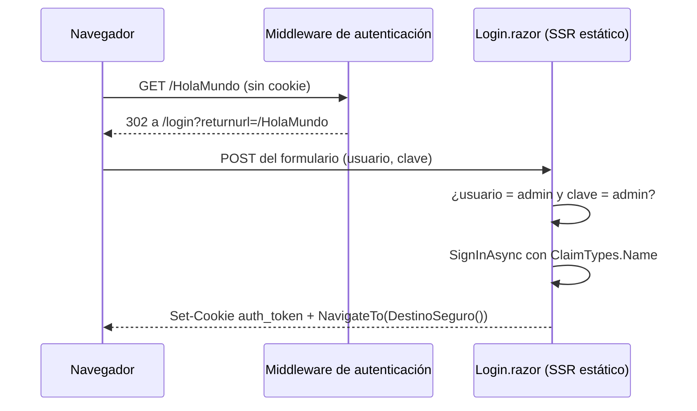

# 02 — Autenticación por cookies

> **Propósito**: explicar cómo está resuelto el ingreso en `WebBlazor.E2E.Base.Login` y por qué las
> páginas de sesión son SSR estático, que es el punto sutil del ejemplo.
> **Fuente primaria**: `src/WebBlazor.E2E.Base.Login/Program.cs`, `Components/Pages/Login.razor`,
> `Components/Pages/Logout.razor` y `Components/Routes.razor`.

## Configuración

`Program.cs`, bloque «Autentificación - login - esquema basado en cookies»:

| Opción | Valor | Nota |
| --- | --- | --- |
| Esquema | `CookieAuthenticationDefaults.AuthenticationScheme` | |
| `Cookie.Name` | `auth_token` | |
| `LoginPath` | `/login` | |
| `AccessDeniedPath` | `/Error` | |
| `ReturnUrlParameter` | `returnurl` | |
| `Cookie.IsEssential` | `true` | Algunos navegadores bloquean las cookies no esenciales |
| `Cookie.MaxAge` | `null` | Cookie de sesión; queda comentada la alternativa de 30 minutos |
| `Cookie.HttpOnly` | `true` | Evita el acceso desde JavaScript |
| `Cookie.SameSite` | `Strict` | El comentario aclara que para OAuth / OpenID Connect correspondería `Lax` |

Se registran además `AddAuthorization()` y `AddCascadingAuthenticationState()`. En el pipeline,
`UseAuthentication()` y `UseAuthorization()` van **antes** de `UseAntiforgery()` y del mapeo de
componentes.

## Por qué el login es SSR estático

Es el punto que el ejemplo enseña, y está escrito como comentario en las dos páginas:

> `SignInAsync` escribe la cabecera `Set-Cookie`, y eso solo es posible mientras la respuesta no
> haya comenzado. Con render interactivo no hay `HttpContext` y el ingreso fallaría en silencio.

Por eso `Login.razor` y `Logout.razor` **no declaran `@rendermode`**. El `HttpContext` llega por
cascada (`[CascadingParameter]`), habilitado por `AddCascadingAuthenticationState()`, sin necesidad
de `IHttpContextAccessor`.

El código incluso contempla el caso degradado: si `HttpContext` es `null` —lo que ocurriría si la
página se renderizara de forma interactiva— muestra «El ingreso solo puede resolverse durante el
render estático.» en lugar de fallar sin explicación.

## Flujo de ingreso

`Login.razor` usa `<EditForm method="post" FormName="LoginForm">` con `DataAnnotationsValidator`.
El modelo `LoginViewModel` —clase anidada— tiene `Usuario` y `Clave`, ambos `[Required]` con su
mensaje en español.

Dos detalles del enlace de formularios:

- `_loginViewModel` se declara **sin inicializador** y se crea en `OnInitialized()` con `??=`: un
  inicializador de campo lo sobrescribiría en el POST (aviso `BL0008`).
- `ReturnUrl` llega por `[SupplyParameterFromQuery(Name = "returnurl")]`, en línea con el
  `ReturnUrlParameter` configurado.

### Credenciales

Están **incrustadas en la página**: `admin` / `admin`, en el bloque `#region verificar contraseña`.
Es un ejemplo didáctico; no hay usuarios, ni almacén, ni hash. Si falla, muestra «Usuario o clave
incorrectos.» en `mensaje-error`.

### Redirección segura

`DestinoSeguro()` solo admite rutas locales, para no habilitar un *open redirect*: exige que
`ReturnUrl` no esté vacío, que sea un URI relativo bien formado, que empiece con `/` y que **no**
empiece con `//`. En cualquier otro caso devuelve `/`.

## Cierre de sesión

`Logout.razor` es igual de estricto con el render estático: `SignOutAsync` borra la cookie
escribiendo una cabecera. Usa un **formulario plano** —`<form method="post" @formname="LogoutForm">`
con `<AntiforgeryToken />`— porque no hay modelo que enlazar, solo la acción. Tras cerrar, navega a
`/login`.

## Autorización en el enrutador

`Routes.razor` usa `<AuthorizeRouteView>` en lugar de `<RouteView>`, con dos plantillas:

- `<NotAuthorized>` muestra `mensaje-no-autorizado` con un enlace a `/login`. El comentario del
  archivo aclara su alcance: el middleware ya redirige la **petición inicial**, así que esto cubre
  la navegación interactiva y la sesión vencida.
- `<Authorizing>` muestra «Verificando credenciales...».

`NavMenu.razor` usa `<AuthorizeView>` para alternar entre los enlaces «Ingresar» y «Cerrar sesión».

## Estado de las pruebas de este flujo

`LoginE2ETests.TestLogin` **no verifica nada**: su cuerpo son dos comentarios. Todo lo descrito acá
está sin cobertura automatizada — ver [05_Estado-Y-Divergencias.md](05_Estado-Y-Divergencias.md).
