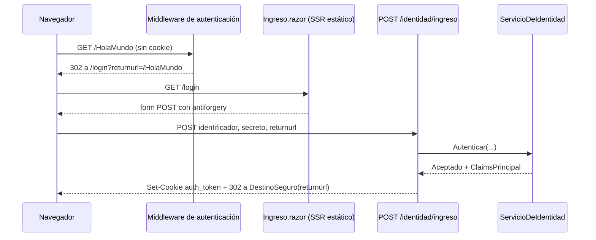

# 02 — Identidad y acceso

> **Propósito**: explicar cómo está resuelto el ingreso en `WebBlazor.E2E.Base.Login` y por qué la
> credencial se emite fuera del circuito, que es el punto sutil del ejemplo.
> **Fuente primaria**: `src/WebBlazor.E2E.Base.Login/Program.cs`, `Endpoints/IdentidadEndpoints.cs`,
> `Servicios/ServicioDeIdentidad.cs`, `Servicios/CatalogoDeResultados.cs`,
> `Components/Paginas/Identidad/Ingreso.razor` y `Components/Routes.razor`.
> **Vigencia**: 2026-09-02, commit `6af2049`.

> **Cambió la forma, no el fondo.** Hasta el commit `f4ee8df` el ingreso y la salida vivían en dos
> páginas Razor de SSR estático (`Login.razor` y `Logout.razor`) que llamaban `SignInAsync` /
> `SignOutAsync` con el `HttpContext` en cascada. Desde `eaa151a` son **dos endpoints POST**, y el
> decidir si una credencial se acepta salió de la página hacia un servicio. La razón de fondo es la
> misma: la cookie se escribe en una cabecera, y una cabecera solo se puede escribir mientras la
> respuesta no haya comenzado.

## Configuración

`Program.cs`, bloque «Autentificación - login - esquema basado en cookies»:

| Opción | Valor | Nota |
| --- | --- | --- |
| Esquema | `CookieAuthenticationDefaults.AuthenticationScheme` | |
| `Cookie.Name` | `auth_token` | |
| `LoginPath` | `IdentidadEndpoints.SuperficieDeAcceso` (`/login`) | La ruta es una constante del módulo de endpoints, no un literal repetido |
| `AccessDeniedPath` | `/Error` | |
| `ReturnUrlParameter` | `returnurl` | |
| `Cookie.IsEssential` | `true` | Algunos navegadores bloquean las cookies no esenciales |
| `Cookie.MaxAge` | `null` | Cookie de sesión; queda comentada la alternativa de 30 minutos |
| `Cookie.HttpOnly` | `true` | Evita el acceso desde JavaScript |
| `Cookie.SameSite` | `Strict` | El comentario aclara que para OAuth / OpenID Connect correspondería `Lax` |

Se registran además `AddAuthorization()`, `AddCascadingAuthenticationState()` y el scoped
`IServicioDeIdentidad`. En el pipeline, `UseAuthentication()` y `UseAuthorization()` van **antes** de
`UseAntiforgery()` y del mapeo de componentes; `app.MapearIdentidad()` va al final.

## Los dos endpoints

`Endpoints/IdentidadEndpoints.cs` publica:

| Método y ruta | Qué hace |
| --- | --- |
| `POST /identidad/ingreso` | Toma `identificador`, `secreto` y `returnurl` `[FromForm]`, consulta a `IServicioDeIdentidad` y, si acepta, `SignInAsync` + redirección a `DestinoSeguro(returnurl)` |
| `POST /identidad/salida` | `SignOutAsync` y redirección a `/login?estado=sesion-cerrada` |

El comentario del archivo dice por qué son endpoints y no manejadores de componente: *«la credencial
de sesión se emite en el ciclo de request: con el circuito ya establecido, la respuesta HTTP ya se
envió y no hay dónde escribir la cabecera que crea la cookie»*.

Si el ingreso se rechaza, el endpoint redirige a `/login?estado=<código>` — **nunca dice qué falló**.

### Redirección segura

`DestinoSeguro()` solo admite rutas locales, para no habilitar un *open redirect*: exige que
`returnurl` no esté vacío, que sea un URI relativo bien formado, que empiece con `/` y que **no**
empiece con `//`. En cualquier otro caso devuelve `/`.

## Quién decide: ServicioDeIdentidad

`Servicios/ServicioDeIdentidad.cs` (scoped, tras `IServicioDeIdentidad`) tiene la credencial de
laboratorio incrustada: `admin` / `admin`, en dos constantes privadas. Devuelve un
`ResultadoDeAutenticacion` con:

| Caso | Código |
| --- | --- |
| Falta el identificador o el secreto | `datos-incompletos` |
| Cualquiera de los dos no coincide | `credenciales-rechazadas` — **un solo desenlace de rechazo** |
| Coinciden | Aceptado, con un `ClaimsPrincipal` que lleva `ClaimTypes.Name` |

Su `<remarks>` deja dicho el alcance: hash del secreto, control de intentos y política de sesión son
materia de la postura de seguridad, no de la presentación; acá se sostiene solo que el rechazo sea
indiferenciado.

## Qué se le dice a la persona: CatalogoDeResultados

`Servicios/CatalogoDeResultados.cs` es el **único origen de los textos**. Cuatro códigos, cada uno
con su texto y su `Tono`; un código desconocido cae en el mensaje genérico, nunca en el código crudo
ni en la traza.

| Código | Texto | Tono |
| --- | --- | --- |
| `credenciales-rechazadas` | «No pudimos validar el ingreso. Revisá el identificador y el secreto.» | `Peligro` |
| `sesion-cerrada` | «Cerraste la sesión.» | `Exito` |
| `sesion-requerida` | «Ingresá para ver esa superficie.» | `Info` |
| `datos-incompletos` | «Faltan datos para intentar el ingreso.» | `Peligro` |

## La superficie de ingreso

`Components/Paginas/Identidad/Ingreso.razor`, `@page "/login"`, `@layout AccesoLayout` y **sin
`@rendermode`**: SSR estático. No es un `EditForm`, es un `<form method="post"
action="/identidad/ingreso" data-enhance="false">` con `<AntiforgeryToken />`, un `input` oculto con
`returnurl` y campos nativos con `autocomplete="username"` / `"current-password"` y `required`.

`data-enhance="false"` importa: la navegación mejorada de Blazor interceptaría el envío y el
endpoint no llegaría a escribir la cabecera.

Dos parámetros llegan por query: `estado` (el código del catálogo, que pinta la banda
`mensaje-resultado`) y `returnurl`.

## Flujo de ingreso

Rechazado, el último paso es `302 a /login?estado=credenciales-rechazadas`.

## Cierre de sesión

Vive en el chrome: `Layout/BarraLateral.razor` monta un `<form method="post"
action="/identidad/salida" data-enhance="false">` con `<AntiforgeryToken />` y el botón
`boton-cerrar-sesion` adentro. Es un `form` y no un enlace porque **muta estado**. Tras cerrar, el
endpoint lleva a `/login?estado=sesion-cerrada`.

## El guard, en tres capas

| Capa | Dónde | Cómo resuelve |
| --- | --- | --- |
| Ruteo | `Routes.razor`, `<AuthorizeRouteView>` → `<NotAuthorized>` | El componente `Redireccion` navega a `/login?estado=sesion-requerida` con `replace: true`, para que el retroceso no devuelva al limbo |
| Superficie | `OnInitializedAsync` de `Inicio.razor` y `HolaMundo.razor` | Lee el `AuthenticationState` en cascada; sin identidad, la superficie queda `Indisponible` |
| Acción | Los endpoints | Deciden por su cuenta, sin confiar en que la superficie haya filtrado |

Ninguna de las tres expone el motivo. `<Authorizing>` muestra «Verificando la sesión…».

## Estado de las pruebas de este flujo

**Sin cobertura automatizada.** `tests/WebBlazor.E2E.Base.Login.E2ETests` no aporta ningún caso que
compile — ver [05_Estado-Y-Divergencias.md](05_Estado-Y-Divergencias.md). Lo que sí hay es el guion
de verificación de `evidencia/2026-09-01-aplicacion-template/verificar.mjs`, en Playwright para Node,
cuyo log del 2026-09-01 registra en verde «guard lleva al ingreso», «rechazo indiferenciado»,
«ingreso aceptado», «superficie protegida operable» y «cierre de sesión por POST».
