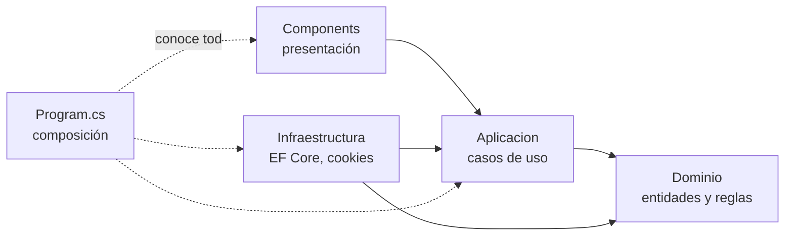

# 01 — Arquitectura y capas

> **Propósito**: explicar cómo se reparte la aplicación en capas, qué depende de qué y dónde se
> compone todo, para poder ubicar cualquier archivo sin recorrer el árbol.
> **Fuente primaria**: `src/MovilidadUrbana.Web/` y `src/MovilidadUrbana.Web/Program.cs`.

## Un proyecto, cuatro capas

`MovilidadUrbana.Web` es **un único proyecto** con las capas de Clean Architecture separadas en
carpetas. Las dependencias apuntan siempre hacia adentro: ninguna capa interior conoce a las que la
rodean.

| Capa | Carpeta | Depende de | Contiene |
| --- | --- | --- | --- |
| Dominio | `Dominio/` | nada | `Entidades/`, `Reglas/`, `Catalogos.cs` |
| Aplicación | `Aplicacion/` | Dominio | `Abstracciones/`, `Localidades/`, `Encuestas/`, `Resultado.cs` |
| Infraestructura | `Infraestructura/` | Aplicación, Dominio | `Persistencia/`, `Sesiones/` |
| Presentación | `Components/` | Aplicación | `App.razor`, `Routes.razor`, `Layout/`, `Pages/` |
| Composición | `Program.cs` | todas | Es el **único** lugar que conoce todas las capas |

La inversión de dependencia está en `Aplicacion/Abstracciones/`: las tres interfaces
—`IRepositorioDeLocalidades`, `IRepositorioDeEncuestas`, `IContextoDeSesion`— las **declara**
Aplicación y las **implementa** Infraestructura.

## Program.cs — la composición, paso a paso

Fuente: `src/MovilidadUrbana.Web/Program.cs`.

| Bloque | Qué hace | Por qué |
| --- | --- | --- |
| Cultura | Fija `es-AR` en `DefaultThreadCurrentCulture` y `…UICulture` | Los separadores de miles y decimales forman parte de lo que verifican las E2E: no pueden depender de la cultura del servidor |
| Razor Components | `AddRazorComponents().AddInteractiveServerComponents()` | Modelo de render del laboratorio |
| Datos | `AddDbContextFactory<ContextoDeDatos>` con SQLite | **Factory**, no contexto de ámbito: ver [03](03_Sesiones-Y-Persistencia.md) |
| Sesión | `ContextoDeSesion` scoped, expuesto también como `IContextoDeSesion` | La misma instancia sirve a la implementación concreta y a la abstracción |
| Repositorios | `RepositorioDeLocalidades`, `RepositorioDeEncuestas`, `SembradorDeSesion` — todos scoped | |
| Casos de uso | `ServicioDeLocalidades`, `ServicioDeEncuestas` — scoped | |
| Arranque | `PreparadorDeBaseDeDatos.Preparar(app.Services)` | Crea el archivo y el esquema antes de atender la primera petición |
| Pipeline | `UseExceptionHandler("/Error")` fuera de Development · `UseStatusCodePagesWithReExecute("/no-encontrado")` · `UseMiddleware<MiddlewareDeSesion>()` · `UseAntiforgery()` · `MapStaticAssets()` · `MapRazorComponents<App>().AddInteractiveServerRenderMode()` | El middleware de sesión va **antes** de antiforgery y del mapeo de componentes |

Cadena de conexión: se lee de `ConnectionStrings:BaseDeDatos` y, si falta, cae en
`Data Source=datos/movilidad.db;Default Timeout=30`. Las E2E la pisan por variable de entorno para
apuntar a `datos-e2e/movilidad.db` — ver [05_Pruebas.md](05_Pruebas.md).

Propiedad del `.csproj` que conviene conocer: `BlazorDisableThrowNavigationException` en `true`,
para que `NavigateTo` durante el render estático no se manifieste como excepción.

## Dónde vive cada cosa

| Si buscás… | Está en |
| --- | --- |
| Una entidad persistida | `Dominio/Entidades/` — `Localidad`, `RespuestaDeEncuesta`, `Sesion` |
| Una validación de negocio | `Dominio/Reglas/` — `ReglasDeLocalidad`, `ReglasDeEncuesta` |
| Listas fijas (provincias, medios, frecuencias, motivos) | `Dominio/Catalogos.cs` |
| Un caso de uso | `Aplicacion/Localidades/ServicioDeLocalidades.cs`, `Aplicacion/Encuestas/ServicioDeEncuestas.cs` |
| El modelo que edita una pantalla | `Aplicacion/*/Modelo*.cs` — campos crudos, tal como se tipean |
| La salida de un caso de uso | `Aplicacion/Resultado.cs` |
| El acceso a datos | `Infraestructura/Persistencia/` |
| La cookie de sesión y su middleware | `Infraestructura/Sesiones/` |
| Una pantalla | `Components/Pages/` |
| El menú, el testigo de interactividad, el pie | `Components/Layout/MainLayout.razor` |

## Resultado — el contrato entre caso de uso y pantalla

`Aplicacion/Resultado.cs` es un `record` con `EsCorrecto`, `Mensaje` y `Errores`. Las claves de
`Errores` son los **nombres de campo que la pantalla conoce** (`nombre`, `provincia`,
`codigoPostal`, `habitantes`, …), de modo que la vista solo tiene que ubicarlos. Tres fábricas:
`Correcto(mensaje)`, `Invalido(errores)` e `Invalido(campo, mensaje)`; la forma con diccionario fija
el aviso genérico «Revise los campos marcados en rojo.».

Es el patrón que hace que la validación no dependa de la interfaz que la invoque: las reglas viven
en el dominio, el caso de uso las aplica y devuelve un `Resultado`, y la pantalla solo pinta.
