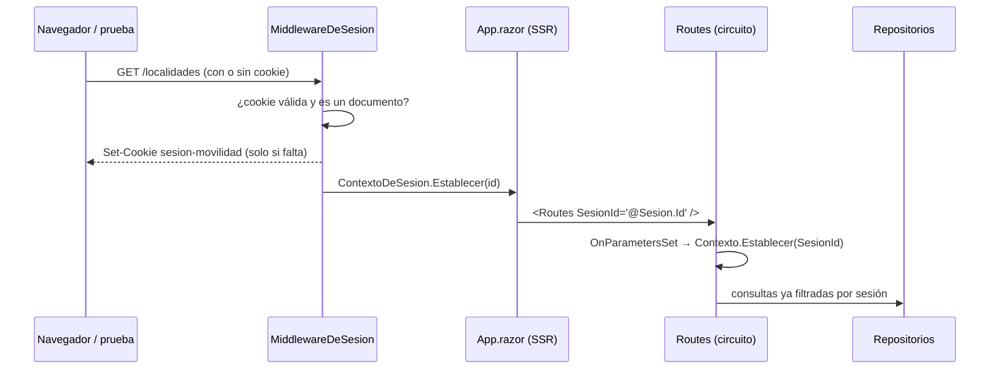

# 03 — Sesiones y persistencia

> **Propósito**: explicar el mecanismo que hace posible probar en paralelo contra un único servidor
> y una única base, y cómo se guardan los datos.
> **Fuente primaria**: `src/MovilidadUrbana.Web/Infraestructura/`.

## El problema que resuelve

En la versión estática del laboratorio cada prueba tenía su `localStorage`. Acá hay **una sola base
SQLite** y todas las pruebas —incluidas las que corren en paralelo— la comparten. Sin aislamiento,
un alta de una prueba aparecería en la tabla de otra.

La solución es que la aplicación reparta un **espacio de datos por sesión**, y que todos los
repositorios filtren por él.

## El recorrido del identificador de sesión

El paso que sorprende: **un circuito de Blazor Server no tiene acceso a la petición HTTP** que lo
originó, así que la cookie no se puede leer desde una página. Se lee en `App.razor` —que sí se
renderiza dentro de la petición— y se pasa como parámetro `string` al componente raíz `Routes`, que
es el puente entre el render estático y el interactivo.

## Piezas

### ContextoDeSesion

`Infraestructura/Sesiones/ContextoDeSesion.cs`. Implementación *scoped* de `IContextoDeSesion`: un
ámbito es una petición HTTP **o** un circuito de Blazor.

| Miembro | Valor / comportamiento |
| --- | --- |
| `NombreDeCookie` | `sesion-movilidad` |
| `LargoMaximo` | 64 |
| `Id` | Arranca con un `Guid` propio del ámbito |
| `Establecer(id)` | Solo asigna si `EsValido(id)` |
| `EsValido` | No vacío y de largo ≤ 64 |

El identificador provisorio del constructor no es decorativo: evita que un ámbito sin cookie termine
leyendo o escribiendo en un espacio de datos compartido.

### MiddlewareDeSesion

`Infraestructura/Sesiones/MiddlewareDeSesion.cs`. Emite la cookie y publica el valor en el contexto.

Opciones de la cookie: `HttpOnly`, `IsEssential`, `SameSite=Lax`, `Path=/`, `MaxAge` de 1 día.

La regla no obvia: **la cookie se emite únicamente al pedir un documento**. `EsUnDocumento` exige
GET, descarta `/_framework` y `/_blazor`, y descarta todo lo que tenga extensión. Si se emitiera
también en las peticiones de css y js —que el navegador lanza en paralelo— la primera visita
generaría varios identificadores a la vez y se quedaría con el último en llegar.

### SembradorDeSesion

`Infraestructura/Persistencia/SembradorDeSesion.cs`. La primera vez que se toca una sesión le deja
su juego inicial: **Corrientes** (Corrientes, 3400, 346 334) y **Resistencia** (Chaco, 3500,
291 720).

Dos detalles de diseño:
- La marca en la tabla `Sesiones` es lo que impide volver a sembrar cuando la persona borró todas
  las localidades a mano. La prueba «Al borrar todas las localidades avisa que no hay datos»
  depende exactamente de eso.
- `SaveChangesAsync` va dentro de un `try/catch (DbUpdateException)` vacío a propósito: si otra
  petición de la misma sesión ganó la carrera insertando la marca, los datos ya están.

El campo `_yaVerificada` evita repetir la consulta dentro del mismo ámbito.

### ContextoDeDatos

`Infraestructura/Persistencia/ContextoDeDatos.cs` — el **único** lugar que conoce el motor.

| `DbSet` | Entidad |
| --- | --- |
| `Localidades` | `Localidad` |
| `Encuestas` | `RespuestaDeEncuesta` |
| `Sesiones` | `Sesion` |

Mapeo relevante:
- `Sesion.Id` es la clave, `HasMaxLength(64)`.
- `Localidad`: `SesionId` (64) requerido, `Nombre` (60), `Provincia` (60), `CodigoPostal` (4), e
  **índice por `SesionId`** —toda consulta del ABM filtra por sesión.
- `RespuestaDeEncuesta`: `SesionId` (64), `Nombre` (80), índice por `SesionId`, y un
  `ValueConverter` + `ValueComparer` para `Medios`: **SQLite no tiene tipo lista**, así que se
  guardan como texto separado por comas.

### PreparadorDeBaseDeDatos

`Infraestructura/Persistencia/PreparadorDeBaseDeDatos.cs`, invocado desde `Program.cs` al arrancar:

1. Resuelve el `DataSource` de la cadena de conexión y **crea la carpeta** si falta.
2. `EnsureCreated()` — no migraciones. El laboratorio no versiona el esquema, y así el binario
   publicado arranca en cualquier máquina sin pasos previos.
3. `PRAGMA journal_mode=WAL` — permite leer mientras otra conexión escribe. Con las E2E en paralelo,
   varias sesiones tocan el mismo archivo al mismo tiempo.

### Los repositorios

`RepositorioDeLocalidades` y `RepositorioDeEncuestas`. Ambos reciben
`IDbContextFactory<ContextoDeDatos>` y **abren un contexto por operación**: es lo recomendado en
Blazor Server, porque un `DbContext` con alcance de ámbito viviría lo que dura el circuito —minutos
u horas— y no está pensado para eso.

Ninguna consulta sale del espacio de datos del visitante:

| Operación | Aislamiento |
| --- | --- |
| `ListarAsync`, `ObtenerAsync` | `Where(l => l.SesionId == sesion.Id)`, con `AsNoTracking()` |
| `AgregarAsync` | Asigna `SesionId` antes de insertar |
| `ActualizarAsync` | Corta en silencio si la entidad no es de la sesión actual |
| `EliminarAsync` | `ExecuteDeleteAsync` con el filtro de sesión en el `Where` |
| Encuestas: `ContarAsync` | Cuenta solo las de la sesión |

`ListarAsync`, `ObtenerAsync` y `AgregarAsync` de localidades llaman antes a
`sembrador.AsegurarAsync()`. `RepositorioDeEncuestas` no siembra nada.

La comprobación de `ActualizarAsync` es redundante —la entidad llegó de `ObtenerAsync`, que ya
filtró— y está puesta para dejar la garantía escrita en el código y no en la memoria de quien lo lea.

## Dónde vive el archivo

| Contexto | Ruta de la base |
| --- | --- |
| `dotnet run` (valor por defecto) | `datos/movilidad.db` |
| Pruebas E2E | `datos-e2e/movilidad.db`, o lo que indique `BASE_DE_DATOS` |

Ambas carpetas están ignoradas por `.gitignore`, junto con `*.db`, `*.db-wal` y `*.db-shm`.
