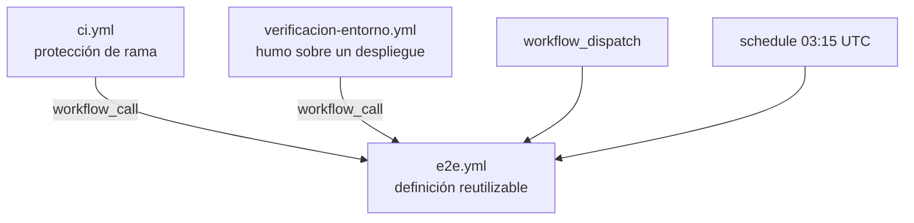

# 06 — CI y workflows

> **Propósito**: describir los tres workflows, cuándo se dispara cada uno y qué prácticas de
> GitHub Actions aplica el laboratorio, que es una parte central de lo que enseña.
> **Fuente primaria**: `.github/workflows/`.

## El mapa



`e2e.yml` es **el único lugar donde está escrito cómo se corren las pruebas**. Los otros dos
workflows solo lo invocan con entradas distintas.

## e2e.yml — la definición reutilizable

### Disparadores

| Disparador | Para qué |
| --- | --- |
| `workflow_call` | Lo invocan `ci.yml` y `verificacion-entorno.yml`; también podría invocarlo otro repositorio |
| `workflow_dispatch` | Corrida a pedido desde *Actions*, eligiendo navegadores y entorno |
| `schedule` | `cron: '15 3 * * *'` — regresión completa todas las noches (03:15 UTC ≈ 00:15 en Argentina) |

### Entradas y salida

| Entrada | Tipo | Por defecto |
| --- | --- | --- |
| `navegadores` | string (`workflow_call`) / choice (`dispatch`) | `chromium` |
| `url-base` | string | vacío = se publica y se levanta localmente |
| `referencia` | string | vacío = el ref del evento |
| `retencion-dias` | number | 7 |

Salida: `resultado` — el resultado agregado, tomado de `jobs.reporte.outputs.resultado`.

En `schedule` los `inputs` llegan vacíos, de ahí los valores por defecto explícitos del bloque
`env` (`NAVEGADORES` cae en las cuatro configuraciones).

### Los cuatro jobs

| Job | Qué hace | Notas |
| --- | --- | --- |
| `publicar` | `dotnet publish` autocontenido para `linux-x64` y sube el artefacto `aplicacion-publicada` | Se saltea con `if: inputs.url-base == ''`. Antes verifica que el SDK del runner coincida con el `<TargetFramework>` del `.csproj` |
| `preparar` | Convierte `chromium,firefox,…` en el JSON de la matriz | Deja la lista en el resumen de la corrida |
| `pruebas` | Un job por configuración: compila las pruebas, traduce `mobile-chrome` a chromium + `EMULAR_MOVIL`, cachea e instala el navegador, baja el artefacto, `chmod +x`, corre `dotnet test` y sube el TRX | `fail-fast: false`, `timeout-minutes: 30`, `PUBLICAR_ANTES_DE_PROBAR=false` |
| `reporte` | Junta los TRX de todas las configuraciones en una tabla del `$GITHUB_STEP_SUMMARY` y refleja el resultado | Falla explícitamente si `needs.pruebas.result != 'success'` |

Detalles que valen para cualquier proyecto:

- `mobile-chrome` **no es un navegador**: es chromium con el descriptor de un Pixel 7. La traducción
  se hace en un paso `case` que exporta `NAVEGADOR` y `EMULAR_MOVIL` a `$GITHUB_ENV`.
- Los artefactos de Actions se empaquetan en zip y **pierden el bit de ejecución**: de ahí el
  `chmod +x publicacion/MovilidadUrbana.Web`.
- El navegador lo instala el CLI que viene **dentro del paquete** `Microsoft.Playwright`
  (`bin/Release/net10.0/.playwright`), que baja la build correspondiente a su propia versión: la
  biblioteca y el navegador no se pueden desincronizar.
- La clave de `actions/cache` se apoya en el `hashFiles` del `.csproj` de pruebas: cambia cuando
  cambia la versión de Playwright, que es cuando cambian las builds de los navegadores.
- El binding de .NET no tiene `merge-reports`: el reporte de cada configuración es un **TRX**, y el
  job `reporte` junta los contadores con un script de Node leyendo el `<Counters>` de cada archivo.
- `if: ${{ !cancelled() && needs.preparar.result == 'success' && needs.publicar.result != 'failure' }}`
  en `pruebas`: `publicar` se saltea cuando se prueba un entorno desplegado, y eso no debe arrastrar
  al job siguiente.

Invocación desde otro repositorio:

```yaml
jobs:
  e2e:
    uses: hdcm-dev/Lab-E2E.WebBlazor/.github/workflows/e2e.yml@main
    with:
      navegadores: chromium,firefox
```

## ci.yml — lo que se ata a la protección de rama

| Disparador | Alcance |
| --- | --- |
| `pull_request` hacia `main` o `develop` (`opened`, `synchronize`, `reopened`, `ready_for_review`) | Verificación rápida: solo `chromium` |
| `push` a `main` (con `paths-ignore` de `**/*.md`, `docs/**`, `.gitignore`) | Las 4 configuraciones |
| `merge_group` | Igual que `push`, al entrar en la cola de merge |

| Job | Qué hace |
| --- | --- |
| `compilacion` («Compilación y unitarias») | `restore` → `build … -warnaserror` → **pruebas unitarias** con TRX al artefacto `resultados-unitarias` → `dotnet test --list-tests` sobre las E2E |
| `e2e` | Invoca `e2e.yml` con `navegadores` según el evento y `referencia` = SHA de la cabeza del PR |
| `comentario-en-pr` | Deja **o actualiza** un comentario con el resultado y el enlace a la corrida |
| `ci-ok` («CI aprobada») | Resume todos los jobs en un único check |

`--list-tests` es el equivalente del `playwright test --list` del runner de JavaScript: comprueba que
el descubrimiento funcione sin levantar navegadores ni la aplicación.

`compilacion` se saltea en pull requests en borrador (`github.event.pull_request.draft != true`).

`ci-ok` es **el único check que conviene exigir** en la regla de protección de rama: así no hay que
actualizarla cada vez que cambia la matriz. Acepta `success` y `skipped`, y falla con
`::error::La CI no está en verde.` ante cualquier otro resultado.

El comentario en el PR marca el cuerpo con `<!-- e2e-playwright -->` y busca el previo para
**actualizarlo en lugar de duplicarlo**. Se limita a ramas del propio repositorio
(`head.repo.full_name == github.repository`): un fork no recibe permisos de escritura y el job
fallaría.

## verificacion-entorno.yml

Prueba de humo a pedido contra un entorno ya desplegado. Entradas: `entorno` (tipo `environment`,
requerido) y `url-base` (requerido). Invoca `e2e.yml` con `navegadores: chromium` y
`retencion-dias: 30`. Con `url-base` cargada el workflow ni siquiera compila la aplicación.

Queda comentada la alternativa de encadenarlo tras un despliegue con
`workflow_run: { workflows: [Deploy], types: [completed] }`.

## Prácticas aplicadas

| Práctica | Cómo |
| --- | --- |
| `concurrency` por rama | Cancela la corrida anterior en pull requests, la conserva en `main` |
| `permissions` mínimos | `contents: read` en general; `pull-requests: write` solo en el job que comenta |
| Compilar una vez, probar muchas | La aplicación se publica en un job y se reutiliza como artefacto en toda la matriz |
| `paths-ignore` | No dispara la CI por cambios de documentación |
| `timeout-minutes` en todos los jobs | |
| `fail-fast: false` en la matriz | Para ver todas las combinaciones que fallan, no solo la primera |
| Coincidencia SDK ↔ framework | Un paso compara `<TargetFramework>` con `net<major>.0` del runner y falla con mensaje claro |

## Runner

Los jobs corren en `runs-on: ubuntu-latest`. Encima de cada uno quedó **comentada** la línea del
runner autoalojado del laboratorio, `runs-on: [self-hosted, i7infra-dev]`: descomentar una y
comentar la otra alcanza para volver al runner propio.

Nada corre dentro de un contenedor de job. El motivo viene del runner autoalojado: ese runner es él
mismo un contenedor y no tiene montado el socket de Docker, así que un job con `container:` falla en
*Initialize containers* con `failed to connect to the docker API at unix:///var/run/docker.sock`.

El cambio de runner trajo dos ajustes: el SDK se pide explícitamente con `actions/setup-dotnet`
—el autoalojado ya traía .NET 10, la imagen de GitHub no lo garantiza— y los navegadores se cachean
con `actions/cache` —el autoalojado es un contenedor de larga vida y conservaba la caché; los de
GitHub arrancan limpios—.

Sobre `/dev/shm`: dentro de un contenedor queda en 64 MB, causa clásica de que Chromium muera a
mitad de una corrida. **Se midió**: con 64 MB las 22 pruebas de chromium pasan igual, así que a esta
escala no hace falta `--disable-dev-shm-usage`. Si apareciera esa intermitencia, las salidas son ese
argumento de lanzamiento o más `--shm-size` en el contenedor del runner.
