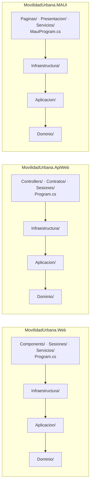

# 01 — Arquitectura de Movilidad Urbana

> **Propósito**: explicar cómo se reparten las capas dentro de cada una de las tres aplicaciones de
> Movilidad Urbana, por qué se repiten, dónde se compone cada una y cómo viaja una petición desde el
> navegador (o un cliente HTTP, o una pantalla del teléfono) hasta la base. Hola Mundo y Login no
> tienen capas: están en [10](10_Hola-Mundo-Y-Login.md).
> **Fuente primaria**: los tres `.csproj` de `src/MovilidadUrbana.*`, `Program.cs` de `Web` y de
> `ApiWeb`, `MauiProgram.cs`, `ServiciosDeAplicacion.cs`, `ServiciosDeInfraestructura.cs`,
> `Sesiones/MiddlewareDeSesion.cs`, `App.razor`, `Routes.razor`.
> **Vigencia**: 2026-09-12, commit `10ce735`.

## Tres aplicaciones, cada una con todas sus capas

Clean Architecture en **carpetas por capa dentro de cada aplicación**, con las dependencias apuntando
siempre hacia adentro. Ninguna de las tres referencia a otro proyecto de la solución.



| Carpeta | Contiene (igual en las tres) | Depende de |
| --- | --- | --- |
| `Dominio/` | `Entidades/` (`Localidad`, `RespuestaDeEncuesta`, `Sesion`), `Reglas/` (`ReglasDeLocalidad`, `ReglasDeEncuesta`), `Catalogos.cs` | nada |
| `Aplicacion/` | `Abstracciones/` (`IRepositorioDeLocalidades`, `IRepositorioDeEncuestas`, `IContextoDeSesion`), `Localidades/` y `Encuestas/` (servicio, modelo, política; `ResumenDeEncuesta`), `Resultado.cs`, `ServiciosDeAplicacion.cs` | `Dominio/` |
| `Infraestructura/` | `Persistencia/` (`ContextoDeDatos`, `PreparadorDeBaseDeDatos`, `RepositorioDeLocalidades`, `RepositorioDeEncuestas`, `SembradorDeSesion`), `Sesiones/ContextoDeSesion.cs`, `ServiciosDeInfraestructura.cs` | `Aplicacion/` + `Microsoft.EntityFrameworkCore.Sqlite` 10.0.11 |
| Presentación | Lo propio de cada cabeza (tabla siguiente) | `Aplicacion/`, `Infraestructura/` |

Verificado al indexar con `diff -r`: las tres copias de `Dominio/`, `Aplicacion/` e
`Infraestructura/` difieren solo en `namespace`, `using` y algún comentario. **Un cambio en una
regla se replica a mano en las tres** — no hay proyecto compartido, y es a propósito
([08](08_Decisiones-Y-Trampas.md)).

| Aplicación | Presentación | Paquetes propios | Particularidades del `.csproj` |
| --- | --- | --- | --- |
| `MovilidadUrbana.Web` | `Components/` (`App`, `Routes`, `Layout/`, `Componentes/`, `Pages/`), `Sesiones/MiddlewareDeSesion.cs`, `Servicios/`, `Theme/`, `wwwroot/` | ninguno además de EF Core | `BlazorDisableThrowNavigationException=true` |
| `MovilidadUrbana.ApiWeb` | `Controllers/`, `Contratos/`, `Sesiones/MiddlewareDeSesionPorEncabezado.cs` | `Microsoft.AspNetCore.OpenApi` 10.0.11, `Scalar.AspNetCore` 2.17.3 | `GenerateDocumentationFile` (los `///` alimentan OpenAPI), `InternalsVisibleTo MovilidadUrbana.ApiWeb.Tests` |
| `MovilidadUrbana.MAUI` | `Presentacion/` (ViewModels y abstracciones `INavegador`, `IAvisos`), `Paginas/`, `Servicios/`, `Controles/`, `Convertidores/`, `Resources/`, `Platforms/Android/` | `Microsoft.Maui.Controls`, `CommunityToolkit.Mvvm` 8.4.2, `Microsoft.Extensions.Logging.Debug` | `net10.0-android` solo; `ApplicationId ar.lab.movilidadurbana`; `SupportedOSPlatformVersion 23` |

`MiddlewareDeSesion` (cookie) vive en `Web/Sesiones/` y no en `Infraestructura/`: es un detalle de
HTTP, y dejarlo en la capa obligaba a depender de ASP.NET Core, lo que impedía reutilizar esa capa
desde la app Android (comentario del archivo). Por eso las tres `Infraestructura/` compilan con solo
EF Core, y la de MAUI se enlaza tal cual en su proyecto de pruebas.

## Composición: cada capa registra lo suyo

Los tres puntos de composición **solo componen**; no registran servicios de otra capa.

| Método de extensión | Archivo (en cada aplicación) | Registra |
| --- | --- | --- |
| `AgregarAplicacion()` | `Aplicacion/ServiciosDeAplicacion.cs` | `ServicioDeLocalidades`, `ServicioDeEncuestas` — *scoped* |
| `AgregarInfraestructura(cadena)` | `Infraestructura/ServiciosDeInfraestructura.cs` | `AddDbContextFactory<ContextoDeDatos>` (SQLite), `ContextoDeSesion` + `IContextoDeSesion` (misma instancia, *scoped*), `SembradorDeSesion`, los dos repositorios |

La cadena de conexión la decide quien compone. El valor por defecto,
`ServiciosDeInfraestructura.CadenaDeConexionPorDefecto`, es
`Data Source=datos/movilidad.db;Default Timeout=30` en las tres copias.

### `MovilidadUrbana.Web/Program.cs`

| Orden | Qué hace | Por qué (comentario en el archivo) |
| --- | --- | --- |
| 1 | Fija `es-AR` como cultura por defecto | Los separadores de miles y decimales son parte de lo que las E2E verifican |
| 2 | `AddRazorComponents().AddInteractiveServerComponents()` | — |
| 3 | `AgregarInfraestructura(cadena)` + `AgregarAplicacion()`, con `GetConnectionString("BaseDeDatos")` o el valor por defecto | — |
| 4 | `AddSingleton<IIdentidadDeVersion>(IdentidadDeVersion.DelEnsamblado(...))` | La versión se resuelve una sola vez, en el host |
| 5 | `AddScoped<IServicioDeDialogos>`, `AddScoped<IServicioDeFoco>` | Estado de interfaz del circuito, no del navegador |
| 6 | `PreparadorDeBaseDeDatos.Preparar(app.Services)` | Crea archivo y esquema (`EnsureCreated`) y activa WAL |
| 7 | `UseExceptionHandler("/Error")` fuera de Development; `UseStatusCodePagesWithReExecute("/no-encontrado")` | Páginas de error propias |
| 8 | `UseMiddleware<MiddlewareDeSesion>()` → `UseAntiforgery()` → `MapStaticAssets()` → `MapRazorComponents<App>().AddInteractiveServerRenderMode()` | La cookie se emite antes de renderizar |

`appsettings.json` de la web **no** trae `ConnectionStrings`, así que en desarrollo usa el valor por
defecto; el fixture E2E la sobrescribe con `ConnectionStrings__BaseDeDatos` hacia
`datos-e2e/movilidad.db`.

### `MovilidadUrbana.ApiWeb/Program.cs`

Misma cultura y mismas dos llamadas de composición; después `AddControllers()`,
`AddProblemDetails()`, `AddOpenApi()`; `UseExceptionHandler()` + `UseStatusCodePages()`; en
Development `MapOpenApi()` y `MapScalarApiReference` (título «Movilidad Urbana — API», cliente por
defecto `curl`); luego `UseMiddleware<MiddlewareDeSesionPorEncabezado>()` y `MapControllers()`.
Cierra con `public partial class Program;` para `WebApplicationFactory`. Su `appsettings.json` sí
declara `ConnectionStrings:BaseDeDatos = Data Source=datos/movilidad-api.db` — base distinta de la
web. Detalle en [12](12_Api-REST.md).

### `MovilidadUrbana.MAUI/MauiProgram.cs`

Misma cultura (fijada además en el hilo principal, que ya existe); fuentes OpenSans; dos ajustes de
handlers de Android (quitar el subrayado nativo de `Entry`/`Picker`/`SearchBar`; aceptar coma
decimal en `EntradaDecimal`); `AgregarInfraestructura($"Data Source={AppDataDirectory}/movilidad.db")`
+ `AgregarAplicacion()`; `SesionDelDispositivo` (singleton, abre el único ámbito de la app y fija la
sesión), `INavegador` → `NavegadorDeShell`, `IAvisos` → `AvisosDelSistema`; los ViewModels se crean
**desde ese ámbito** (`SesionDelDispositivo.Crear<T>()`), `LocalidadesViewModel` y
`LocalidadEditorViewModel` transitorios, `EncuestaViewModel` singleton (la encuesta a medio cargar
sobrevive al cambio de pestaña); las tres páginas transitorias; `PreparadorDeBaseDeDatos.Preparar`
tras `Build()`. Detalle en [13](13_App-Android.md).

## Flujo de una interacción en la web

```mermaid
sequenceDiagram
    participant N as Navegador
    participant M as MiddlewareDeSesion
    participant A as App.razor (SSR)
    participant R as Routes (circuito)
    participant P as Página
    participant S as Servicio de aplicación
    participant Repo as Repositorio (EF Core)
    N->>M: GET /localidades (documento)
    M->>M: lee/emite cookie sesion-movilidad; ContextoDeSesion.Establecer(id)
    M->>A: renderiza con la petición HTTP a mano
    A->>R: <Routes @rendermode=InteractiveServer SesionId=@Sesion.Id/>
    N->>R: WebSocket: circuito interactivo (nuevo ámbito de DI)
    R->>R: OnParametersSet → Contexto.Establecer(SesionId)
    R->>P: RouteView → Localidades.razor
    P->>S: ServicioDeLocalidades.GuardarAsync(modelo)
    S->>Repo: ListarAsync / AgregarAsync (filtra por IContextoDeSesion.Id)
    Repo-->>P: Resultado (aviso + errores por campo)
```

El punto delicado es el **puente entre el render estático y el circuito**: un circuito de Blazor
Server no tiene acceso a la petición HTTP que lo originó, así que la cookie se lee en `App.razor`
—el único lugar con la petición a mano— y viaja como parámetro `string` (serializable) al componente
raíz `Routes`, que en `OnParametersSet` la establece en el `ContextoDeSesion` del ámbito del
circuito (`Routes.razor`, comentarios). Es la razón de la desviación «render mode en la raíz y no
por página» ([11](11_Template-Y-Superficies.md)). El identificador provisorio que `ContextoDeSesion`
genera en su constructor evita que un ámbito sin cookie lea un espacio compartido.

En la API el mismo `ContextoDeSesion` lo establece `MiddlewareDeSesionPorEncabezado` desde
`X-Sesion-Id` ([12](12_Api-REST.md)); en Android, `SesionDelDispositivo` una sola vez al arrancar
([13](13_App-Android.md)). La capa de aplicación no distingue los tres casos: solo ve
`IContextoDeSesion.Id`.

## Dónde vive cada responsabilidad

Rutas relativas a cada `src/MovilidadUrbana.<App>/`; las de las tres capas existen en las tres.

| Responsabilidad | Capa | Archivo |
| --- | --- | --- |
| Límites y validaciones puras | Dominio | `Reglas/ReglasDeLocalidad.cs`, `Reglas/ReglasDeEncuesta.cs` |
| Provincias, medios, frecuencias, motivos | Dominio | `Catalogos.cs` |
| Mensajes de error por campo y flujo de un caso de uso | Aplicacion | `Localidades/ServicioDeLocalidades.cs`, `Encuestas/ServicioDeEncuestas.cs` |
| Requisitos enunciados antes del intento | Aplicacion | `Localidades/PoliticaDeLocalidades.cs`, `Encuestas/PoliticaDeEncuestas.cs` |
| Ficha de revisión de una encuesta | Aplicacion | `Encuestas/ResumenDeEncuesta.cs` |
| Quién es el visitante | Aplicacion (contrato) / Infraestructura (valor) | `IContextoDeSesion` / `Sesiones/ContextoDeSesion.cs` |
| Cookie de sesión | Web | `Sesiones/MiddlewareDeSesion.cs` |
| Encabezado de sesión | ApiWeb | `Sesiones/MiddlewareDeSesionPorEncabezado.cs` |
| Sesión del dispositivo | MAUI | `Servicios/SesionDelDispositivo.cs` |
| Esquema, índices, conversión de `Medios` | Infraestructura | `Persistencia/ContextoDeDatos.cs` |
| Siembra inicial por sesión | Infraestructura | `Persistencia/SembradorDeSesion.cs` |
| Diálogos, foco, identidad de versión | Web | `Servicios/` |
| DTOs y traducción a `ValidationProblemDetails` | ApiWeb | `Contratos/`, `Controllers/ProblemasDeValidacion.cs` |
| Navegación, avisos y teclado del teléfono | MAUI | `Servicios/NavegadorDeShell.cs`, `Servicios/AvisosDelSistema.cs`, `Servicios/TecladoEnPantalla.cs` |

Detalle del dominio en [02](02_Dominio-Y-Reglas.md); de sesión y persistencia en
[03](03_Sesiones-Y-Persistencia.md).
