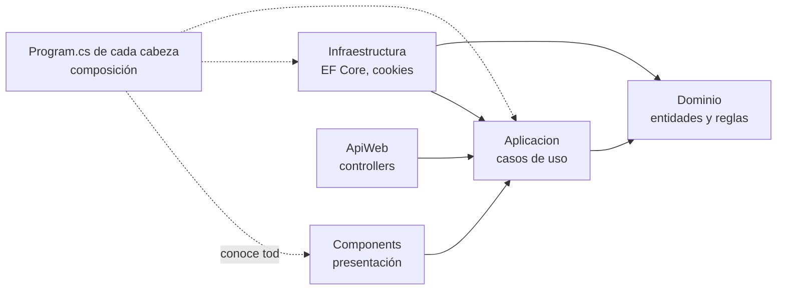

# 01 — Arquitectura y capas

> **Propósito**: explicar cómo se reparte la aplicación en capas, qué depende de qué y dónde se
> compone todo, para poder ubicar cualquier archivo sin recorrer el árbol.
> **Fuente primaria**: `src/MovilidadUrbana.Web/` y `src/MovilidadUrbana.Web/Program.cs`.
> **Vigencia**: 2026-09-12, commit `88e5caa`.

## Tres capas en proyectos, dos cabezas

Desde el 2026-09-12 cada capa de Clean Architecture es **un proyecto** —`MovilidadUrbana.Dominio`,
`MovilidadUrbana.Aplicacion`, `MovilidadUrbana.Infraestructura`— y hay dos cabezas de presentación que
las comparten: `MovilidadUrbana.Web` (Blazor) y `MovilidadUrbana.ApiWeb` (REST, ver
[12](12_Api-REST.md)). Hasta entonces las capas eran carpetas dentro del proyecto web; se extrajeron
para que la API no duplicara las reglas ni referenciara un proyecto web. Lo que sigue describe las
capas, que no cambiaron por dentro. Las dependencias apuntan siempre hacia adentro: ninguna capa
interior conoce a las que la rodean.

Este índice es solo de Movilidad Urbana. Las otras dos aplicaciones de la solución —Hola Mundo y
Login— no tienen capas: están en [10_Hola-Mundo-Y-Login.md](10_Hola-Mundo-Y-Login.md).

| Capa | Proyecto | Depende de | Contiene |
| --- | --- | --- | --- |
| Dominio | `MovilidadUrbana.Dominio` | nada | `Entidades/`, `Reglas/`, `Catalogos.cs` |
| Aplicación | `MovilidadUrbana.Aplicacion` | Dominio | `Abstracciones/`, `Localidades/`, `Encuestas/`, `Resultado.cs`, `AgregarAplicacion()` |
| Infraestructura | `MovilidadUrbana.Infraestructura` | Aplicación, Dominio; el framework de ASP.NET Core solo por el middleware | `Persistencia/`, `Sesiones/`, `AgregarInfraestructura(cadena)` |
| Presentación | `Components/`, `Servicios/`, `Theme/` | Aplicación | `App.razor`, `Routes.razor`, `Layout/`, `Pages/` y `Componentes/` —un componente por patrón del template—; `Servicios/` de interfaz (diálogos, foco, identidad de versión); `Theme/` (íconos) |
| Composición | `Program.cs` de cada cabeza | todas | Elige la cadena de conexión y llama a `AgregarInfraestructura` y `AgregarAplicacion` |

La inversión de dependencia está en `Aplicacion/Abstracciones/`: las tres interfaces
—`IRepositorioDeLocalidades`, `IRepositorioDeEncuestas`, `IContextoDeSesion`— las **declara**
Aplicación y las **implementa** Infraestructura.

## Program.cs — la composición, paso a paso

Fuente: `src/MovilidadUrbana.Web/Program.cs`.

| Bloque | Qué hace | Por qué |
| --- | --- | --- |
| Cultura | Fija `es-AR` en `DefaultThreadCurrentCulture` y `…UICulture` | Los separadores de miles y decimales forman parte de lo que verifican las E2E: no pueden depender de la cultura del servidor |
| Razor Components | `AddRazorComponents().AddInteractiveServerComponents()` | Modelo de render del laboratorio |
| Infraestructura (`AgregarInfraestructura`) | `AddDbContextFactory<ContextoDeDatos>` con SQLite | **Factory**, no contexto de ámbito: ver [03](03_Sesiones-Y-Persistencia.md) |
| Sesión | `ContextoDeSesion` scoped, expuesto también como `IContextoDeSesion` | La misma instancia sirve a la implementación concreta y a la abstracción |
| Repositorios | `RepositorioDeLocalidades`, `RepositorioDeEncuestas`, `SembradorDeSesion` — todos scoped | |
| Casos de uso (`AgregarAplicacion`) | `ServicioDeLocalidades`, `ServicioDeEncuestas` — scoped | |
| Presentación | `IIdentidadDeVersion` singleton (`IdentidadDeVersion.DelEnsamblado`); `IServicioDeDialogos` y `IServicioDeFoco` scoped | La versión se resuelve una sola vez en el host, y diálogos y foco son estado de interfaz del circuito |
| Arranque | `PreparadorDeBaseDeDatos.Preparar(app.Services)` | Crea el archivo y el esquema antes de atender la primera petición |
| Pipeline | `UseExceptionHandler("/Error")` fuera de Development · `UseStatusCodePagesWithReExecute("/no-encontrado")` · `UseMiddleware<MiddlewareDeSesion>()` · `UseAntiforgery()` · `MapStaticAssets()` · `MapRazorComponents<App>().AddInteractiveServerRenderMode()` | El middleware de sesión va **antes** de antiforgery y del mapeo de componentes |

Cadena de conexión: se lee de `ConnectionStrings:BaseDeDatos` y, si falta, cae en
`ServiciosDeInfraestructura.CadenaDeConexionPorDefecto` (`datos/movilidad.db`); la API usa
`datos/movilidad-api.db` desde su `appsettings.json`. Las E2E la pisan por variable de entorno para
apuntar a `datos-e2e/movilidad.db` — ver [05_Pruebas.md](05_Pruebas.md).

Propiedad del `.csproj` que conviene conocer: `BlazorDisableThrowNavigationException` en `true`,
para que `NavigateTo` durante el render estático no se manifieste como excepción.

## Dónde vive cada cosa

| Si buscás… | Está en |
| --- | --- |
| Una entidad persistida | `MovilidadUrbana.Dominio/Entidades/` — `Localidad`, `RespuestaDeEncuesta`, `Sesion` |
| Una validación de negocio | `MovilidadUrbana.Dominio/Reglas/` — `ReglasDeLocalidad`, `ReglasDeEncuesta` |
| Listas fijas (provincias, medios, frecuencias, motivos) | `MovilidadUrbana.Dominio/Catalogos.cs` |
| Un caso de uso | `MovilidadUrbana.Aplicacion/Localidades/ServicioDeLocalidades.cs`, `Aplicacion/Encuestas/ServicioDeEncuestas.cs` |
| El modelo que edita una pantalla | `MovilidadUrbana.Aplicacion/*/Modelo*.cs` — campos crudos, tal como se tipean |
| La salida de un caso de uso | `MovilidadUrbana.Aplicacion/Resultado.cs` |
| El acceso a datos | `MovilidadUrbana.Infraestructura/Persistencia/` |
| La cookie de sesión y su middleware | `MovilidadUrbana.Infraestructura/Sesiones/` |
| Una pantalla | `Components/Pages/` (con su `.razor.cs` en `Localidades` y `Encuesta`) |
| El shell: barra lateral, `#mq-main`, sello, host de diálogos, aviso de reconexión y testigo de interactividad | `Components/Layout/MainLayout.razor` |
| Un patrón visual del catálogo (grilla, campo, asistente, diálogo, banda…) | `Components/Componentes/` — ver [11](11_Template-Y-Superficies.md) |
| El requisito que un campo muestra antes del intento | `MovilidadUrbana.Aplicacion/*/Politica*.cs`, derivado de las constantes de `Dominio/Reglas/` |
| Los trazos SVG y el tamaño por rol de cada ícono | `Theme/Iconos.cs`, `Theme/RolesDeIcono.cs` |
| La interoperabilidad mínima con el navegador | `wwwroot/js/mq-dialogo.js`, `wwwroot/js/mq-foco.js` |

## Resultado — el contrato entre caso de uso y pantalla

`MovilidadUrbana.Aplicacion/Resultado.cs` es un `record` con `EsCorrecto`, `Mensaje` y `Errores`. Las claves de
`Errores` son los **nombres de campo que la pantalla conoce** (`nombre`, `provincia`,
`codigoPostal`, `habitantes`, …), de modo que la vista solo tiene que ubicarlos. Tres fábricas:
`Correcto(mensaje)`, `Invalido(errores)` e `Invalido(campo, mensaje)`; la forma con diccionario fija
el aviso genérico «Revise los campos marcados en rojo.».

Es el patrón que hace que la validación no dependa de la interfaz que la invoque: las reglas viven
en el dominio, el caso de uso las aplica y devuelve un `Resultado`, y la pantalla solo pinta. La API lo
demuestra: traduce el mismo `Resultado` a `ValidationProblemDetails` con las mismas claves.
