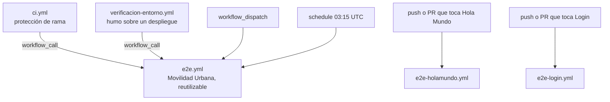

# 06 — CI y workflows

> **Propósito**: describir los cinco workflows, cuándo se dispara cada uno y qué prácticas de
> GitHub Actions aplica el laboratorio, que es una parte central de lo que enseña.
> **Fuente primaria**: `.github/workflows/` y la sección «Los workflows» de `README.md`. Las
> corridas observadas salen de la API pública de GitHub Actions.
> **Vigencia**: 2026-09-12, commit `88e5caa`.

## El mapa



## Un workflow E2E por proyecto web, en escalera

Desde el 2026-09-12 hay un workflow de pruebas E2E **por aplicación**, y no son copias de uno solo:
cada uno tiene la complejidad que su proyecto necesita, para estudiarlos de a un escalón.

| Workflow | Aplicación | Qué suma respecto del anterior |
| --- | --- | --- |
| `e2e-holamundo.yml` («E2E — Hola Mundo») | Hola Mundo | Punto de partida: un job y un navegador que compila, levanta la aplicación y prueba |
| `e2e-login.yml` («E2E — Login») | Login | Publica una vez y reparte la aplicación como artefacto a una matriz de navegadores |
| `e2e.yml` («E2E») | Movilidad Urbana | Reporte unificado, invocable desde otros workflows, regresión nocturna y prueba contra un entorno desplegado |

Son **independientes**: no se invocan entre sí ni desde `ci.yml`. `ci.yml` compila la solución
entera —Hola Mundo y Login incluidos— pero solo invoca `e2e.yml`.

## e2e-holamundo.yml — el escalón más simple

| Aspecto | Valor |
| --- | --- |
| Disparadores | `push` a `main` y `pull_request` hacia `main`, **filtrados por ruta** (`paths`) al proyecto web, su proyecto de pruebas y el propio YAML; `workflow_dispatch` |
| Jobs | Uno, `pruebas`, en `ubuntu-latest`, `timeout-minutes: 20`, `permissions: contents: read` |
| Navegador | Solo chromium |
| `URL_APP` | `http://localhost:5027` |

Pasos: checkout · `setup-dotnet` · compila aplicación y pruebas en Release · instala chromium
con `--with-deps` usando el CLI del paquete · **levanta la aplicación** con `dotnet run` en
`http://localhost:5027` y espera a que responda · `dotnet test` con `--settings pruebas.runsettings`
y TRX · sube resultados y el log de la aplicación **solo si algo falla**.

La prueba no tiene fixture, así que el workflow levanta la aplicación por ella, en la URL que la
prueba tiene escrita.

## e2e-login.yml — compilar una vez, probar muchas

| Aspecto | Valor |
| --- | --- |
| Disparadores | `push` y `pull_request` sobre `main`, filtrados por las rutas de Login; `workflow_dispatch` con la entrada `navegadores` |
| `concurrency` | Por ref, cancelando la corrida anterior solo en pull requests |
| Jobs | `publicar` (15 min) y `pruebas` (matriz, 20 min), en `ubuntu-latest` |
| `URL_APP` | `http://localhost:5181` |

| Job | Qué hace |
| --- | --- |
| `publicar` | `dotnet publish` autocontenido para `linux-x64`, sube el artefacto de la aplicación (`retention-days: 7`) y arma la lista de navegadores (un `push` o un PR prueban con chromium) |
| `pruebas` | Por navegador, `fail-fast: false`: compila las pruebas, instala el navegador con `--with-deps`, baja el artefacto, `chmod +x`, **arranca el binario publicado** desde su carpeta en `http://localhost:5181`, espera `/login`, corre `dotnet test -- Playwright.BrowserName=<navegador>` y sube resultados solo si falla |

No junta los TRX en un reporte ni se deja invocar desde otro workflow: eso es lo que agrega
`e2e.yml`.

## e2e.yml — Movilidad Urbana, la definición reutilizable

Es el único lugar donde está escrito cómo se corren las pruebas **de Movilidad Urbana**. Los otros
dos consumidores —`ci.yml` y `verificacion-entorno.yml`— solo lo invocan con entradas distintas.

### Disparadores

| Disparador | Para qué |
| --- | --- |
| `workflow_call` | Lo invocan `ci.yml` y `verificacion-entorno.yml`; también podría invocarlo otro repositorio |
| `workflow_dispatch` | Corrida a pedido desde *Actions*, eligiendo navegadores (`choice`) y entorno |
| `schedule` | `cron: '15 3 * * *'` — regresión completa todas las noches (03:15 UTC ≈ 00:15 en Argentina) |

### Entradas y salida

| Entrada | Tipo | Por defecto |
| --- | --- | --- |
| `navegadores` | string (`workflow_call`) / choice (`dispatch`) | `chromium`; en `schedule`, las cuatro configuraciones por el `env` |
| `url-base` | string | vacío = se publica y se levanta localmente |
| `referencia` | string | vacío = el ref del evento |
| `retencion-dias` | number | 7 |

Salida: `resultado` — el resultado agregado, tomado de `jobs.reporte.outputs.resultado`. En
`schedule` los `inputs` llegan vacíos, de ahí los valores por defecto explícitos del bloque `env`
(`NAVEGADORES: inputs.navegadores || 'chromium,firefox,webkit,mobile-chrome'`).

### Los cuatro jobs

| Job | Runner | Qué hace |
| --- | --- | --- |
| `publicar` | **`[self-hosted, i7infra-dev]`** | `dotnet publish` autocontenido para `linux-x64` y sube `aplicacion-publicada`. Se saltea con `url-base`. Antes verifica que el SDK del runner coincida con el `<TargetFramework>` del `.csproj` |
| `preparar` | `ubuntu-latest` | Convierte `chromium,firefox,…` en el JSON de la matriz |
| `pruebas` | `ubuntu-latest` | Un job por configuración (30 min): compila las pruebas, traduce `mobile-chrome` a chromium + `EMULAR_MOVIL=true`, cachea (`actions/cache` sobre `~/.cache/ms-playwright`) e instala el navegador, baja el artefacto, `chmod +x`, corre `dotnet test` con `PUBLICAR_ANTES_DE_PROBAR=false` y sube el TRX. `fail-fast: false` |
| `reporte` | `ubuntu-latest` | Junta los TRX en una tabla del `$GITHUB_STEP_SUMMARY` leyendo el `<Counters>` de cada uno, y falla si `needs.pruebas.result != 'success'` |

Detalles que valen para cualquier proyecto:

- `mobile-chrome` **no es un navegador**: es chromium con el descriptor de un Pixel 7.
- Los artefactos de Actions se empaquetan en zip y **pierden el bit de ejecución**: de ahí el
  `chmod +x` —también en `e2e-login.yml`—.
- El navegador lo instala el CLI que viene **dentro del paquete** `Microsoft.Playwright`
  (`node/linux-x64/node package/cli.js install --with-deps`), que baja la build de su propia
  versión: biblioteca y navegador no se pueden desincronizar.
- El binding de .NET no tiene `merge-reports`: el job `reporte` junta los contadores a mano.

Invocación desde otro repositorio:

```yaml
jobs:
  e2e:
    uses: hdcm-dev/Lab-E2E.WebBlazor/.github/workflows/e2e.yml@main
    with:
      navegadores: chromium,firefox
```

## ci.yml — lo que se ata a la protección de rama

| Disparador | Alcance |
| --- | --- |
| `pull_request` hacia `main` o `develop` (`opened`, `synchronize`, `reopened`, `ready_for_review`) | Verificación rápida: solo `chromium` |
| `push` a `main` (con `paths-ignore` de `**/*.md`, `docs/**`, `.gitignore`) | Las 4 configuraciones |
| `merge_group` | Igual que `push`, al entrar en la cola de merge |

`concurrency: ci-<ref>`, cancelando solo en pull requests. `permissions: contents: read` en la raíz.

| Job | Qué hace |
| --- | --- |
| `compilacion` («Compilación y unitarias», 15 min) | `restore` → `build Lab-E2E.WebBlazor.sln -warnaserror` —los doce proyectos— → **pruebas unitarias** con TRX (`resultados-unitarias`, 7 días) → **pruebas de la API** en proceso (`api.trx`) → `dotnet test --list-tests` sobre las E2E **de Movilidad Urbana** |
| `e2e` | Invoca `./.github/workflows/e2e.yml` con `navegadores` según el evento y `referencia` = SHA de la cabeza del PR |
| `comentario-en-pr` | Deja **o actualiza** un comentario con el resultado y el enlace a la corrida; solo para ramas del propio repositorio (un fork no tiene permisos de escritura) |
| `ci-ok` («CI aprobada») | Resume todos los jobs en un único check |

`ci-ok` es **el único check que conviene exigir** en la regla de protección de rama. Acepta
`success` y `skipped`. Si esa regla está o no configurada en GitHub **no se pudo verificar** desde
esta máquina: la API de protección de rama exige autenticación.

## verificacion-entorno.yml

Prueba de humo a pedido contra un entorno ya desplegado. Entradas: `entorno` (tipo `environment`) y
`url-base`, las dos requeridas. Un solo job, `humo`, que invoca `e2e.yml` con
`navegadores: chromium` y `retencion-dias: 30`.

## Prácticas aplicadas

No todas están en los tres workflows E2E: repartirlas es parte de la escalera.

| Práctica | Cómo | Dónde |
| --- | --- | --- |
| `concurrency` por rama | Cancela en pull requests, conserva en `main` | `ci.yml`, `e2e.yml`, `e2e-login.yml` |
| `permissions` mínimos | `contents: read`; `pull-requests: write` solo en el job que comenta | todos |
| Compilar una vez, probar muchas | Se publica en un job y se reutiliza como artefacto | `e2e.yml`, `e2e-login.yml` |
| Filtro de rutas | `paths-ignore` de documentación; `paths` del proyecto | `ci.yml`; `e2e-holamundo.yml`, `e2e-login.yml` |
| `timeout-minutes` en todos los jobs y `fail-fast: false` en las matrices | | todos |
| Coincidencia SDK ↔ framework | Compara `<TargetFramework>` con el SDK del runner | `e2e.yml` |
| SDK explícito | `actions/setup-dotnet`, porque la imagen de GitHub no garantiza la versión | todos |

## Runner

Casi todos los jobs corren en `runs-on: ubuntu-latest`. **La excepción es `publicar` de
`e2e.yml`** (línea 89), con el runner propio `[self-hosted, i7infra-dev]` activo; en los demás jobs
de `e2e.yml` y de `ci.yml` esa línea queda comentada encima de `ubuntu-latest`, para volver al runner
propio descomentando una y comentando la otra. `e2e-holamundo.yml` y `e2e-login.yml` corren enteros
en `ubuntu-latest`.

Nada corre dentro de un contenedor de job: el runner autoalojado es él mismo un contenedor sin el
socket de Docker, y un job con `container:` falla en *Initialize containers*.

Sobre `/dev/shm`: **se midió** que con 64 MB las 22 pruebas de chromium de Movilidad Urbana pasan
igual, así que a esta escala no hace falta `--disable-dev-shm-usage` (fuente: `README.md`).

## Corridas observadas

Consultadas en la API pública de GitHub Actions
(`/repos/hdcm-dev/Lab-E2E.WebBlazor/actions/workflows/<archivo>/runs`) el 2026-09-12.

| Workflow | Corridas | Resultado |
| --- | --- | --- |
| `e2e.yml` | 23 | Las 23 en verde: 20 programadas y 3 manuales; la última programada sobre `98fde5f` |
| `ci.yml` | 31 | 28 en verde (17 `push`, 11 `pull_request`), 2 `push` canceladas por `concurrency`, 1 `pull_request` en rojo; las últimas dos, sobre `f9f3ca2` y `06528d3`, en verde |
| `e2e-holamundo.yml` | 1 | En verde, `push` sobre `f9f3ca2` |
| `e2e-login.yml` | 1 | En verde, `push` sobre `f9f3ca2` |
| `verificacion-entorno.yml` | 0 | Nunca se disparó |

El workflow que Hola Mundo traía de su repositorio de origen (`e2e_2.yml`) tuvo **0 corridas verdes
de 4**: no levantaba la aplicación y compartía `name` y nombre de artefacto con `e2e.yml`. Se retiró
el 2026-09-12 (`CHANGELOG.md`).
